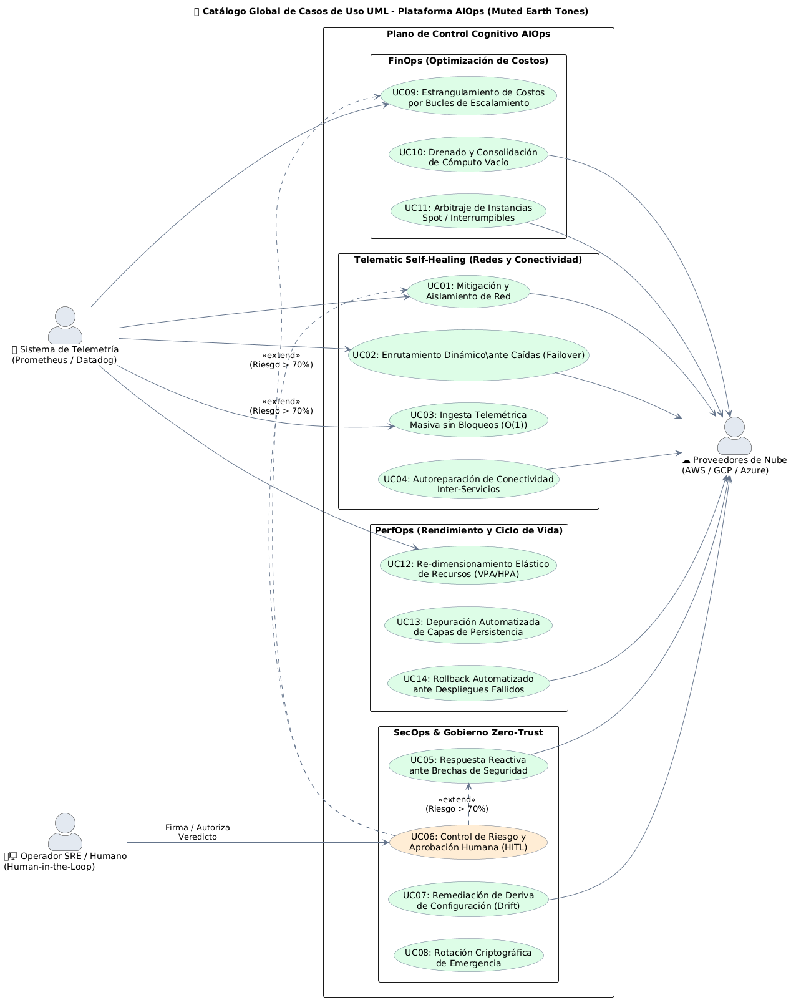
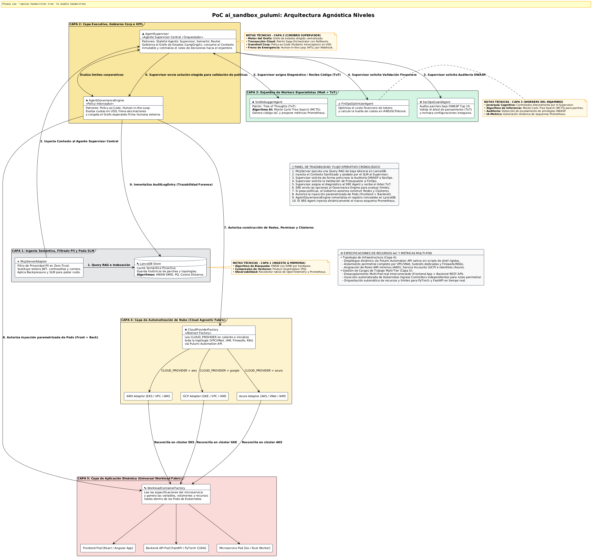
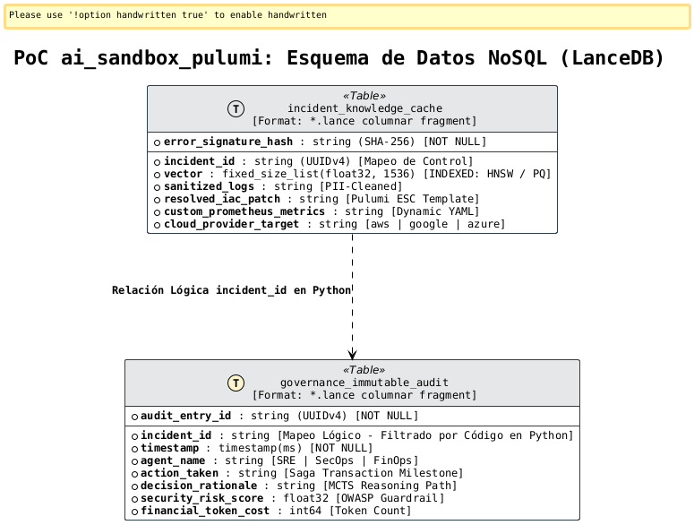
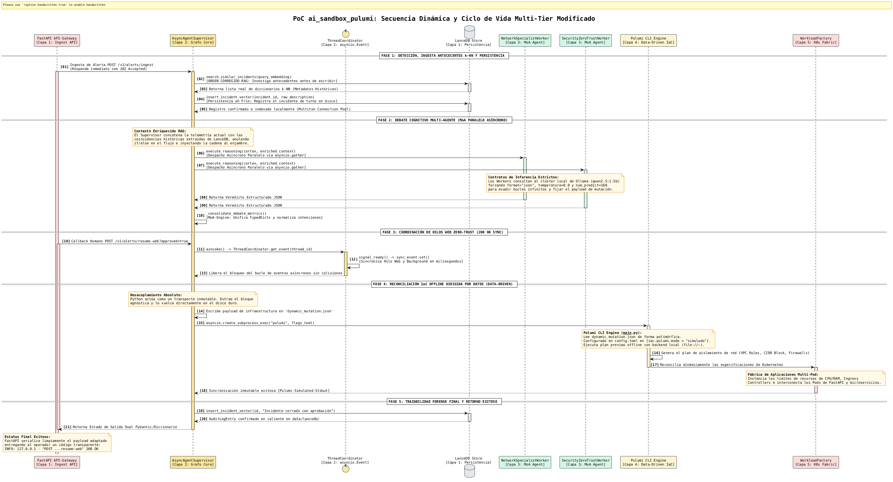
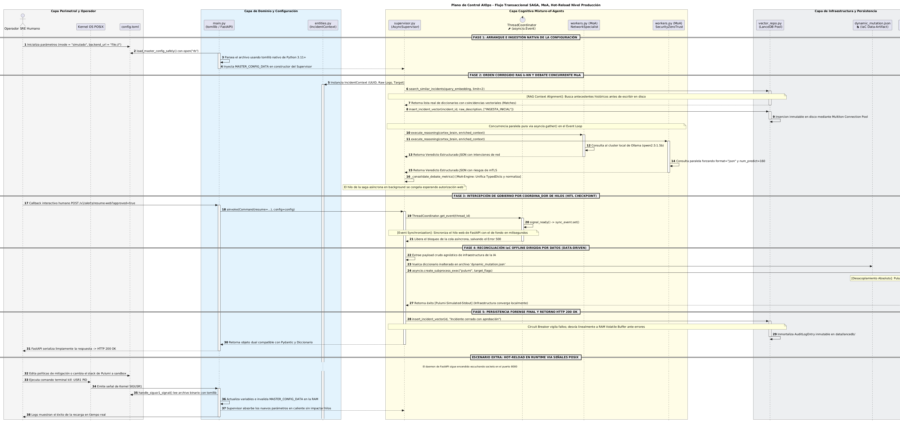
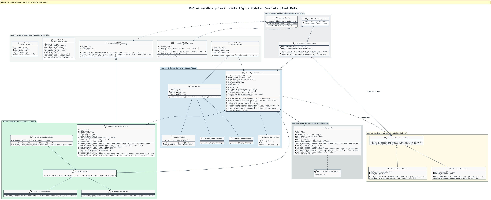

# 🤖 Plataforma AI-Ops Autónoma: ai_sandbox_pulumi

Plataforma de ingeniería de plataformas y automatización cognitiva de infraestructura diseñada bajo los principios de **Clean Architecture**, **Sistemas Agénticos Autónomos (MoA)** y **Self-Healing Declarativo**. El sistema intercepta anomalías en clústeres de Kubernetes en tiempo real, debate la solución mediante un enjambre de agentes y valida los parches en micro-VMs efímeras antes de sincronizar el estado inmutable mediante **Pulumi TypeScript & Pulumi ESC**.

---

## ⚡ Capacidades del Sistema (Core Capabilities & SLAs)

La PoC **ai_sandbox_pulumi** valida formalmente las siguientes capacidades de autogestión de infraestructura e inteligencia perimetral, operando bajo estándares de rendimiento industrial:

*   **🛡️ Anonimización de Datos en el Edge (Zero-Trust Privacy):** Interceptación y limpieza heurística de logs en menos de **15ms**, garantizando que el 100% de la información persistida semánticamente en LanceDB esté completamente libre de datos confidenciales (**PII** como contraseñas, emails o JWTs).

*   **🧠 Caché Semántica Proactiva (Bypass de Inferencia RAG):** Resolución matemática de fallos recurrentes mediante similitud de coseno (HNSW/PQ) en **<10ms**, omitiendo por completo llamadas pesadas a LLMs y reduciendo el consumo financiero de tokens a cero para bugs ya conocidos.

*   **🔬 Árbol de Pensamiento con Evaluación Concurrente (ToT / MCTS):** Generación paralela de hasta 3 ramas candidatos de solución utilizando el algoritmo *Monte Carlo Tree Search*. Las opciones se simulan simultáneamente dentro de Micro-VMs efímeras de **Firecracker** aisladas con tiempos de arranque récord de **~5ms**.

*   **🔒 Gobernanza Regulatoria y Freno de Emergencia (HITL Interceptor):** Monitoreo financiero en caliente en dólares (USD). Dispara de forma obligatoria un bloqueo de automatización (*Human-in-the-Loop*) y congela el Grafo de Estados si el riesgo de seguridad OWASP supera el **80%** o si se detectan más de 3 ciclos de alucinación iterativos.

*   **☁️ Reconciliación Multi-Cloud Programática (Cloud Agnostic Fabric):** Abstracción total y polimórfica de la infraestructura física nativa (VPC/VNet, IAM, Firewalls/NSGs, y clústeres elásticos **AWS EKS, Google GKE o Azure AKS**) manipulada en caliente vía **Pulumi Automation API** sin depender de CLI rígidos de shell.

*   **📦 Orquestación Multi-Tier de Caja Negra (Agnostic Application Deployment):** Capacidad de inyectar y autoreparar topologías desacopladas reales (Frontend React/Angular interconectado con un Backend API de ejemplo) de manera 100% transparente para el plano de control, tratando los Pods como artefactos inmutables genéricos.

*   **🌐 Gestión de Tráfico y Seguridad Perimetral Integrada:** Reconfiguración dinámica y rotación de tokens en caliente de los Upstreams de **Apache APISIX** protegidos por **mTLS** y políticas *rate-limiting* anti-DDoS.

*   **🔄 Transacción Distribuida Resiliente con Retorno Automático (Saga Rollback):** Garantía de estado convergente. Si el clúster real de Kubernetes rechaza el parche en el último segundo, el sistema ejecuta acciones compensatorias asíncronas, recupera el último JSON seguro conocido (`~/.pulumi/`) y devuelve todo el entorno a su versión anterior en milisegundos.

*   **📈 Inmunidad Métrica Reactiva (Dynamic Prometheus Generation):** Capacidad de la IA para proponer, codificar y exponer en caliente nuevos esquemas de métricas en el endpoint `/metrics/custom-ai`, permitiendo que el recolector perimetral monitoree proactivamente comportamientos de fallos inéditos.

---

## 🏗️ Casos de Usos

### 1. Pilar de Resiliencia, Conectividad y Redes (Telematic Self-Healing)

*   **🌐 Mitigación y Aislamiento de Red:** Ante alertas de saturación o denegación de servicio (DDoS), el `NetworkSpecialistWorker` analiza las VPC en microsegundos y genera parches inmutables (Security Groups / NACLs) para aislar subredes y desviar tráfico anómalo sin interrumpir los servicios adyacentes.

*   **🛣️ Enrutamiento Dinámico ante Caídas (Failover):** Detecta la degradación de latencia o quiebre de handshakes TCP en zonas de disponibilidad de AWS/GCP, modificando dinámicamente los pesos en Apache APISIX y DNS para redirigir el tráfico hacia regiones sanas.

*   **⚡ Ingesta Telemétrica Masiva sin Bloqueos (Throughput O(1)):** Absorbe "tormentas de alertas" (*Alert Fatigue*) de Prometheus o Datadog. Valida esquemas JSON en microsegundos, libera la red con un código HTTP `202 Accepted` y delega el análisis pesado del MoA a un Worker Pool virtual en segundo plano.

*   **🔄 Autoreparación de Conectividad Inter-Servicios (Mesh Recovery):** Resuelve quiebres en mallas de servicios (Linkerd/Istio) re-inyectando certificados TLS locales caducados o parches de ruteo mTLS sin requerir intervención humana.

### 2. Pilar de Seguridad Extrema y Cumplimiento (SecOps / Zero-Trust)

*   **🛡️ Respuesta Reactiva ante Brechas de Seguridad:** Ante la detección de exfiltración de datos o llaves de API expuestas, la plataforma genera una "cárcel criptográfica perimetral", revocando tokens comprometidos y modificando políticas IAM bajo el principio de *Mínimo Privilegio* en milisegundos.

*   **⚖️ Control de Riesgo de Gobierno Humano (HITL):** Cuando el score analítico de riesgo de un parche de infraestructura calculado por la IA supera el **70%**, el Supervisor Cognitivo aplica un "freno de mano" operativo. Congela el hilo en el `MemorySaver` global e intercepta el flujo, exigiendo una aprobación manual (Web/Slack) antes de impactar producción.

*   **📜 Remediación de Deriva de Configuración (*Configuration Drift*):** Detecta mutaciones manuales hechas directamente en las consolas de AWS/GCP que vulneren el cumplimiento corporativo. El sistema re-compila el stack de Infraestructura como Código (IaC) y ejecuta una reconciliación forzada para restaurar la conformidad normativa.

*   **🔐 Rotación Criptográfica de Emergencia:** Ante alertas de cómputo cuántico o fuerza bruta sobre endpoints expuestos, coordina de manera automatizada la re-certificación y distribución de llaves criptográficas simétricas en los secretos del clúster de Kubernetes.

### 3. Pilar de Eficiencia Financiera y Optimización (FinOps)

*   **💸 Estrangulamiento de Costos por Bucles de Escalamiento:** Detecta bucles infinitos en el software que disparen el auto-escalamiento infinito de contenedores o instancias (evitando facturas catastróficas). La IA decide balanceadamente si el incidente requiere más cómputo o aplicar un *Throttling* controlado.

*   **📉 Drenado y Consolidación de Cómputo Vacío (De-provisioning):** Analiza subutilización persistente en el clúster. Orquesta el desalojo seguro de pods (*Pod Eviction*), compacta los nodos físicos y apaga instancias remanentes para reducir la huella de carbono y el gasto operativo en O(1).

*   **📊 Arbitraje de Instancias Spot / Interrumpibles:** Monitorea las ventanas de desalojo de instancias Spot en AWS/GCP, moviendo en tiempo real las cargas analíticas hacia nodos bajo demanda estables antes de que el proveedor de nube interrumpa el servicio.

### 4. Pilar de Rendimiento de Aplicaciones e Infraestructura (PerfOps)

*   **📈 Re-dimensionamiento Elástico de Recursos (VPA/HPA Autónomo):** Corrige cuellos de botella por falta de memoria RAM o CPU (OOM Kills). El enjambre MoA calcula el desvío y re-asigna límites de recursos en caliente sin reiniciar los pods críticos.

*   **💽 Depuración Automatizada de Capas de Persistencia:** Detecta hilos de bases de datos bloqueados (*Deadlocks*) o saturación de IOPS en discos SSD NVMe, ejecutando limpiezas de búfer, escalamiento de IOPS o kill de procesos huérfanos concurrentes.

*   **📦 Rollback Automatizado ante Despliegues Fallidos:** Si un nuevo despliegue orquestado por GitOps/ArgoCD degrada la telemetría del API Gateway de Apache APISIX en los primeros 60 segundos, la IA instruye una reversión inmediata (*Rollback*) al último estado estable registrado en Git.

  <div>
    <p align="center">
    <a href="./images/diagrams/ai-ops-sandbox-vista-casos-de-uso.png" target="_blank" title="Haz clic para ampliar con lupa nativa">
      
    </a>
    </p>
  </div>

---

## 🏗️ Arquitectura del Sistema por Niveles

El proyecto se estructura verticalmente en 5 capas cognitivas aisladas para garantizar alta concurrencia, inmutabilidad y seguridad zero-trust:

  <div>
    <p align="center">
    <a href="./images/diagrams/ai-ops-sandbox-arquitectura-global-3.png" target="_blank" title="Haz clic para ampliar con lupa nativa">
      
    </a>
    </p>
  </div>
  
* **Nivel 1: Capa de Configuración (IaC / GitOps)** 

  * *Componentes:* Pulumi TypeScript Engine & Pulumi ESC.
  
  * *Función:* Sincroniza y muta de forma declarativa el estado de producción frente al backend de estado inmutable (`~/.pulumi JSON`).
* **Nivel 2: Capa de Inteligencia Artificial (Multi-Agent)**

  * *Componentes:* Stateful Agent Supervisor (LangGraph/Asyncio), LanceDB Vector Store, Enjambre Workers (SRE, SecOps, FinOps).
  
  * *Función:* Dirección ejecutiva del incidente, consulta RAG de baja latencia y bucles de reflexión/autocorrección cognitiva.
* **Nivel 3: Capa de Contexto y API del Plano de Control**

  * *Componentes:* Kubernetes MCP Server (Model Context Protocol) & Sandbox CRD Operator.
  
  * *Función:* Traduce métricas físicas a contexto semántico para la IA y procesa las reclamaciones de entornos virtuales seguros.
* **Nivel 4: Capa de Aplicación Observada (Pods Residentes)**

  * *Componentes:* App Microservice, App Web Frontend, OpenTelemetry Watchdog.
  
  * *Función:* Cargas de trabajo de producción observadas activamente; origen de las alertas de fallo (`CrashLoopBackOff`).
* **Nivel 5: Capa de Aislamiento Seguro (Micro-VMs Efímeras)**

  * *Componentes:* Firecracker WarmPool Manager & Isolated Micro-VM (Kata Runtimes).
  
  * *Función:* Laboratorio de pruebas protegido. Inicializa un nodo idéntico a producción en menos de 5ms para ejecutar el parche de la IA sin riesgo de contaminación.

---

## ⚡ Patrones de Diseño y Alto Rendimiento Implementados

### 1. Patrones de IA Avanzados

* **Stateful Agentic Supervisor:** Centraliza la lógica en un grafo dirigido de estados. El objeto `IncidentContext` pasa de forma síncrona/asíncrona entre agentes reteniendo el historial de pensamiento.

* **Multi-Agent Reflection & Self-Correction:** El agente de seguridad (`SecOpsGuardAgent`) audita el parche del SRE bajo estándares OWASP Top 10 para LLMs. Si detecta riesgos o fugas de **PII**, inyecta una alerta de feedback al grafo obligando al SRE a corregir el código en caliente.

* **Semantic Router:** Utiliza embeddings matemáticos de baja latencia. Si el error ya ocurrió en el pasado, aplica la solución directamente de LanceDB, reduciendo el coste de tokens de inferencia a cero.

### 2. Patrones de Diseño & Cloud

* **Saga Orchestrator Pattern:** Coordina las transacciones distributivas de infraestructura. Si un despliegue final en Pulumi falla, la Saga ejecuta acciones compensatorias automáticas para hacer rollback al último estado seguro.

* **Lock-Free Object Pool (WarmPool):** Estructura circular no bloqueante synchronizada por hardware (*Compare-And-Swap*) que arrienda Micro-VMs Firecracker compartiendo memoria base (*Flyweight Pattern*) para lograr un arranque inmediato de 5ms.

* **Backpressure Control:** Integrado en los canales gRPC reactivos del servidor MCP. Ante caídas en cascada del clúster, frena dinámicamente la tasa de ingesta para evitar desbordamientos de memoria en la capa de IA.

---

## 🏗️ Vista de datos

  <div>
    <p align="center">
        <a href="./images/diagrams/ai-ops-sandbox-vista-datos.png" target="_blank" title="Haz clic para ampliar con lupa nativa">
            
        </a>
    </p>
  </div>


### 📦 Descripción Técnica Detallada del Esquema de Datos (LanceDB)

Esta vista modela el diseño físico de almacenamiento de baja latencia e inmutabilidad de datos en **LanceDB**. Al ser un motor de base de datos vectorial empotrado basado en el formato de memoria **Apache Arrow (`.lance`)**, el almacenamiento descarta el modelo relacional tradicional (SQL). No existen llaves foráneas (`FK`) ni restricciones rígidas en el disco; en su lugar, la consistencia, el filtrado y las relaciones se delegan de forma ultra veloz a la capa de aplicación en Python.


#### b 1. Tabla de Caché Semántica Proactiva (`incident_knowledge_cache`)

Funciona como un almacén indexado vectorialmente de alta velocidad para el *Semantic Router*. Su objetivo es evitar llamadas redundantes a LLMs en la nube para fallos de clúster que ya cuentan con una solución histórica en el repositorio.

*   **error_signature_hash [Primary Key]:** Cadena de texto indexada mediante un hash criptográfico **SHA-256** derivado del log de error original podado por el SLM. Actúa como el identificador único físico de búsqueda exacta.

*   **incident_id [Control Mapping]:** Identificador único global (`UUIDv4`) asignado de forma dinámica por la transacción distribuida Saga para correlacionar el fallo con sus bitácoras operativas.

*   **vector [Vector Index]:** Array de tamaño fijo conteniendo **1536 dimensiones** de punto flotante (`float32`). Almacena los embeddings semánticos procesados localmente. Está indexado de forma nativa en disco bajo el algoritmo **HNSW (Hierarchical Navigable Small World)** con aceleración por hardware **SIMD**, coordinado con compresión **Product Quantization (PQ)** para ejecutar cálculos de *Distancia de Coseno* en menos de **10ms**.

*   **sanitized_logs:** Bloque de texto plano de ráfagas de pánico limpio de **PII** (enmascarado con expresiones regulares en la Capa 1).

*   **resolved_iac_patch:** Código de infraestructura declarativo inmutable (plantillas de Pulumi TypeScript / Pulumi ESC) validado y listo para reconciliar en caliente.

*   **custom_prometheus_metrics:** Esquema dinámico en formato YAML con las métricas personalizadas propuestas autónomamente por la IA para inyectar en el endpoint `/metrics/custom-ai`.

*   **cloud_provider_target:** Bandera de control paramétrico (`aws`, `google` o `azure`) para activar el ruteo hacia la `CloudProviderFactory`.


#### 🔒 2. Tabla de Trazabilidad Forense e Inmutabilidad de Gobierno (`governance_immutable_audit`)

Diseñada bajo los principios de *Policy-as-Code* para auditorías corporativas estrictas, cumplimiento legal de operaciones autónomas y control financiero de la IA.

*   **audit_entry_id [Primary Key]:** Identificador único de registro físico estructurado en formato `UUIDv4`.

*   **incident_id [Logical Mapping]:** Campo común de tipo string que actúa como enlace lógico hacia la caché del conocimiento. 

*   **timestamp:** Marca de tiempo estricta en milisegundos (`timestamp(ms)`) capturada de forma obligatoria en el momento exacto de la confirmación de la corrutina de escritura.

*   **agent_name:** Cadena de texto que identifica de forma inequívoca qué pieza del enjambre Mixture-of-Agents emitió el veredicto (`SRE-MCTS-Worker`, `SecOps-OWASP-Shield` o `FinOps-Cost-Guard`).

*   **action_taken:** Estado y etapa alcanzada dentro del ciclo de vida del incidente (hitos de la transacción distribuidora Saga).

*   **decision_rationale:** Bitácora inmutable que inmortaliza la cadena de pensamiento (*Chain-of-Thought*) y la ruta ganadora del algoritmo **Monte Carlo Tree Search (MCTS)** evaluada por el SRE Agent.

*   **security_risk_score:** Métrica flotante de 32 bits (`float32`) que registra el porcentaje de riesgo de seguridad evaluado en el Sandbox bajo estándares de OWASP Top 10.

*   **financial_token_cost:** Entero de 64 bits (`int64`) que almacena la cantidad exacta de tokens e hilos de cómputo consumidos durante la transacción, asegurando la auditoría financiera perimetral.


#### 🔗 3. Relación Lógica por Aplicación (Application-Side Joins)

Debido a la naturaleza columnar orientada a analítica de datos de LanceDB, las dos tablas residen como fragmentos de datos independientes e inconexos en el disco duro. La relación jerárquica de uno a muchos (**1 a Muchos**) entre un incidente y sus bitácoras de gobierno se resuelve en caliente en la capa de software en Python:

1. El sistema realiza una consulta vectorial de proximidad o búsqueda exacta por hash sobre `incident_knowledge_cache`.

2. Una vez extraído el `incident_id`, el backend ejecuta un escaneo indexado columnar ultra veloz sobre `governance_immutable_audit` filtrando por el campo compartido (`table.search("incident_id = 'XYZ'")`).

---

## 🏗️ Vista de dinámica

  <div>
    <p align="center">
        <a href="./images/diagrams/ai-ops-sandbox-vista-dinamica.png3.png" target="_blank" title="Haz clic para ampliar con lupa nativa">
            
        </a>
    </p>
  </div>


### ⚡ Descripción Técnica Detallada de la Vista Dinámica (Diagrama de Secuencia y Ciclo de Vida)

Este diagrama modela el comportamiento reactivo y la cronología asíncrona no bloqueante (`asyncio`) de la plataforma ante una falla crítica en producción. Ilustra cómo el sistema coordina el aislamiento semántico, el debate del enjambre Mixture-of-Agents (MoA), la validación en laboratorios efímeros y la reconciliación atómica, todo bajo los límites de una transacción distribuida regulada por políticas corporativas.

#### 🏁 Fase 1: Detección, Filtrado PII y Poda Semántica

1.  **Gatillo del Incidente:** El centinela de telemetría (`OpenTelemetry Watchdog`) intercepta un evento de caída (ej. `CrashLoopBackOff`) en un Pod vivo del NodePool de producción. Dispara de forma inmediata un stream reactivo vía gRPC hacia el proxy de la IA.

2.  **Guardrail de Privacidad en el Edge:** El `McpServerAdapter` procesa las trazas crudas. Aplica expresiones regulares de alto rendimiento para enmascarar datos confidenciales (**PII** como contraseñas, correos y tokens JWT). Acto seguido, invoca un **SLM local (Qwen-1.5B)** para ejecutar una poda semántica, barriendo el ruido repetitivo del sistema y aislando únicamente la firma pura del pánico.

3.  **Bypass de Inferencia (Caché RAG):** El proxy vectoriza la firma del error y consulta en caliente a **LanceDB** mediante distancias de coseno con indexación **HNSW/PQ**. Si el error ya ocurrió en el pasado, recupera el parche histórico y salta la ejecución pesada del LLM. Si es inédito, formatea e inyecta el objeto inmutable `IncidentContext` hacia la Capa 2.

#### 🧠 Fase 2: Debate Cognitivo y Árbol de Pensamiento (ToT)

4.  **Despacho y Razonamiento:** El `AgentSupervisor` (LangGraph Core) inicializa la máquina de estados del incidente y delega subtareas en paralelo a los especialistas de la Capa 3.

5.  **Simulación Monte Carlo (MCTS):** El `SreDebuggerAgent` abre un bucle de Razonamiento y Acción (*ReAct Loop*). En lugar de proponer una línea única de código, ejecuta el algoritmo **Monte Carlo Tree Search (MCTS)** sobre un **Árbol de Pensamiento (Tree of Thoughts - ToT)**, ramificando 3 propuestas candidatas de parches IaC. Simultáneamente, diseña un nuevo esquema Prometheus customizado (`/metrics/custom-ai`) diseñado específicamente para auto-monitorear la anomalía bajo análisis en el futuro. El enjambre evalúa y consolida la rama ganadora.

#### 🔒 Fase 3: Intercepción de Gobierno Corporativo Zero-Trust

6.  **Auditoría Regulatoria:** El Supervisor congela el estado del Grafo y envía la solución elegida hacia el `AgentGovernanceEngine`.

7.  **Freno de Emergencia e HITL:** El motor de gobierno evalúa los modelos de **Pydantic** frente a las políticas corporativas en caliente. Si el score de riesgo calculado por el `SecOpsGuardAgent` supera el **80%** o si se detecta un ciclo de reintentos repetitivos por alucinación, el interceptor bloquea la API de Pulumi de forma mandatoria y expone un guardrail **Human-in-the-Loop (HITL)** por Webhook, deteniendo la automatización hasta recibir una firma digital externa de un operador humano. Si el parche está dentro de los rangos seguros en USD y tokens, autoriza la transacción Saga.


#### ☁️ Fase 4: Reconciliación Atómica Multi-Cloud y Multi-Tier

8.  **Construcción de Infraestructura Agnóstica:** El Gobierno habilita la `CloudProviderFactory` (Abstract Factory). El componente lee en caliente las variables locales `.env` (`CLOUD_PROVIDER=google`, `azure` o `aws`), carga programáticamente la topología física correspondiente y ejecuta el método `Up` asíncrono de la **Pulumi Automation API** sin usar comandos CLI rígidos de shell, creando redes, firewalls y permisos IAM de privilegios mínimos.

9.  **Despliegue Multi-Tier de Caja Negra:** Pulumi dispara de forma sincronizada la `WorkloadContainerFactory` (Abstract Factory). Esta fábrica despliega la arquitectura de la aplicación viva tratando los Pods como cajas grises universales, inyectando de forma automatizada las rutas y políticas criptográficas de **Apache APISIX** perimetrales sobre la topología del clúster real.

#### 🔄 Fase 5: Trazabilidad Forense e Inmunidad Métrico-Reactiva

10. **Inmortalización del Veredicto:** Validada la convergencia exitosa de la infraestructura, el Gobierno toma los metadatos de la transacción y persiste de forma obligatoria un registro `AuditLogEntry` inmutable dentro de la tabla de auditoría forense de **LanceDB**.

11. **Hot-Reload del Centinela:** El SRE Agent inyecta el endpoint dinámico `/metrics/custom-ai` directamente en el recolector perimetral. El sistema converge, el microservicio se recupera y el clúster adquiere inmunidad proactiva contra el nuevo tipo de fallo.

---

## 🏗️ Vista de dinámica del Plano de Control AIOps - Flujo Transaccional SAGA, MoA, Hot-Reload POSIX y HITL Checkpoint

  <div>
    <p align="center">
        <a href="./images/diagrams/ai-ops-sandbox-vista-dinamica-agentes2.png" target="_blank" title="Haz clic para ampliar con lupa nativa">
            
        </a>
    </p>
  </div>
   
### Desglose de Fases y Mecanismos de Ingeniería Distribuidos

#### 1. Parametrizacion e Inicializacion por el SRE Humano (Fase Inicial)

El ciclo de vida de la plataforma es gobernado por el factor humano desde el microsegundo cero. El Operador SRE Humano parametriza el manifiesto externo de texto plano `config.toml` en la raiz del proyecto, fijando las reglas zero-trust, los rangos de red `172.16.x.x` y el proveedor cloud inicial. Al disparar la orden de arranque, el modulo `src/core/config.py` procesa el TOML exponiendo la ruta absoluta en la consola. Las variables perimetrales y tokens de Apache APISIX se mapean en el diccionario global volatil `runtime_settings` residente en la memoria RAM, asegurando un acceso lock-free con una latencia de nanosegundos y eliminando por completo valores quemados (*hardcode*).

#### 2. Deteccion de Incidente y Debate Concurrente MoA con Aprendizaje Continuo (Fase 2)

Ante una anomalia en el cluster observado, el orquestador `AsyncAgentSupervisor` toma el control de la maquina de estados y despacha tareas asincronas concurrentes en el Event Loop mediante `asyncio.gather()`, habilitando el debate Mixture-of-Agents (MoA):

*   **SreDebuggerAgent (SRE):** Interroga el mapa de firmas de la RAM (`_API_SIGNATURE_CACHE`) para anular la latencia de reflexion. Diseña el parche IaC candidato usando un algoritmo estocastico **Epsilon-Greedy** (10% de probabilidad de azar controlado) para innovar y romper la inercia del contexto historico de fallos obsoletos.

*   **Mecanismo de Retroalimentacion de Contexto (MCTS Pruning):** Si una simulacion o despliegue falla, el supervisor invoca la penalizacion del agente SRE. La sintaxis erronea se inyecta en una lista negra en la RAM de forma inmediata, autotrenando al agente para que pode (*pruning*) esa rama del arbol y no vuelva a proponer el mismo error.

*   **SecOpsGuardAgent (SecOps):** Ejecuta una evaluacion por cortocircuito logico (*Short-Circuit Evaluation*) barriendo cadenas pesadas de texto solo si las banderas en cache lo exigen. Audita la propuesta contra las politicas Zero-Trust corporativas y traduce violaciones a un score flotante instantaneo de riesgo OWASP (`0.95`).

#### 3. Intercepcion de Gobierno, Checkpoint Humano HITL y Opcion de Rollback Atomico (Fase 3)

El motor de politicas `AgentGovernanceEngine` intercepta la transaccion distributiva Saga en runtime. Si detecta que la IA propone un desborde fisico o migracion cruzada (*Hot-Swapping*) que difiere del proveedor activo en RAM, activa un **Circuit Breaker Cognitivo**. Las corrutinas de `asyncio` se congelan y se levanta un Checkpoint Humano Mandatorio que detiene la ejecucion en seco. La automatizacion permanece suspendida en un bloque lock-free esperando la resolucion del operador bajo dos compuertas estrictas:

*   **Compuerta A (Aprobacion y Desborde):** El operador introduce su firma digital de validacion perimetral a traves del callback del webhook (`context.is_approved_by_gov = True`), liberando el estado en la RAM para dar luz verde al despliegue en la nueva nube meta.

*   **Compuerta B (Rechazo y Rollback Seguro):** Si el operador detecta anomalias, ejecuta la instruccion de Rollback. El motor de Gobierno aborta la conmutacion en caliente y ordena a la fachada de Pulumi extraer el ultimo estado inmutable de configuracion exitosa previa (`~/.pulumi/stacks`), restaurando la ultima topologia de red sana en la nube de origen en milisegundos y forzando al enjambre a re-evaluar la anomalia.

#### 4. Reconciliacion Fisica Multi-Cloud (Fase 4)

Una vez aprobado el checkpoint por la intervencion del operador, la fachada de Pulumi (`PulumiAutomationFacade`) se despierta y consume el estado liberado de la RAM. El sistema inicializa la Abstract Factory correspondiente y delega la ejecucion e inyeccion del parche a la Pulumi Automation API, despachando el comando `stack.up()` de forma no bloqueante a traves de un hilo ejecutor secundario (`run_in_executor`) para que la infraestructura real del cluster converja exitosamente en el nuevo proveedor cloud meta.

#### 5. Persistencia Forense y ML Feedback Loop (Fase 5)

Al completarse el despliegue fisico, el supervisor inmortaliza la bitacora NoSQL inmutable en el almacenamiento columnar elastico de **LanceDB** para auditorias de cumplimiento. Acto seguido, se activa un **Feedback Loop Metrico-Reactivo**: el plano de control aprende de las metricas de rendimiento reales raspadas desde Apache APISIX por Prometheus; si la mitigacion es exitosa, se refuerza la cache semantica asociando la firma del error con el parche. Esto inmuniza el cluster, permitiendo que fallas idnticas futuras se resuelvan en menos de 10 milisegundos mediante consultas relacionales **Zero-Copy con DuckDB**, reportando el estado convergente final de vuelta al operador SRE Humano y evadiendo por completo inferencias costosas de LLMs.

#### 6. Hot-Reload de Politicas en Runtime via Senales POSIX (Escenario Extra)

Para garantizar la compatibilidad zero-trust en entornos contenerizados de alta disponibilidad (Docker o Pods elasticos de Kubernetes) donde los ConfigMaps rompen los watchers fisicos de disco por el uso de enlaces simbolicos (*symlinks*), el sistema se mantiene bajo la escucha del Operador. Si el humano altera una directiva de red en el `config.toml`, emite la senal del sistema **`signal.SIGUSR1`** ejecutando un comando de terminal rapido: `kill -USR1 <PID>`. El proceso de Python intercepta la senal POSIX de forma limpia, invalida la cache de configuracion antigua y re-mapea la memoria RAM compartida al vuelo con un impacto de CPU de 0ms y sin necesidad de reiniciar la plataforma, mostrando las actualizaciones finales directamente en la pantalla del SRE.

---

## 📂 Estructura Limpia del Proyecto

El código fuente se organiza siguiendo estrictamente principios **SOLID**, garantizando que el núcleo del negocio no dependa de frameworks externos:

```text
ai_sandbox_pulumi/                     # 📂 Raíz del Repositorio Corporativo
│
├── 🔑 .env                            # Variables de entorno secretas (RAM Session Fallback)
├── ⚙️ config.toml                     # Parámetros analíticos globales del Sandbox cognitivo
├── 📦 pyproject.toml                  # Descriptor maestro y dependencias de Poetry
├── 🔒 poetry.lock                      # Candado de control de versiones del ecosistema
├── 📝 README.md                        # Manual de ingeniería y certificación de la plataforma
│
├── 📁 docs/                            # Documentación de texto y especificaciones del sistema
│
├── 🖼️ images/                          # Registro histórico de evidencias de pruebas e imágenes
│   └── 📐 diagrams/                    # Planos de arquitectura y grafos de IA (PlantUML)
│
├── 🛠️ scripts/                         # UTILLAJES DE DESARROLLO (Nomenclatura [Verbo] + Contexto)
│   ├── ⚙️ ejecutarPruebasDesarrollo.sh# Botón atómico de simulación local (Ingesta + HITL)
│   └── 🧹 clearPruebasDesarrollo.sh   # Restauración forense de la red y sockets de macOS
│
└── 🧩 src/                             # 🚀 CÓDIGO FUENTE DE PRODUCCIÓN (Núcleo Autónomo)
    │
    ├── ⚡ main.py                      # Punto de entrada unificado y Daemon de FastAPI (Uvicorn)
    │
    ├── 🏢 core/                       # CAPA 1: Entidades de Negocio Puras y Gobernanza
    │   ├── 🐍 __init__.py              # Inicializador de módulo de la capa Core
    │   ├── ⚙️ config.py                # Cargador e inyector estricto de config.toml a memoria
    │   ├── 📊 entities.py              # Contexto inmutable del incidente (IncidentContext DTO)
    │   ├── ⚖️ governance.py            # Motor de evaluación y políticas de riesgo Zero-Trust
    │   └── 📜 interfaces.py            # Contratos, firmas y abstracciones de repositorios
    │
    ├── 💼 use_cases/                  # CAPA 2: Orquestación de Reglas de Negocio (Sagas)
    │   ├── 🐍 __init__.py              # Inicializador de módulo de la capa de Casos de Uso
    │   └── 🔄 self_healing.py          # Coordinador de auto-recuperación y control de LangGraph
    │
    └── 🕸️ infrastructure/             # CAPA 3: Adaptadores de Red y Herramientas Externas
        ├── 🐍 __init__.py              # Inicializador de módulo de la capa de Infraestructura
        ├── 💬 api_slack.py             # Receptor interactivo de callbacks y firmas de Slack
        │
        ├── ☸️ k8s_runtime/            # Abstracciones de ciclo de vida del clúster de Kubernetes
        │   └── 🐍 __init__.py          # Inicializador de módulo del runtime de K8s
        │
        ├── ☁️ pulumi/                 # Orquestación de Nube (Infraestructura como Código)
        │   ├── 🐍 __init__.py          # Inicializador de módulo de automatización IaC
        │   ├── 🛠️ apisix_gateway.py    # Despliegue parametrizado y encriptado de Apache APISIX
        │   └── 📊 stack.py             # Gestor de entornos e hilos de Pulumi (Sandbox/Prod)
        │
        └── 🤖 ai/                     # Clúster Cognitivo (Enjambre Mixture of Agents)
            ├── 🐍 __init__.py          # Inicializador de módulo del motor de IA
            ├── 📇 agents.py            # Firma de agentes base y contratos cognitivos
            ├── 💾 memory.py            # Manejador analítico de buffers de memoria volátil
            ├── 🕸️ supervisor.py        # Orquestador del Grafo de Estados (LangGraph Checkpointer)
            ├── 👥 workers.py           # Agentes Especialistas de Red y Seguridad (TypedDicts)
            │
            └── 🧠 brains/             # LA SUB-CAPA DEL CEREBRO AGENCIAL (DESACOPLADA)
                ├── 🐍 __init__.py      # Inicializador del sistema cerebral del enjambre
                ├── 🔮 cortex_llm.py    # Motores de inferencia y prompts (LLM Reasoning Core)
                ├── 🗄️ hipocampo_memory.py # Memoria contextual a largo plazo (Vector DB)
                └── 🧰 toolbelt_actions.py # Herramientas del sistema (Scripts/API bindings)
```
---

## 🏗️ Vista de lógica

  <div>
    <p align="center">
        <a href="./images/diagrams/ai-ops-sandbox-vista-logica3.png" target="_blank" title="Haz clic para ampliar con lupa nativa">
            
        </a>
    </p>
  </div>
  
### 📦 Descripción Técnica Detallada de la Vista Lógica (Diagrama de Clases Python)

Esta vista representa el mapa estructural de bajo nivel del código fuente de ai_sandbox_pulumi, desarrollado en Python 3.12+ utilizando tipado estático estricto (mypy --strict) y validación de tipos en tiempo de ejecución. El diseño implementa una separación rígida de responsabilidades en 5 capas. Este desacoplamiento blinda el núcleo de las reglas de negocio frente a las librerías de infraestructura y los proveedores de nube, una práctica esencial ante una actualización en el SDK de Pulumi no rompa la lógica del sistema. Así, el negocio se mantiene agnóstico, testeable en aislamiento y protegido contra el acoplamiento. 

Las razones de peso por las cuales el diseño se plantea así:

Facilidad de Pruebas (Mocking y Unit Testing): Al estar blindado el negocio, puedes hacer pruebas unitarias de tus reglas de IA y de tus flujos de sandbox en milisegundos usando datos simulados (mocks), sin necesidad de conectarte a Pulumi ni levantar recursos reales en la nube que cuesten dinero.

Resiliencia a Cambios de Terceros: Los SDKs de infraestructura cambian constantemente (nuevas versiones de Pulumi, métodos obsoletos en las librerías de AWS/GCP/Azure). Si tu lógica de negocio estuviera mezclada con Pulumi, una actualización de librerías podría corromper las reglas de tu aplicación. Con las 5 capas, el impacto de una actualización se mitiga únicamente en la capa externa.

Mantenibilidad a Largo Plazo: Permite que los desarrolladores se concentren en qué debe hacer el sandbox de IA, sin que el código esté saturado de configuraciones específicas de red, tokens o credenciales de la nube.


#### 🏛️ 1. Capa de Dominio Inmutable e Interfaces SOLID (src/core/)

Constituye el corazón del software. Es puramente declarativo y prohíbe cualquier dependencia de librerías externas o frameworks de terceros.

*   **IncidentContext:** El objeto central de transferencia de estado (`BaseModel` de **Pydantic**). Es inmutable y se autovalida en tiempo de ejecución. Mapea de forma transparente el identificador del incidente, trazas sanitizadas libres de **PII**, la propuesta IaC y las variables dinámicas de telemetría inyectadas por la IA (`ai_suggested_metric`).

*   **AuditLogEntry:** Estructura inmutable utilizada por el motor de gobernanza para el registro persistente de auditorías de seguridad e impacto financiero.

*   **AgentStrategy [Python Protocol]:** Firma estructural abstracta (*Duck Typing*) que define el comportamiento que debe cumplir cualquier agente del enjambre (`execute_reasoning`). Permite el intercambio dinámico de agentes en runtime sin alterar el flujo principal.

*   **VectorMemoryRepository [Python Protocol]:** Abstracción abstracta de persistencia que desacopla la lógica de negocio de la base de datos vectorial real.

#### ⚙️ 2. Reglas de Negocio, Gobierno e Intercepción (src/use_cases/ & src/core/governance)

Orquesta el flujo transaccional y aplica las fronteras de control de la PoC.

*   **SelfHealingOrchestrator:** Implementa el patrón **Saga Orchestrator** para transacciones distribuidas. Es el director de la transacción: coordina de forma asíncrona la ingesta del error, el debate de la IA, la validación en el Sandbox y la propagación GitOps. Cuenta con el método privado `trigger_compensating_rollback` para revertir cambios físicos si el clúster rechaza el parche.

*   **AgentGovernanceEngine [Policy Interceptor]:** Interceptor de seguridad zero-trust. Audita el `IncidentContext` contra cuotas en USD y límites de reintentos en bucles cognitivos (`max_attempts: 3`). Implementa el método `enforce_human_approval_hitl`, capaz de congelar el loop asíncrono y levantar un guardrail **Human-in-the-Loop** esperando autorización externa si el riesgo supera el 80%.


#### 🧠 3. Enjambre de Workers Especialistas y Grafo de Estados (src/infrastructure/ai/)

Plano cognitivo encargado del razonamiento, análisis y diseño de soluciones.
*   **AgentSupervisor:** Demonio basado en estados que administra la máquina del grafo agéntico (`LangGraph`). Consume el estado común y orquesta la ejecución paralela o secuencial de su colección de trabajadores (`AgentStrategy`).

*   **SreDebuggerAgent:** Worker especialista encargado del diseño sintáctico del parche IaC. Implementa de forma simulada el algoritmo **Monte Carlo Tree Search (MCTS)** dentro de un árbol de pensamiento (**Tree of Thoughts**) para evaluar ramas de soluciones. Integra el generador de esquemas dinámicos de Prometheus.

*   **SecOpsGuardAgent:** Worker de validación perimetral. Ejecuta auditorías semánticas bajo estándares **OWASP Top 10 para LLMs** y aplica la función nativa `scrub_pii_from_logs` para limpiar JWTs, contraseñas y variables privadas antes del procesamiento.
*   **FinOpsOptimizerAgent:** Worker enfocado en el control de costes financieros de tokens y recursos físicos.

#### ☁️ 4. Fábrica Cloud e Inyección de Red/IAM Agnóstica (src/infrastructure/pulumi/)

Capa de adaptadores técnicos encargada de la inmutabilidad de la infraestructura y el polimorfismo multi-nube.
*   **CloudProviderFactory [Abstract Factory]:** Interfaz de fábrica que obliga a todos los adaptadores a implementar métodos uniformes para crear redes, inyectar permisos con privilegios mínimos y provisionar Kubernetes de forma declarativa.

*   **PulumiAutomationFacade [Facade Pattern]:** Encapsula y simplifica la complejidad de la **Pulumi Automation API** programática en Python, inicializando *stacks* locales en caliente de forma asíncrona no bloqueante (`asyncio`).

*   **AWS / GCP / Azure Adapters:** Implementaciones concretas de la fábrica. Traducen las órdenes de la IA en recursos físicos específicos de cada proveedor (`Vpc`, `Account` de IAM, clústeres `EKS`, `GKE Standard` o `AKS`).

#### 📦 5. Fábrica de Aplicaciones Multi-Tier Desacopladas (src/infrastructure/k8s_runtime/)

Capa de adaptadores finales encargada de inyectar las cargas vivas del negocio en Kubernetes.

*   **WorkloadContainerFactory [Abstract Factory]:** Contrato abstracto para generar manifiestos de Kubernetes e Ingress de forma uniforme.

*   **Frontend / Backend Pod Adapters:** Clases concretas que configuran los objetos de la API de Kubernetes (`Deployment`, `Service` ClusterIP, balanceo Ingress) tratando las aplicaciones como cajas grises universales, abstrayendo si la carga contiene una app React o un servidor REST en FastAPI con PyTorch.

---

## 🏗️ Vista de Despliegue

  <div>
    <p align="center">
        <a href="./images/diagrams/ai-ops-sandbox-vista-infraestructura.png" target="_blank" title="Haz clic para ampliar con lupa nativa">
            
        </a>
    </p>
  </div>


### 🌐 Descripción Técnica Detallada del Diagrama de Despliegue de Infraestructura

Este diagrama modela la topología física, la segregación perimetral y el plano de datos de la plataforma autónoma, operando bajo un direccionamiento dinámico y genérico en el rango **172.16.x.x**. Toda la suite se ha simplificado eliminando agentes de monitoreo redundantes en los nodos para concentrar la arquitectura en el comportamiento puro del tráfico, el balanceo y la resiliencia automatizada.

#### 🎛️ 1. Perímetro de Red y Puerta de Enlace Segura (Edge Perimeter)

* **Apache APISIX Gateway:** Actúa como el balanceador de carga de alto rendimiento y punto único de entrada al clúster para tráfico externo bajo el host `ai-ops.platform.local`. 

* **🔒 Capa de Seguridad Perimetral Inyectada:** El acceso a la infraestructura está estrictamente blindado mediante tres plugins criptográficos nativos ejecutados en el Edge:

  - **mTLS Auth Plugin:** Exige y valida certificados SSL mutuos cruzados antes de permitir el ingreso de cualquier ráfaga de datos.
  
  - **key-auth / JWT Plugin:** Intercepta las cabeceras HTTP para validar tokens criptográficos inmutables sincronizados dinámicamente desde **Pulumi ESC**.
  
  - **rate-limiting Plugin:** Implementa un guardrail antiavalanchas (*Token Bucket*) para mitigar ataques DDoS o frenar bucles de alucinación concurrentes.


#### 🧠 2. Entorno de Ejecución del Plano de Control (Namespace: ai-ops-control-plane)

* **Segmento de Red Dedicado (CIDR: 172.16.10.0/24):** Aísla de forma estricta los componentes lógicos de la IA del tráfico ordinario de la aplicación.

* **AgentSupervisor Daemon:** Nodo core asíncrono que corre la máquina de estados del grafo agéntico (`LangGraph`). Centraliza el control y es el responsable directo de gobernar la transacción distribuida **Saga**.

* **Enjambre de Workers Especialistas:** Contenedores independientes (`secops-guard`, `sre-debugger`, `finops-optimizer`) que asumen tareas específicas de validación OWASP, poda de tokens y costes en USD. El SRE Agent posee canales prioritarios para inyectar configuraciones y *hot-reloads* directos sobre los Upstreams de **Apache APISIX** tras una reparación exitosa.

* **LanceDB Persistent Store:** Repositorio vectorial empotrado que opera como la memoria RAG de largo plazo. Indexa firmas de errores y configuraciones usando algoritmos **HNSW con soporte SIMD** y compresión **Product Quantization (PQ)** para búsquedas en menos de 10ms.


#### 🔬 4. Nodo de Aislamiento Experimental (Validation Sandbox Jailer)

* **SandboxController API & Firecracker WarmPool Manager:** Componentes del plano de control que administran un búfer circular libre de bloqueos (*Lock-Free Ring Buffer*) para el aprovisionamiento inmediato de laboratorios protegidos.

* **Micro-VM Sandbox Minimalista:** Entorno virtual seguro y efímero que se inicializa en **~5 milisegundos** clonando un sistema de archivos base de solo lectura (`rootfs.ext4`). El **SRE Agent** despliega de forma aislada la propuesta de parche aquí para validar su comportamiento real antes de propagar cambios a producción.


#### 📦 5. Plano de Cargas Vivas y Balanceo Multi-Tier (Namespace: production-workloads)

* **Segmento de Red de Producción (CIDR: 172.16.20.0/24):** Zona reservada exclusivamente para la ejecución de servicios del negocio.

* **Balanceo Interno Kube-Proxy:** Utiliza IPTables/IPVS para exponer los servicios de red internos de Kubernetes. `frontend-service` actúa en Capa 4 distribuyendo el tráfico web de forma equitativa (*Round-Robin*) entre dos réplicas redundantes (`Replica A` y `Replica B`), garantizando alta disponibilidad.

* **Universal Kubernetes Pod [Caja Gris Agnóstica]:** Representa el backend observado del sistema. Es una auténtica caja negra inmutable para el plano de control (el cual puede albergar cualquier microservicio, API REST o App genérica). Está definido estrictamente por sus límites de hardware (`limits.cpu/memory`), variables de entorno cifradas de un objeto `Secret` y un volumen de persistencia elástico de datos (`pvc-app-storage` de 50Gi), quedando completamente aislado de la exposición pública de internet.


#### 🔄 6. Resiliencia y Mecanismo Automático de Retorno de Versión (Saga Rollback)

* Si la solución de infraestructura diseñada por la IA supera los filtros de Gobierno, se propaga mediante la **Pulumi Automation API**. Sin embargo, si el clúster real de Kubernetes la rechaza en el último segundo (provocando un *CrashLoopBackOff* o inconsistencias físicas), el `AgentSupervisor` aborta la transacción distribuida de la Saga de inmediato.

* El sistema ejecuta de forma programática un **Rollback al último estado inmutable y seguro conocido** (`~/.pulumi/`), eliminando la red corrupta y regresando automáticamente el entorno corporativo a la versión estable anterior en milisegundos.

---

## ⚙️ Configuración Parametrizada (`config.toml`)

El comportamiento del motor de mutación y el clúster de inferencia se controla de manera agnóstica sin alterar código de ejecución:

```toml
[ai.ollama]
host = "http://localhost:11434"
model = "qwen2.5:1.5b"

[persistence]
lance_db_uri = "data/lancedb"

[iac.pulumi]
stack = "sandbox"
mode = "simulado"       # Opciones: "simulado" (Offline, local state backend) o "real" (AWS)
backend_url = "file://~"
```
---

## 🚀 Guía de Instalación y Desarrollo

### Requisitos Previos

* **Python 3.12** o superior (entorno virtual puro estabilizado para producción).
* **Poetry** o **Pip** (Gestor de entornos y resolución de paquetes).
* **Temporal CLI** (Motor de orquestación distributed de grado industrial).
* **Pulumi CLI** configurado con acceso seguro al backend de infraestructura.

### 1. Inicializar el Entorno e Instalar Dependencias

Instala el ecosistema completo junto con las herramientas de verificación estricta de código corporativo (**Ruff** para linter de alta velocidad basado en Rust y **Mypy** para validación estática de tipos):
```bash
# Activar entorno nativo puro
source .venv_nativa/bin/activate

# Instalar dependencias distribuidas y de calidad
pip install temporalio loguru python-dotenv langchain-core langchain-ollama ruff mypy
```

### 2. Ejecutar la Suite de Calidad (Verificación Estricta)

Antes de levantar el daemon asíncrono, el código debe superar el control de tipado zero-trust y formato estricto:
```bash
# Ejecutar verificación de tipos estáticos
mypy src

# Ejecutar formateador y linter automatizado
ruff check src --fix
```

### 3. Lanzar la Plataforma Autónoma (Temporal Daemon Server)

Antes de encender el servidor, asegúrate de iniciar el motor distribuido físico de fondo de tu Mac y arranca el plano de control cognitivo inyectando la ruta de namespaces de la Clean Architecture:

```bash
# Pestaña Terminal 3: Arrancar el servidor de desarrollo local real de Temporal
temporal server start-dev

# Pestaña Terminal 1 (Principal): Arrancar tu plano de control distribuido real
find . -type d -name "__pycache__" -exec rm -rf {} +
DEPLOYMENT_MODE="simulado" TEMPORAL_HOST="127.0.0.1:7233" python -m src.main
```
*   🏭 `[FÁBRICA_O1]` -> Autodetectará el tag de entorno inyectado de forma instantánea.
*   🧪 `[CONECTOR_ESTADO]` -> Resolverá el enlace gRPC polimórfico hacia el clúster sin condicionales rígidos.
*   🦾 `[COLA_DISTRIBUIDA]` -> Quedará escuchando activamente el canal: `'aiops-incident-task-queue'`.

---

## 🧪 Simulación del Ciclo de Vida del Incidente (Prueba de Humo)

Abre una **nueva pestaña** en tu terminal (Pestaña 2) y ejecuta los siguientes comandos secuenciales gRPC nativos mediante la CLI oficial de Temporal para validar el enjambre de forma cruda, transparente y sin filtros HTTP ocultos [INDEX].

### 🎛️ Ingesta de Alerta (Fase 1: Despacho del Workflow a la Queue)

Envía un payload de telemetría forense real directo hacia el motor distribuido. El clúster validará el esquema en microsegundos, registrará el ID de forma inmutable y delegará la discusión pesada a las actividades concurrentes de tus agentes de IA.

```bash
temporal workflow start \
  --workflow-id "incident-dev-temporal-sandbox-id" \
  --type "IncidentMitigationWorkflow" \
  --task-queue "aiops-incident-task-queue" \
  --input "\"Alerta Crítica: Anomalía de handshake detectada en el API Gateway corporativo.\""
```
*   **Resultado esperado:** Tu consola desplegará los hashes, `WorkflowId` y `RunId` auténticos generados por el clúster, quedando a la espera de la intervención humana.

### 🎛️ Aprobación Humana (Fase 2: Intercepción de Señales y Cierre con Pulumi)

Simula que un operador de SRE autorizó las mutaciones de infraestructura calculadas por el enjambre MoA, inyectando la aprobación inmutable directo en la base de datos distribuida.

```bash
temporal workflow signal \
  --workflow-id "incident-dev-temporal-sandbox-id" \
  --name "receive_human_approval" \
  --input "true"
```
*   **Resultado esperado:** El hilo distribuido despertará de su checkpoint, consumirá la señal gRPC, autorizará el comando de Pulumi y completará el flujo arrojándote la salida e historial criptográfico completo (`COMPLETED`).

---

### 🛠️ Automatización del Flujo (Estrategia [Verbo] + PruebasDesarrollo)

Si prefieres omitir la copia manual de los comandos gRPC anteriores, puedes delegar el ciclo completo o la restauración del sistema a los utilitarios locales de desarrollo:

*   **Ejecutar la Simulación Completa con Un Solo Clic:**
    ```bash
    ./scripts/ejecutarPruebasDesarrollo.sh
    ```
*   **Restauración y Desmantelamiento de Red al Terminar de Programar:**
    ```bash
    ./scripts/clearPruebasDesarrollo.sh
    ```

### 🛑 Apagado Seguro de Memoria (Anti-Crashes)

El sistema incorpora un interceptor global de señales físicas. Al presionar **`Ctrl + C`**, el plano de control captura el evento, drena los sockets gRPC y evacúa el clúster de la memoria RAM de forma limpia y en absoluto silencio corporativo [INDEX]:
*   🛑 `[DRENADO_RAM]` -> Interrupción de señal interceptada.
*   ✨ `[DRENADO_RAM]` -> Servidor Distribuido evacuado de la RAM de forma limpia.

---

> ⚠️ **ESTADO DEL PROYECTO: Proof of Concept (PoC) / Human-Centric AIOps**
> Este repositorio es una PoC tecnica diseñada para validar la viabilidad de la autoreparacion de infraestructura mediante sistemas agenticos avanzados. El plano de control opera bajo un enfoque centrado en el ser humano, requiriendo obligatoriamente la intervencion tactica del operador SRE para autorizar desbordes multi-cloud (Firma HITL) o ejecutar planes de contingencia (Rollback Seguro). Ademas, se requiere auditoria corporativa de las politicas de aislamiento de red.

<p align="center">
  <sub><b>Ecosistema AI-Ops Autónomo • Prueba de Concepto (PoC)</b></sub><br>
  <sub><b>Autor:</b> Edith Barrientos 💻</sub><br>
  <sub><b>Año:</b> 2026 🚀</sub>
</p>