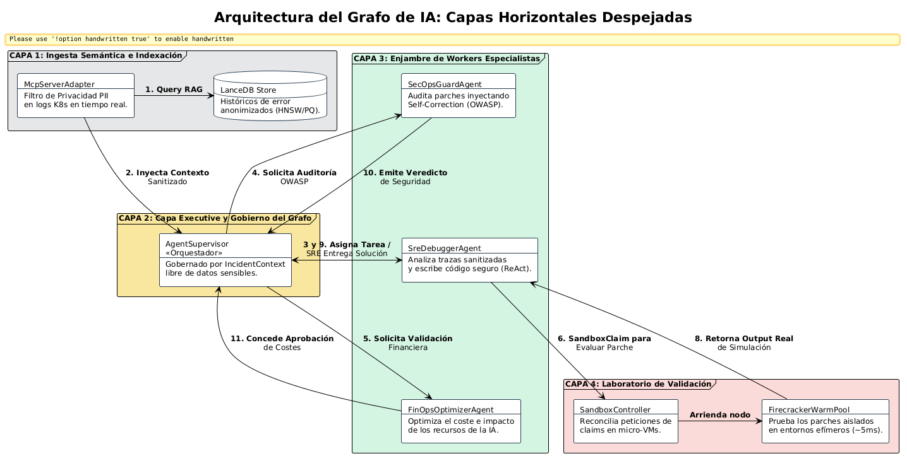
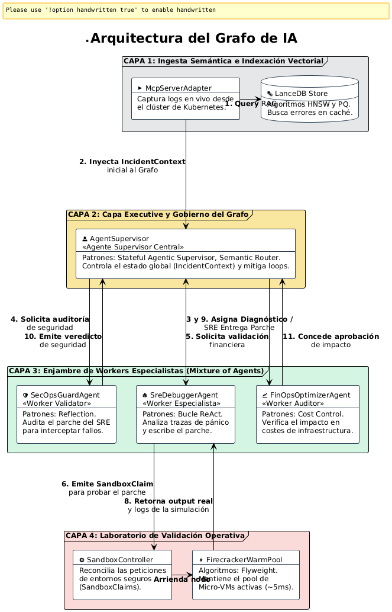

# 🤖 Plataforma AI-Ops Autónoma: ai_sandbox_pulumi

Plataforma de ingeniería de plataformas y automatización cognitiva de infraestructura diseñada bajo los principios de **Clean Architecture**, **Sistemas Agénticos Autónomos (MoA)** y **Self-Healing Declarativo**. El sistema intercepta anomalías en clústeres de Kubernetes en tiempo real, debate la solución mediante un enjambre de agentes y valida los parches en micro-VMs efímeras antes de sincronizar el estado inmutable mediante **Pulumi TypeScript & Pulumi ESC**.

---

## 🏗️ Arquitectura del Sistema por Niveles

El proyecto se estructura verticalmente en 5 capas cognitivas aisladas para garantizar alta concurrencia, inmutabilidad y seguridad zero-trust:


<!-- ==============================================================================
     BLOQUE AISLADO 1: ARQUITECTURA GLOBAL
     ============================================================================== -->

  <div class="image-lens-wrapper">
    <p align="center">
    <a href="./images/arquitectura_global.png" target="_blank" title="Haz clic para ampliar con lupa nativa">
      
    </a>
  </p>
  </div>
  
  
  
* **Nivel 1: Capa de Configuración (IaC / GitOps)** 
  * *Componentes:* Pulumi TypeScript Engine & Pulumi ESC.
  * *Función:* Sincroniza y muta de forma declarativa el estado de producción frente al backend de estado inmutable (`~/.pulumi JSON`).
* **Nivel 2: Capa de Inteligencia Artificial (Multi-Agent)**
  * *Componentes:* Stateful Agent Supervisor (LangGraph/Asyncio), LanceDB Vector Store, Enjambre Workers (SRE, SecOps, FinOps).
  * *Función:* Dirección ejecutiva del incidente, consulta RAG de baja latencia y bucles de reflexión/autocorrección cognitiva.
* **Nivel 3: Capa de Contexto y API del Plano de Control**
  * *Componentes:* Kubernetes MCP Server (Model Context Protocol) & Sandbox CRD Operator.
  * *Función:* Traduce métricas físicas a contexto semántico para la IA y procesa las reclamaciones de entornos virtuales seguros.
* **Nivel 4: Capa de Aplicación Observada (Pods Residentes)**
  * *Componentes:* App Microservice, App Web Frontend, OpenTelemetry Watchdog.
  * *Función:* Cargas de trabajo de producción observadas activamente; origen de las alertas de fallo (`CrashLoopBackOff`).
* **Nivel 5: Capa de Aislamiento Seguro (Micro-VMs Efímeras)**
  * *Componentes:* Firecracker WarmPool Manager & Isolated Micro-VM (Kata Runtimes).
  * *Función:* Laboratorio de pruebas protegido. Inicializa un nodo idéntico a producción en menos de 5ms para ejecutar el parche de la IA sin riesgo de contaminación.

---

## ⚡ Patrones de Diseño y Alto Rendimiento Implementados

### 1. Patrones de IA Avanzados
* **Stateful Agentic Supervisor:** Centraliza la lógica en un grafo dirigido de estados. El objeto `IncidentContext` pasa de forma síncrona/asíncrona entre agentes reteniendo el historial de pensamiento.
* **Multi-Agent Reflection & Self-Correction:** El agente de seguridad (`SecOpsGuardAgent`) audita el parche del SRE bajo estándares OWASP Top 10 para LLMs. Si detecta riesgos o fugas de **PII**, inyecta una alerta de feedback al grafo obligando al SRE a corregir el código en caliente.
* **Semantic Router:** Utiliza embeddings matemáticos de baja latencia. Si el error ya ocurrió en el pasado, aplica la solución directamente de LanceDB, reduciendo el coste de tokens de inferencia a cero.

### 2. Patrones de Diseño & Cloud
* **Saga Orchestrator Pattern:** Coordina las transacciones distributivas de infraestructura. Si un despliegue final en Pulumi falla, la Saga ejecuta acciones compensatorias automáticas para hacer rollback al último estado seguro.
* **Lock-Free Object Pool (WarmPool):** Estructura circular no bloqueante synchronizada por hardware (*Compare-And-Swap*) que arrienda Micro-VMs Firecracker compartiendo memoria base (*Flyweight Pattern*) para lograr un arranque inmediato de 5ms.
* **Backpressure Control:** Integrado en los canales gRPC reactivos del servidor MCP. Ante caídas en cascada del clúster, frena dinámicamente la tasa de ingesta para evitar desbordamientos de memoria en la capa de IA.

---


## 🏗️ Vista de dinámica

<!-- ==============================================================================
     BLOQUE AISLADO 2: VISTA DINÁMICA
     ============================================================================== -->
  
  <div class="image-lens-wrapper">
    <p align="center">
    <a href="./images/ai-ops-sandbox-vista-dinamica.png" target="_blank" title="Haz clic para ampliar con lupa nativa">
      
    </a>
  </p>
  </div>
  
---


## 📂 Estructura Limpia del Proyecto

El código fuente se organiza siguiendo estrictamente principios **SOLID**, garantizando que el núcleo del negocio no dependa de frameworks externos:

```text
ai_sandbox_pulumi/
├── ⚙️ .github/
│   └── 🚀 workflows/          # Pipelines de CI/CD para automatización de pruebas y linters.
├── 🌐 config/                 # Manifiestos de red y políticas de seguridad para clústeres.
├── 📝 docs/                   # Especificaciones, diagramas de arquitectura y especificaciones de prompts.
├── 🧪 tests/                  # Suite de Aseguramiento de Calidad (Quality Assurance).
│   ├── 🔗 integration/        # Pruebas integrales de extremo a extremo frente a entornos reales.
│   └── 🧩 unit/               # Pruebas unitarias que aíslan los LLM a través de mocks estrictos.
│
├── 📂 src/                    # Código fuente principal de la aplicación AI-Ops.
│   │
│   ├── 🏛️ core/               # CAPA 1: DOMINIO PURO (Reglas de software inmutables - SOLID)
│   │   ├── 🔹 __init__.py     # Inicializador del módulo core.
│   │   ├── 🔹 entities.py     # Modelos de datos de incidentes validados en runtime (Pydantic).
│   │   └── 🔹 interfaces.py   # Contratos abstractos estructurales y Duck Typing (Python Protocols).
│   │
│   ├── ⚙️ use_cases/          # CAPA 2: CASOS DE USO (Lógica pura de orquestación de la aplicación)
│   │   ├── 🔹 __init__.py     # Inicializador del módulo de casos de uso.
│   │   └── 🔹 self_healing.py # Coordinador asíncrono de la transacción distribuida Saga.
│   │
│   └── 🔌 infrastructure/     # CAPA 3: ADAPTADORES (Frameworks, SDKs y librerías externas)
│       ├── 🔹 __init__.py     # Inicializador del módulo de infraestructura.
│       ├── 🧠 ai/             # Enjambre cognitivo e Inteligencia Artificial.
│       │   ├── 🔸 __init__.py # Inicializador de la suite cognitiva.
│       │   ├── 🔸 agents.py   # SecOps Advanced Agent (Guardrail OWASP + Anonimizador PII).
│       │   ├── 🔸 memory.py   # Persistencia Vectorial en LanceDB (Búsquedas SIMD HNSW).
│       │   └── 🔸 supervisor.py # Demonio Orquestador Central (Grafo Dirigido/Stateful Graph).
│       │
│       ├── 📦 k8s_runtime/    # Adaptadores para el Plano de Control de K8s y Sandboxes (Firecracker).
│       └── ☁️ pulumi/         # Automatización de Infraestructura como Código (Pulumi Automation API).
│
├── 📦 pyproject.toml          # Manifiesto industrial centralizado (Poetry, Ruff, Mypy Strict).
├── 🚀 main.py                 # Punto de entrada asíncrono nativo (asyncio application app loop).
└── 📖 README.md               # Manual de ingeniería, arquitectura y despliegue del sistema.
                 # Punto de entrada asíncrono nativo (asyncio engine loop)
```
---


## 🏗️ Vista de lógica

<!-- ==============================================================================
     BLOQUE AISLADO 2: VISTA Lógica
     ============================================================================== -->
  
  <div class="image-lens-wrapper">
    <p align="center">
        <a href="./images/ai-ops-sandbox-vista-logica.png" target="_blank" title="Haz clic para ampliar con lupa nativa">
            
        </a>
    </p>
  </div>
  
---

## 🏗️ ARQUITECTURA DE IA

<!-- ==============================================================================
     BLOQUE AISLADO 4: ARQUITECTURA DE IA
     ============================================================================== -->

  <div class="image-lens-wrapper">
       <p align="center">
        <a href="./images/ai-ops-sandbox-arquitectura-global-2.png" target="_blank" title="Haz clic para ampliar con lupa nativa">
            
        </a>
    </p>
    
    
  </div>
  
---

## 🚀 Guía de Instalación y Desarrollo

### Requisitos Previos
* Python 3.12 o superior.
* Poetry (Gestor de entornos y paquetes).
* Pulumi CLI configurado con acceso a tu cuenta/backend.

### 1. Inicializar el Entorno e Instalar Dependencias
Instala el ecosistema completo junto con las herramientas de verificación estricta (**Ruff** para linter de alta velocidad en Rust y **Mypy** para validación estática de tipos):
```bash
poetry install
```

### 2. Ejecutar la Suite de Calidad (Verificación Estricta)
Antes de levantar el daemon asíncrono, el código debe superar el control de tipado zero-trust y formato:
```bash
# Ejecutar verificación de tipos estáticos
poetry run mypy src

# Ejecutar formateador y linter automatizado
poetry run ruff check src --fix
```

### 3. Lanzar la Plataforma Autónoma
Inicia el bucle reactivo de eventos asíncronos para comenzar a escuchar incidentes en tu clúster de Kubernetes:
```bash
poetry run python main.py
```
---

> ⚠️ **ESTADO DEL PROYECTO: Proof of Concept (PoC) / Prueba de Concepto**
> Este repositorio es una PoC técnica diseñada para validar la viabilidad de la autoreparación de infraestructura mediante sistemas agénticos avanzados. Se requiere auditoría corporativa de las políticas de aislamiento.


<p align="center">
  <sub><b>Ecosistema AI-Ops Autónomo • Prueba de Concepto (PoC)</b></sub><br>
  <sub><b>Autor:</b> Edith Barrientos 💻</sub><br>
  <sub><b>Año:</b> 2026 🚀</sub>
</p>