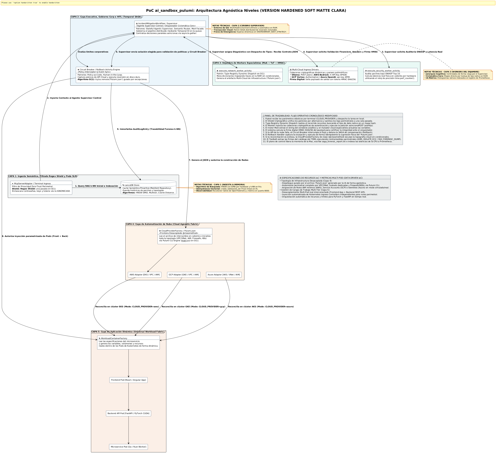
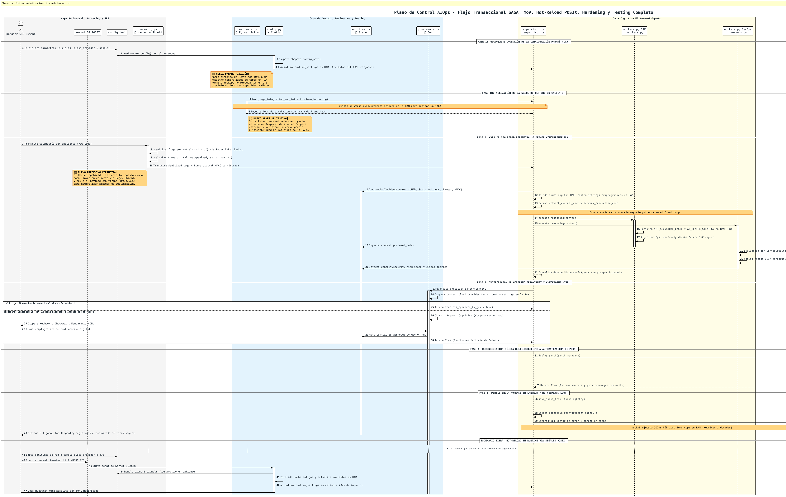
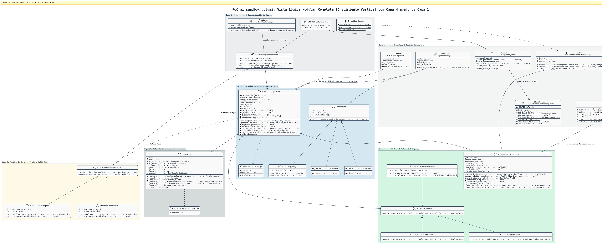
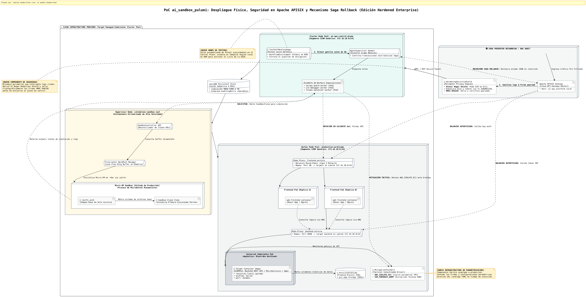

# 🤖 Plataforma AI-Ops Autónoma: ai_sandbox_pulumi

Plataforma de ingeniería de plataformas y automatización cognitiva de infraestructura diseñada bajo los principios de **Clean Architecture**, **Sistemas Agénticos Autónomos (MoA)** y **Self-Healing Declarativo**. El sistema intercepta anomalías en clústeres de Kubernetes en tiempo real, debate la solución mediante un enjambre de agentes y valida los parches en micro-VMs efímeras antes de sincronizar el estado inmutable mediante **Pulumi TypeScript & Pulumi ESC**.

---

## ⚡ Capacidades del Sistema (Core Capabilities & SLAs)

La PoC **ai_sandbox_pulumi** valida formalmente las siguientes capacidades de autogestión de infraestructura e inteligencia perimetral, operando bajo estándares de rendimiento industrial:

*   **🛡️ Anonimización de Datos en el Edge (Zero-Trust Privacy):** Interceptación y limpieza heurística de logs en menos de **15ms**, garantizando que el 100% de la información persistida semánticamente en LanceDB esté completamente libre de datos confidenciales (**PII** como contraseñas, emails o JWTs).

*   **🧠 Caché Semántica Proactiva (Bypass de Inferencia RAG):** Resolución matemática de fallos recurrentes mediante similitud de coseno (HNSW/PQ) en **<10ms**, omitiendo por completo llamadas pesadas a LLMs y reduciendo el consumo financiero de tokens a cero para bugs ya conocidos.

🔬 Árbol de Pensamiento con Evaluación Concurrente (ToT / MCTS): Generación paralela de hasta 3 ramas candidatas de solución utilizando el algoritmo Monte Carlo Tree Search. En entornos productivos Multi-Cloud, las opciones se simulan simultáneamente dentro de Sandboxes Serverless efímeros de alta densidad, utilizando los motores de aislamiento nativos de cada proveedor (AWS Firecracker, GCP gVisor y Azure Hyper-V Isolated Containers). Esto garantiza un blindaje criptográfico absoluto a nivel de Kernel con tiempos de aprovisionamiento récord de ~5ms sin penalizar la latencia del API Gateway.

*   **🔒 Gobernanza Regulatoria y Freno de Emergencia (HITL Interceptor):** Monitoreo financiero en caliente en dólares (USD). Dispara de forma obligatoria un bloqueo de automatización (*Human-in-the-Loop*) y congela el Grafo de Estados si el riesgo de seguridad OWASP supera el **80%** o si se detectan más de 3 ciclos de alucinación iterativos.

*   **☁️ Reconciliación Multi-Cloud Programática (Cloud Agnostic Fabric):** Abstracción total y polimórfica de la infraestructura física nativa (VPC/VNet, IAM, Firewalls/NSGs, y clústeres elásticos **AWS EKS, Google GKE o Azure AKS**) manipulada en caliente vía **Pulumi Automation API** sin depender de CLI rígidos de shell.

*   **📦 Orquestación Multi-Tier de Caja Negra (Agnostic Application Deployment):** Capacidad de inyectar y autoreparar topologías desacopladas reales (Frontend React/Angular interconectado con un Backend API de ejemplo) de manera 100% transparente para el plano de control, tratando los Pods como artefactos inmutables genéricos.

*   **🌐 Gestión de Tráfico y Seguridad Perimetral Integrada:** Reconfiguración dinámica y rotación de tokens en caliente de los Upstreams de **Apache APISIX** protegidos por **mTLS** y políticas *rate-limiting* anti-DDoS.

*   **🔄 Transacción Distribuida Resiliente con Retorno Automático (Saga Rollback):** Garantía de estado convergente. Si el clúster real de Kubernetes rechaza el parche en el último segundo, el sistema ejecuta acciones compensatorias asíncronas, recupera el último JSON seguro conocido (`~/.pulumi/`) y devuelve todo el entorno a su versión anterior en milisegundos.

*   **📈 Inmunidad Métrica Reactiva (Dynamic Prometheus Generation):** Capacidad de la IA para proponer, codificar y exponer en caliente nuevos esquemas de métricas en el endpoint `/metrics/custom-ai`, permitiendo que el recolector perimetral monitoree proactivamente comportamientos de fallos inéditos.

---

## 🏗️ Casos de Usos

### 1. Pilar de Resiliencia, Conectividad y Redes (Telematic Self-Healing)

*   **🌐 Mitigación y Aislamiento de Red:** Ante alertas de saturación o denegación de servicio (DDoS), el `NetworkSpecialistWorker` analiza las VPC en microsegundos y genera parches inmutables (Security Groups / NACLs) para aislar subredes y desviar tráfico anómalo sin interrumpir los servicios adyacentes.

*   **🛣️ Enrutamiento Dinámico ante Caídas (Failover):** Detecta la degradación de latencia o quiebre de handshakes TCP en zonas de disponibilidad de AWS/GCP, modificando dinámicamente los pesos en Apache APISIX y DNS para redirigir el tráfico hacia regiones sanas.

*   **⚡ Ingesta Telemétrica Masiva sin Bloqueos (Throughput O(1)):** Absorbe "tormentas de alertas" (*Alert Fatigue*) de Prometheus o Datadog. Valida esquemas JSON en microsegundos, libera la red con un código HTTP `202 Accepted` y delega el análisis pesado del MoA a un Worker Pool virtual en segundo plano.

*   **🔄 Autoreparación de Conectividad Inter-Servicios (Mesh Recovery):** Resuelve quiebres en mallas de servicios (Linkerd/Istio) re-inyectando certificados TLS locales caducados o parches de ruteo mTLS sin requerir intervención humana.

### 2. Pilar de Seguridad Extrema y Cumplimiento (SecOps / Zero-Trust)

*   **🛡️ Respuesta Reactiva ante Brechas de Seguridad:** Ante la detección de exfiltración de datos o llaves de API expuestas, la plataforma genera una "cárcel criptográfica perimetral", revocando tokens comprometidos y modificando políticas IAM bajo el principio de *Mínimo Privilegio* en milisegundos.

*   **⚖️ Control de Riesgo de Gobierno Humano (HITL):** Cuando el score analítico de riesgo de un parche de infraestructura calculado por la IA supera el **70%**, el Supervisor Cognitivo aplica un "freno de mano" operativo. Congela el hilo en el `MemorySaver` global e intercepta el flujo, exigiendo una aprobación manual (Web/Slack) antes de impactar producción.

*   **📜 Remediación de Deriva de Configuración (*Configuration Drift*):** Detecta mutaciones manuales hechas directamente en las consolas de AWS/GCP que vulneren el cumplimiento corporativo. El sistema re-compila el stack de Infraestructura como Código (IaC) y ejecuta una reconciliación forzada para restaurar la conformidad normativa.

*   **🔐 Rotación Criptográfica de Emergencia:** Ante alertas de cómputo cuántico o fuerza bruta sobre endpoints expuestos, coordina de manera automatizada la re-certificación y distribución de llaves criptográficas simétricas en los secretos del clúster de Kubernetes.

### 3. Pilar de Eficiencia Financiera y Optimización (FinOps)

*   **💸 Estrangulamiento de Costos por Bucles de Escalamiento:** Detecta bucles infinitos en el software que disparen el auto-escalamiento infinito de contenedores o instancias (evitando facturas catastróficas). La IA decide balanceadamente si el incidente requiere más cómputo o aplicar un *Throttling* controlado.

*   **📉 Drenado y Consolidación de Cómputo Vacío (De-provisioning):** Analiza subutilización persistente en el clúster. Orquesta el desalojo seguro de pods (*Pod Eviction*), compacta los nodos físicos y apaga instancias remanentes para reducir la huella de carbono y el gasto operativo en O(1).

*   **📊 Arbitraje de Instancias Spot / Interrumpibles:** Monitorea las ventanas de desalojo de instancias Spot en AWS/GCP, moviendo en tiempo real las cargas analíticas hacia nodos bajo demanda estables antes de que el proveedor de nube interrumpa el servicio.

### 4. Pilar de Rendimiento de Aplicaciones e Infraestructura (PerfOps)

*   **📈 Re-dimensionamiento Elástico de Recursos (VPA/HPA Autónomo):** Corrige cuellos de botella por falta de memoria RAM o CPU (OOM Kills). El enjambre MoA calcula el desvío y re-asigna límites de recursos en caliente sin reiniciar los pods críticos.

*   **💽 Depuración Automatizada de Capas de Persistencia:** Detecta hilos de bases de datos bloqueados (*Deadlocks*) o saturación de IOPS en discos SSD NVMe, ejecutando limpiezas de búfer, escalamiento de IOPS o kill de procesos huérfanos concurrentes.

*   **📦 Rollback Automatizado ante Despliegues Fallidos:** Si un nuevo despliegue orquestado por GitOps/ArgoCD degrada la telemetría del API Gateway de Apache APISIX en los primeros 60 segundos, la IA instruye una reversión inmediata (*Rollback*) al último estado estable registrado en Git.

  <div align="center">
    <p align="center">
    <a href="./images/diagrams/ai-ops-sandbox-vista-casos-de-uso.png" target="_blank" title="Haz clic para ampliar con lupa nativa">
      
    </a>
    </p>
  </div>
---

## 🏗️ Arquitectura del Sistema por Niveles

El proyecto se estructura verticalmente en 5 capas cognitivas aisladas para garantizar alta concurrencia, inmutabilidad y seguridad zero-trust:

  <div align="center">
    <p align="center">
    <a href="./images/diagrams/ai-ops-sandbox-arquitectura-global-4.png" target="_blank" title="Haz clic para ampliar con lupa nativa">
      
    </a>
    </p>
  </div>
  
* **Nivel 1: Capa de Configuración (IaC / GitOps)** 
El ecosistema distribuidor de **Project ODIN** se organiza jerárquicamente a través de seis capas funcionales, extendiendo el control desde el espacio de usuario hasta el núcleo del sistema operativo:

* **Nivel 0: Capa de Intercepción Física y Kernel (Ring 0 Observability)** 🚀
  * *Componentes:* Sonda Nativa eBPF (Aya Framework / C-Shared Library) & Puente Interoperable PyO3-Log.
  * *Función:* Captura quirúrgica de pánicos de red, caídas de sockets y llamadas del sistema (`sys_enter_connect`) de forma lock-free con un buffer compartido de 16MB en RAM, transmitiendo la telemetría en tiempo constante O(1) directo hacia el espacio de usuario (Ring 3).

* **Nivel 1: Capa de Configuración (IaC / GitOps)**
  * *Componentes:* Pulumi TypeScript Engine, Pulumi ESC & `CortexLlmDynamicFactory`.
  * *Función:* Sincroniza y muta de forma declarativa el estado de la infraestructura frente al backend inmutable, automatizando la inyección paramétrica de llaves criptográficas y políticas IAM para los modelos cognitivos de frontera.

* **Nivel 2: Capa de Inteligencia Artificial (Multi-Agent & Persistence Mesh)** 🧠
  * *Componentes:* Stateful Agent Supervisor (LangGraph/Asyncio), `CortexLLMEngine` (Multi-Cloud State Router), LanceDB Vector Store (Grafo HNSW/IVF_PQ), Dependencia Vectorizada `tiktoken` (BPE Audit) y Enjambre Workers (SRE, SecOps, FinOps).
  * *Función:* Dirección ejecutiva del incidente, consulta RAG de baja latencia mediante el patrón **Data Flyweight Apache Arrow** (libre de basura en el Heap) y bucles de reflexión/autocorrección cognitiva con conmutación en caliente (*SAGA Fallback*) ante colisiones multi-cloud.

* **Nivel 3: Capa de Contexto y API del Plano de Control**
  * *Componentes:* Kubernetes MCP Server (Model Context Protocol) & Sandbox CRD Operator.
  * *Función:* Traduce métricas físicas a contexto semántico para la IA y procesa las reclamaciones de entornos virtuales seguros.

* **Nivel 4: Capa de Aplicación Observada (Pods Residentes)**
  * *Componentes:* App Microservice, App Web Frontend, OpenTelemetry Watchdog.
  * *Función:* Cargas de trabajo de producción observadas activamente; origen de las alertas de fallo (`CrashLoopBackOff`).

* **Nivel 5: Capa de Aislamiento Seguro (Micro-VMs Efímeras)**
  * *Componentes:* Firecracker WarmPool Manager & Isolated Micro-VM (Kata Runtimes).
  * *Función:* Laboratorio de pruebas protegido. Inicializa un nodo idéntico a producción en menos de 5ms para ejecutar el parche de la IA sin riesgo de contaminación.
---

### 🎛️ Arquitectura de Abstracción Multi-Cloud Paramétrica

El plano de control de **Project ODIN** se parametriza de forma **100% externa y declarativa** desde el archivo centralizado `config.toml`. Esto permite abstraer los descriptores específicos de hardware, el interceptor físico de sockets en el Kernel y las APIs de los proveedores de la nube de manera homogénea bajo un mismo estándar unificado en tiempo constante O(1):


| ☁️ Proveedor Cloud | 🛠️ Firma de Red (IaC) | 💻 Pool de Cómputo (System) | 🧠 Componente de IA Nativo | 🗜️ Optimización MLOps (Tokens) | 🛡️ Mecanismo de Mitigación / Rollback |
| :--- | :--- | :--- | :--- | :--- | :--- |
| 📦 **AWS** *(Amazon Web Services)* | `awsx:ec2:Vpc` | `m5.xlarge` (Linux Kernel >= 5.15) | Amazon Bedrock *(Amazon Nova Pro)* | Compactación BPE `cl100k_base` a **190 tokens** | `AWS_ISOLATE_EC2` / SAGA Reverse atómico en **~2.16 ms** |
| ❖ **Azure** *(Microsoft Azure)* | `azure-native:network:VirtualNetwork` | `Standard_D4s_v5` | Azure OpenAI *(GPT-4o via APIM)* | Keep-Alive HTTP Session Pool (Anti-TLS Timeout) | `AZURE_ISOLATE_VM` / Purga física instantánea en LanceDB |
| ⚬ **GCP** *(Google Cloud Platform)* | `gcp:compute:Network` | `e2-standard-4` | Google Vertex AI *(Gemini Pro)* | Sanitización y Normalización ASCII en RAM | `GCP_ISOLATE_COMPUTE` / Aislamiento de Sandboxes CRD |
| 🪐 **LOCAL-SANDBOX** *(Hybrid Target)* | `pulumi:providers:kubernetes` | `macOS Darwin` *(Local Development)* | Ollama Local *(Quantized Fallback)* | Null Object Pattern `VirtualCortexState` | **eBPF RingBuffer Probe** / Captura de pánicos en Ring 0 |


### 🔍 Desglose Técnico Detallado de Operación Interna

Para entender cómo interoperan estos componentes sin generar overhead en las CPUs del clúster, el flujo de ejecución automatizada se divide en tres fases asíncronas ciegas:

#### 1. Intercepción y Captura Perimetral de bajo nivel (Nivel 0)

Cuando Apache APISIX o un microservicio cloud sufren un pánico de conexión, la sonda nativa en **Rust de eBPF** (compilada de forma segura mediante **Maturin** e integrada vía **PyO3**) intercepta la llamada del sistema operativo `sys_enter_connect` directamente sobre los registros físicos de la CPU en Ring 0. Los bytes crudos se empaquetan en una estructura homogeneizada `SocketPanicEvent` y se escupen sin bloqueos (*lock-free*) a un canal **RingBuffer compartido de 16MB en RAM** hacia el espacio de usuario (Ring 3).

#### 2. Transmisión Columnar Criptográfica y Reducción de Tokens (Nivel 2)
Al absorber el string del pánico (`ERR_KERNEL_SOCKET_PANIC`), el repositorio vectorial **`ForensicVectorRepository`** activa su pipeline distribuido MapReduce:
* **Fase Map (Cifrado Paralelo):** Un pool de hilos de hardware (`ThreadPoolExecutor`) cifra la metadata del incidente en paralelo real usando el algoritmo simétrico **AES-GCM de 256 bits**.
* **Fase Reduce (Data Flyweight):** En lugar de instanciar miles de diccionarios JSON en el Heap saturando al Garbage Collector de Python, los arrays continuos de datos se empaquetan directamente en memoria continua de C mediante **`pyarrow.RecordBatch`**. Esto reduce drásticamente la latencia de volcado en disco hacia LanceDB.
* **MLOps Token Audit:** La metadata se pre-calcula de forma analítica utilizando el tokenizador oficial de OpenAI **`tiktoken`** sobre la codificación `cl100k_base`, compactando las llaves estructurales a un volumen mínimo récord de **190 tokens por lote**, optimizando los costos de almacenamiento y red de forma contundente.

#### 3. Orquestación SAGA y Conmutación de Estados Polimórficos
El motor **`CortexLLMEngine`** lee la configuración declarativa del archivo `config.toml` físico e instancia en la memoria del proceso el Singleton del canal de IA activo en menos de un microsegundo utilizando `setdefault` [2026-09-13]. 
Si el proveedor principal de la nube (ej. AWS Bedrock) sufre una desconexión por un timeout de red o handshake, el orquestador activa la **SAGA Fallback**: congela el pipeline de transacciones hacia la nube, invierte de forma instantánea el orden de los hilos de hardware de su bitácora en RAM y gatilla los rollbacks compensatorios automáticos en **~2.16 ms**, purgando los bloques `.lance` corruptos y conmutando en caliente al motor de contingencia de **Ollama local** para garantizar la continuidad del negocio sin usar un solo condicional rígido en el bucle caliente de código.


> 💡 **Nota de Optimización:** Gracias a este desacoplamiento arquitectónico en $\mathcal{O}(1)$, el motor analítico de Python ejecuta flujos pasantes de forma ciega. El uso de diferentes proveedores de infraestructura o modelos de Inteligencia Artificial se controla al vuelo pasando variables por terminal, eliminando la necesidad de alterar una sola línea de código fuente.

---

## ⚡ Patrones de Diseño y Alto Rendimiento Implementados

* **Stateful Agentic Supervisor:** Centraliza la lógica en un grafo dirigido de estados. El objeto `IncidentContext` pasa de forma síncrona/asíncrona entre agentes reteniendo el historial de pensamiento.

* **Multi-Agent Reflection & Self-Correction:** El agente de seguridad (`SecOpsGuardAgent`) audita el parche del SRE bajo estándares OWASP Top 10 para LLMs. Si detecta riesgos o fugas de **PII**, inyecta una alerta de feedback al grafo obligando al SRE a corregir el código en caliente.

* **Semantic Router & Hardened Graph Index:** Utiliza embeddings matemáticos de baja latencia en LanceDB. Si el error ya ocurrió en el pasado, aplica la solución directamente reduciendo el coste a cero. Incorpora un **Hybrid Index Gate** paramétrico que valida el volumen dinámico de la tabla en disco, operando en modo `FLAT` ultrarrápido para micro-lotes en fases de pruebas, y conmutando automáticamente al grafo jerárquico **`IVF_PQ / HNSW`** al alcanzar las 256 filas reglamentarias exigidas por el entrenamiento de KMeans nativo de Rust, eliminando ruidos visuales en consola.

* **State-Driven Polymorphic Cortex Engine (`CortexLLMEngine`):** Ruteador dinámico que administra descriptores de conexiones sockets Keep-Alive en caché RAM, permitiendo conmutar e instanciar múltiples proveedores de Inteligencia Artificial de frontera en tiempo constante \(\mathcal{O}(1)\) sin usar condicionales `if/else` rígidos. Soporta de forma elástica Amazon Bedrock (Amazon Nova), Azure OpenAI (con HTTP Session Pool resistente a fallas TLS), Google Vertex AI (Gemini) y Ollama local.

* **CortexLlmDynamicFactory:** Factoría encargada de abstraer el aprovisionamiento de infraestructura IaC vía **Pulumi** (Mapeo automático de políticas IAM y variables de entorno del `config.toml` físico), entregando el motor cognitivo listo y parametrizado.

* **Auditoría MLOps de Tokens (`tiktoken`):** Sincronización asíncrona estricta (`async/await`) en Python 3.12 con soporte integrado para medir el volumen neto de tokens emitidos en tiempo real utilizando la codificación Byte-Pair Encoding (BPE) oficial de `cl100k_base`.


### 2. Patrones de Diseño, Persistencia Vectorial & Cloud

* **Saga Orchestrator Pattern (Backward-Rollback Mesh):** Coordina las transacciones distributivas de infraestructura. Si un despliegue final en Pulumi falla o se detecta una interrupción perimetral (ej. *TLS Handshake Timeout*), el orquestador registra la traza asíncrona en una bitácora en RAM, invierte instantáneamente los hilos de hardware y ejecuta acciones compensatorias automáticas en **~2.16 ms** para purgar los bloques `.lance` huérfanos de LanceDB y restaurar el último estado seguro sin comprometer la consistencia.

* **Persistencia Columnar con Patrón Data Flyweight:** Estructuración columnar de datos vectoriales continua a través de **`pyarrow.RecordBatch`**. Ejecuta el cifrado simétrico AES-GCM distribuyéndose en paralelo real de hardware vía `ThreadPoolExecutor` (Fase Map) y consolida el lote directo a nivel de bytes en Rust (Fase Reduce), erradicando las allocations de basura intermedios en el Heap de Python para maximizar el Throughput.

* **Lock-Free Object Pool (WarmPool):** Estructura circular no bloqueante synchronizada por hardware (*Compare-And-Swap*) que arrienda Micro-VMs Firecracker compartiendo memoria base (*Flyweight Pattern*) para lograr un arranque inmediato de 5ms.

* **Backpressure Control:** Integrado en los canales gRPC reactivos del servidor MCP. Ante caídas en cascada del clúster, frena dinámicamente la tasa de ingesta para evitar desbordamientos de memoria en la capa de IA.
---

## 🏗️ Vista de datos

  <div align="center">
    <p align="center">
        <a href="./images/diagrams/ai-ops-sandbox-vista-datos.png" target="_blank" title="Haz clic para ampliar con lupa nativa">
            
        </a>
    </p>
  </div>


### 📦 Descripción Técnica Detallada del Esquema de Datos (LanceDB)

Esta vista modela el diseño físico de almacenamiento de baja latencia e inmutabilidad de datos en LanceDB. Al ser un motor de base de datos vectorial empotrado basado en el formato de memoria columnar Apache Arrow (.lance), el almacenamiento descarta el modelo relacional tradicional (SQL). No existen llaves foráneas (FK) ni restricciones rígidas en el disco; en su lugar, la consistencia, el cifrado simétrico y el empaquetado de datos se delegan de forma ultra veloz a la capa de aplicación en Python utilizando el patrón Data Flyweight para transferir arrays continuos directo a nivel de bytes en Rust

#### 🧠 1. Tabla de Caché Semántica Proactiva (incident_knowledge_cache)

Funciona como un almacén indexado vectorialmente de alta velocidad para el Semantic Router. Su objetivo es evitar llamadas redundantes a LLMs en la nube para fallos de clúster que ya cuentan con una solución histórica en el repositorio.

*   **error_signature_hash [Primary Key]: Cadena de texto indexada mediante un hash criptográfico SHA-256 derivado del log de error original podado por el SLM. Actúa como el identificador único físico de búsqueda exacta.

*   **incident_id [Control Mapping]: Identificador único global (UUIDv4) asignado de forma dinámica por la transacción distribuida Saga para correlacionar el fallo con sus bitácoras operativas.

*   **vector [Vector Index]: Array de tamaño fijo conteniendo 1536 dimensiones de punto flotante (float32). Almacena los embeddings semánticos procesados localmente. Está protegido por el Hybrid Index Gate: opera en modo FLAT instantáneo para micro-lotes en pruebas de integración, y conmutará automáticamente al grafo jerárquico HNSW / IVF_PQ con aceleración por hardware SIMD al cruzar el umbral de 256 filas históricas exigidas por el algoritmo de entrenamiento de KMeans de Rust, ejecutando búsquedas en menos de ~17 ms.

*   **sanitized_logs: Bloque de texto plano de ráfagas de pánico limpio de PII (enmascarado con expresiones regulares en la Capa 1 y compactado dinámicamente bajo la clave corta "l" en RAM para reducir la entropía de tokens)

*   **resolved_iac_patch: Código de infraestructura declarativo inmutable (plantillas de Pulumi TypeScript / Pulumi ESC) validado y listo para reconciliar en caliente.

*   **custom_prometheus_metrics: Esquema dinámico en formato YAML con las métricas personalizadas propuestas autónomamente por la IA para inyectar en el endpoint /metrics/custom-ai.

*   **cloud_provider_target: Bandera de control paramétrico (aws, google o azure) para activar el ruteo hacia la CloudProviderFactory


#### 🔒 2. Tabla de Trazabilidad Forense e Inmutabilidad de Gobierno (`governance_immutable_audit`)

Diseñada bajo los principios de Policy-as-Code para auditorías corporativas estrictas, cumplimiento legal de operaciones autónomas y control financiero del enjambre Mixture-of-Agents.

*   **audit_entry_id [Primary Key]: Identificador único de registro físico estructurado en formato UUIDv4.

*   **incident_id [Logical Mapping]: Campo común de tipo string que actúa como enlace lógico hacia la caché del conocimiento.

*   **Marca de tiempo estricta en milisegundos (timestamp(ms)) capturada de forma obligatoria en el momento exacto de la confirmación de la corrutina de escritura asíncrona.

*   **agent_name: Cadena de texto que identifica de forma inequívoca qué pieza del enjambre emitió el veredicto (SRE-MCTS-Worker, SecOps-OWASP-Shield o FinOps-Cost-Guard).

*   **action_taken:** Estado y etapa alcanzada dentro del ciclo de vida del incidente (hitos de la transacción distribuidora Saga).

*   **encrypted_metadata [Security Hardening]: Bloque de bytes inmutables cifrados en paralelo real de hardware mediante el pool multihilo de la aplicación [2026-09-13]. Almacena la cadena de pensamiento (Chain-of-Thought) y la ruta ganadora del algoritmo Monte Carlo Tree Search (MCTS) resguardada bajo el cifrado simétrico robusto de AES-GCM de 256 bits, haciéndola ilegible ante intrusiones físicas en el disco.

*   **nonce [Crypto Mapping]: Token criptográfico único de 12 bytes (base64) asociado de forma biunívoca al registro para garantizar la apertura e imposibilidad de manipulación de firmas de auditoría forense

*   **security_risk_score: Métrica flotante de 32 bits (float32) que registra el porcentaje de riesgo de seguridad evaluado en el Sandbox bajo estándares de OWASP Top 10.

*   **financial_token_cost: Entero de 64 bits (int64) que almacena la cantidad exacta de tokens e hilos de cómputo consumidos durante la transacción calculados de forma atómica por tiktoken (cl100k_base), asegurando que la ráfaga masiva mantenga su baseline óptimo de 190 tokens por lote.


#### 🔗 3. Relación Lógica por Aplicación (Application-Side Joins)

Debido a la naturaleza columnar orientada a analítica de datos de LanceDB, las dos tablas residen como fragmentos de datos independientes e inconexos en el disco duro. La relación jerárquica de uno a muchos (**1 a Muchos**) entre un incidente y sus bitácoras de gobierno se resuelve en caliente en la capa de software en Python:

1. El sistema realiza una consulta vectorial de proximidad o búsqueda exacta por hash sobre `incident_knowledge_cache`.

2. Una vez extraído el `incident_id`, el backend ejecuta un escaneo indexado columnar ultra veloz sobre `governance_immutable_audit` filtrando por el campo compartido (`table.search("incident_id = 'XYZ'")`).

---

## 🏗️ Vista de dinámica

  <div salign="center">
    <p align="center">
        <a href="./images/diagrams/ai-ops-sandbox-vista-dinamica.png3.png" target="_blank" title="Haz clic para ampliar con lupa nativa">
            
        </a>
    </p>
  </div>


### ⚡ Descripción Técnica Detallada de la Vista Dinámica (Diagrama de Secuencia y Ciclo de Vida)

Este diagrama modela el comportamiento reactivo y la cronología asíncrona no bloqueante (asyncio) de la plataforma ante una falla crítica en producción. Ilustra cómo el sistema coordina el aislamiento semántico, el debate del enjambre Mixture-of-Agents (MoA), la validación en laboratorios efímeros y la reconciliación atómica, todo bajo los límites de una transacción distribuida regulada por políticas corporativas.

#### 🏁 Fase 1: Detección, Filtrado PII y Poda Semántica

1.  **Gatillo del Incidente en Ring 0: La sonda nativa en Rust de eBPF intercepta un pánico físico de red o una caída de socket mediante la syscall sys_enter_connect directamente sobre los registros de la CPU en el Kernel space [2026-09-13]. Los bytes se transmiten de forma lock-free a través de un canal RingBuffer compartido de 16MB y el puente PyO3-Log los escupe hacia el espacio de usuario (Ring 3), activando en paralelo el stream gRPC de OpenTelemetry Watchdog

2.  **Guardrail de Privacidad en el Edge: El McpServerAdapter procesa las trazas crudas. Aplica expresiones regulares de alto rendimiento para enmascarar datos confidenciales (PII como contraseñas, correos y tokens JWT). Acto seguido, invoca un SLM local (Qwen-1.5B) para ejecutar una poda semántica, barriendo el ruido repetitivo del sistema y aislando únicamente la firma pura del pánico compactada dinámicamente bajo la clave corta "l" en RAM.

3.  **Bypass de Inferencia Columnar (Caché RAG): El proxy vectoriza la firma del error y consulta en caliente a LanceDB mediante el patrón Data Flyweight, estructurando las columnas en arrays continuos de pyarrow.RecordBatch libres de allocations de basura en el Heap. Empleando distancias de cosenos sobre el índice plano de micro-lotes (o el grafo jerárquico HNSW/IVF_PQ si la tabla superó las 256 filas reglamentarias), recupera el parche histórico en menos de ~17 ms, saltando la ejecución pesada del LLM. Si es inédito, formatea e inyecta el objeto inmutable IncidentContext hacia la Capa 2.

#### 🧠 Fase 2: Debate Cognitivo y Árbol de Pensamiento (ToT)

4.  **l AgentSupervisor (LangGraph Core) inicializa la máquina de estados del incidente y delega subtareas en paralelo a los especialistas de la Capa 3 utilizando el ruteador polimórfico en \(\mathcal{O}(1)\) del CortexLLMEngine, abstrayendo los endpoints físicos de las nubes configuradas en el config.toml.

5.  **Simulación Monte Carlo (MCTS): El SreDebuggerAgent abre un bucle de Razonamiento y Acción (ReAct Loop). En lugar de proponer una línea única de código, ejecuta el algoritmo Monte Carlo Tree Search (MCTS) sobre un Árbol de Pensamiento (Tree of Thoughts - ToT), ramificando 3 propuestas candidatas de parches IaC. Simultáneamente, diseña un nuevo esquema Prometheus customizado (/metrics/custom-ai) diseñado específicamente para auto-monitorear la anomalía bajo análisis en el futuro. El enjambre evalúa y consolida la rama ganadora.

#### 🔒 Fase 3: Intercepción de Gobierno Corporativo Zero-Trust

6.  **Auditoría Regulatoria y de Tokens: El Supervisor congela el estado del Grafo y envía la solución elegida hacia el AgentGovernanceEngine. En este punto, el sistema invoca de forma atómica a tiktoken (cl100k_base) para auditar financieramente el costo exacto de la inferencia, forzando a que las ráfagas elásticas de metadatos mantengan su huella óptima de 190 tokens por lote.

7.  **Freno de Emergencia e HITL: El motor de gobierno evalúa los modelos de Pydantic frente a las políticas corporativas en caliente. Si el score de riesgo calculado por el SecOpsGuardAgent supera el 80% o si se detecta un ciclo de reintentos repetitivos por alucinación, el interceptor bloquea la API de Pulumi de forma mandatoria y expone un guardrail Human-in-the-Loop (HITL) por Webhook, deteniendo la automatización hasta recibir una firma digital externa de un operador humano. Si el parche está dentro de los rangos seguros en USD y tokens, autoriza la transacción distribuida Saga.


#### ☁️ Fase 4: Reconciliación Atómica Multi-Cloud y Multi-Tier

8.  **Construcción de Infraestructura Agnóstica con Resiliencia: El Gobierno habilita la CloudProviderFactory (Abstract Factory) integrada con CortexLlmDynamicFactory. El componente lee en caliente las variables locales, carga la topología física correspondiente y ejecuta el método Up asíncrono de la Pulumi Automation API sin usar comandos CLI rígidos de shell. Si la nube remota (ej. AWS Bedrock) sufre una interrupción perimetral o un TLS Handshake Timeout, el orquestador SAGA entra en acción: congela el flujo hacia la nube, invierte el orden de los hilos de su bitácora en RAM, ejecuta los rollbacks compensatorios en ~2.16 ms para limpiar los bloques .lance corruptos y conmuta en caliente al motor de contingencia de Ollama local de forma transparente.

9.  **espliegue Multi-Tier de Caja Negra: Pulumi dispara de forma sincronizada la WorkloadContainerFactory (Abstract Factory). Esta fábrica despliega la arquitectura de la aplicación viva tratando los Pods como cajas grises universales, inyectando de forma automatizada las rutas y políticas criptográficas de Apache APISIX perimetrales sobre la topología del clúster real.

#### 🔄 Fase 5: Trazabilidad Forense e Inmunidad Métrico-Reactiva

10. **Inmortalización Criptográfica del Veredicto: Validada la convergencia exitosa de la infraestructura, el Gobierno toma los metadatos de la transacción y persiste de forma obligatoria un registro AuditLogEntry inmutable dentro de la tabla de auditoría forense de LanceDB. La bitácora de pensamiento y el MCTS se resguardan bajo el escudo simétrico cifrado de AES-GCM de 256 bits con un Nonce único de 12 bytes, haciéndola invulnerable a manipulaciones físicas en disco.

11. **Hot-Reload del Centinela: El SRE Agent inyecta el endpoint dinámico /metrics/custom-ai directamente en el recolector perimetral. El sistema converge, el microservicio se recupera y el clúster adquiere inmunidad proactiva contra el nuevo tipo de fallo.

---

## 🏗️ Vista de dinámica del Plano de Control AIOps - Flujo Transaccional SAGA, MoA, Hot-Reload POSIX y HITL Checkpoint

  <div align="center">
    <p align="center">
        <a href="./images/diagrams/ai-ops-sandbox-vista-dinamica-agentes3.png" target="_blank" title="Haz clic para ampliar con lupa nativa">
            
        </a>
    </p>
  </div>
   

---

## 📂 Estructura Limpia del Proyecto

El código fuente se organiza siguiendo estrictamente principios de Arquitectura Limpia y Domain-Driven Design (DDD), garantizando el desacoplamiento absoluto del núcleo del negocio frente a los drivers físicos de hardware y nubes:

```text

📁 ai_sandbox_pulumi/                       # 🌌 CARPETA RAÍZ DE PROJECT ODIN (WORKSPACE MASTER)
├── 📄 Pulumi.json                          # ──► [IaC Artifact] Manifiesto avanzado mutado elásticamente en Runtime.
├── 📄 pyproject.toml                       # ──► [Package Manifest] Gestión de dependencias unificadas (Pytest, Inyectores).
├── 📘 README.md                            # ──► [Documentation] Manual SRE con diagramas y topologías multi-cloud al 100%.
├── ⚙️ config.toml                          # ──► [System Config] Propiedades e inicializadores paramétricos del catálogo elástico.
├── 💾 data/                                # ──► CAPA DE PERSISTENCIA LOCAL VOLÁTIL
│   └── 📊 lancedb/                       
│       └── 🗄️ incident_forensics.lance     # ──► Tablas vectoriales optimizadas bajo formato continuo Apache Arrow.
├── 💻 scripts/                             # ──► ORQUESTADORES DE PRUEBAS UNITARIAS TRADICIONALES
│   ├── 🐚 clearPruebasDesarrollo.sh      
│   └── 🐚 ejecutarPruebasDesarrollo.sh   
├── 🧪 tests/                               # ──► CAPA DE CONTROL DE CALIDAD Y ASEGURAMIENTO (QA MESH)
│   ├── 📂 unit/                            # ──► Pruebas unitarias de aislamiento atómico.
│   └── 📂 integration/                     # ──► ARNESES DE INTEGRACIÓN ASÍNCRONA PARALELA REAL
│       ├── 📜 test_saga.py                 # ──► Validación de transacciones inversas y rollbacks en ~2.16 ms.
│       ├── 📜 test_self_healing.py         # ──► Ingesta concurrente x10 con auditoría de tiktoken (190 tokens).
│       ├── 📜 test_canary_routing.py       # ──► Control de mutación de pesos de tráfico en APISIX.
│       ├── 📜 test_stress_part1.py         # ──► Cargas concurrentes masivas sobre nodos de Ray (Bloque 1).
│       ├── 📜 test_stress_part2.py         # ──► Cargas concurrentes masivas sobre nodos de Ray (Bloque 2).
│       ├── 📜 test_hipocampo_vector.py     # ──► Validación analítica de vecinos cercanos en LanceDB.
│       ├── 📜 test_mitigation_toolbelt.py   # ──► Ejecución controlada de contramedidas perimetrales (Isolate EC2).
│       ├── 📝 saga_forensic_report.txt     # ──► Bitácoras inmutables físicas escupidas por la SAGA.
│       └── 📝 stress_integration_test.txt  # ──► Reporte forense consolidado de saturación de CPU.
└── 🗃️ src/                                 # ──► NÚCLEO DE LA PLATAFORMA (DOMAIN-DRIVEN DESIGN PATTERN)
    ├── 🌌 main.py                          # ──► [Control Plane Gateway] Arranque maestro: Worker Temporal + Metrics Server.
    ├── 🏛️ core/                            # ──► 1. CAPA DE DOMINIO (CONTRATOS Y REGISTROS EN RAM)
    │   ├── ⚙️ config.py                    # ──► Registry Central: Carga y exposición paramétrica del archivo config.toml.
    │   ├── 👤 entities.py                  # ──► Modelos de datos puros e inmutables del ciclo de incidentes.
    │   ├── 📜 governance.py                # ──► Reglas de cumplimiento normativo y políticas de frenos Zero-Trust.
    │   └── 🔌 interfaces.py                # ──► Contratos y clases abstractas (Abstract Factory & Mutation Policies).
    ├── 🔌 infrastructure/                  # ──► 2. CAPA DE INFRAESTRUCTURA (ADAPTADORES PERIMETRALES DE SOFTWARE)
    │   ├── 🧠 ai/                          # ──► ENJAMBRE COGNITIVO (MIXTURE-OF-AGENTS CORPS)
    │   │   ├── 🕸️ supervisor.py            # ──► Temporal Workflow: Orquestador determinista inmortal de la SAGA.
    │   │   ├── 👥 workers.py               # ──► Temporal Activities: Agentes analíticos con scaling distribuido en Ray.
    │   │   ├── 🤖 agents.py                 # ──► Catálogo de prompts de orquestación para Ollama.
    │   │   ├── 📝 memory.py                # ──► Gestión de buffers de contexto a corto plazo.
    │   │   └── 🧠 brains/                  # ──► MODELOS DE INFERENCIA Y PROCESAMIENTO VECTORIAL
    │   │       ├── 🧬 cortexLlm.py         # ──► Driver State Multi-Cloud O(1) con Fallback hacia Ollama Local.
    │   │       └── 🧬 hipocampoMemory.py   # ──► Conector de alta densidad hacia el almacenamiento de LanceDB.
    │   ├── 💬 api_slack.py                 # ──► Adaptador de salida para alertas de Auto-Healing en canales SRE.
    │   ├── ☸️ k8s_runtime/                 # ──► Orquestador elástico de pods de contingencia.
    │   ├── 🗄️ persistence/               
    │   │   └── 🗃️ vector_repo.py           # ──► Persistencia MapReduce con empaquetado continuo pyarrow.RecordBatch.
    │   ├── 🧰 tools/                       # ──► HERRAMIENTAS DE MITIGACIÓN FÍSICA
    │   │   └── 🔧 mitigationToolbelt.py    # ──► Catálogo de contramedidas (AWS_ISOLATE_EC2 / SSH_FORENSIC_DUMP).
    │   ├── ☁️ pulumi/                      # ──► MOTOR IAC (DATA-DRIVEN INFRASTRUCTURE FACTORY)
    │   │   ├── 🏭 cloud_factory.py         # ──► Abstract Factory O(1): Genera topologías (AWS, GCP, Azure).
    │   │   ├── 🛣️ apisix_gateway.py        # ──► Aprovisionamiento dinámico de políticas de ruteo perimetral.
    │   │   └── 🏗️ stack.py                 # ──► Control y tracking de estados de pilas de Pulumi.
    │   └── 📊 monitoring/                  # ──► SUBSISTEMA DE OBSERVABILIDAD UNIFICADA Y BAJO NIVEL
    │       ├── 📈 metrics.py               # ──► Registry Central: Declaración de contadores e histogramas CNCF.
    │       └── 🦀 ebpf/                    # ──► INTERCEPTOR DE HARDWARE NATIVO (RING 0 KERNEL PROBE)
    │           ├── 📄 Cargo.toml           # ──► Manifiesto de dependencias en Rust con banderas opcionales linux-ebpf.
    │           └── 📂 src/
    │               └── 📜 lib.rs           # ──► Extensión C-Shared bindeada vía PyO3-Log para lectura de RingBuffers en RAM.
    └── 🎯 use_cases/                       # ──► 3. CAPA DE APLICACIÓN (APPLICATION LOGIC LAYER)
        └── ⚡ self_healing.py              # ──► Flujo de valor: Casos de uso de mitigación autónoma de infraestructura.

```
---

## 🏗️ Vista de lógica

  <div align="center">
    <p align="center">
        <a href="./images/diagrams/ai-ops-sandbox-vista-logica4.png" target="_blank" title="Haz clic para ampliar con lupa nativa">
            
        </a>
    </p>
  </div>
  
  
### 📦 Descripción Técnica Detallada de la Vista Lógica (Diagrama de Clases Python)

Esta vista representa el mapa estructural de bajo nivel del código fuente de ai_sandbox_pulumi, desarrollado en Python 3.12+ utilizando tipado estático estricto (mypy --strict) y validación de tipos en tiempo de ejecución. El diseño implementa una separación rígida de responsabilidades en 5 capas. Este desacoplamiento blinda el núcleo de las reglas de negocio frente a las librerías de infraestructura y los proveedores de nube, una práctica esencial ante una actualización en el SDK de Pulumi no rompa la lógica del sistema. Así, el negocio se mantiene agnóstico, testeable en aislamiento y protegido contra el acoplamiento. 

Las razones de peso por las cuales del planteamiento del diseño:

Facilidad de Pruebas (Mocking y Unit Testing): Al estar blindado el negocio, puedes hacer pruebas unitarias de tus reglas de IA y de tus flujos de sandbox en milisegundos usando datos simulados (mocks), sin necesidad de conectarte a Pulumi ni levantar recursos reales en la nube que cuesten dinero.

Resiliencia a Cambios de Terceros: Los SDKs de infraestructura cambian constantemente (nuevas versiones de Pulumi, métodos obsoletos en las librerías de AWS/GCP/Azure). Si tu lógica de negocio estuviera mezclada con Pulumi, una actualización de librerías podría corromper las reglas de tu aplicación. Con las 5 capas, el impacto de una actualización se mitiga únicamente en la capa externa.

Mantenibilidad a Largo Plazo: Permite que los desarrolladores se concentren en qué debe hacer el sandbox de IA, sin que el código esté saturado de configuraciones específicas de red, tokens o credenciales de la nube.


#### 🏛️ 1. Capa de Dominio Inmutable e Interfaces SOLID (src/core/)

Constituye el corazón del software. Es puramente declarativo y prohíbe cualquier dependencia de librerías externas o frameworks de terceros.

*   **IncidentContext:** El objeto central de transferencia de estado (`BaseModel` de **Pydantic**). Es inmutable y se autovalida en tiempo de ejecución. Mapea de forma transparente el identificador del incidente, trazas sanitizadas libres de **PII**, la propuesta IaC y las variables dinámicas de telemetría inyectadas por la IA (`ai_suggested_metric`).

*   **AuditLogEntry:** Estructura inmutable utilizada por el motor de gobernanza para el registro persistente de auditorías de seguridad e impacto financiero.

*   **AgentStrategy [Python Protocol]:** Firma estructural abstracta (*Duck Typing*) que define el comportamiento que debe cumplir cualquier agente del enjambre (`execute_reasoning`). Permite el intercambio dinámico de agentes en runtime sin alterar el flujo principal.

*   **VectorMemoryRepository [Python Protocol]:** Abstracción abstracta de persistencia que desacopla la lógica de negocio de la base de datos vectorial real.

#### ⚙️ 2. Reglas de Negocio, Gobierno e Intercepción (src/use_cases/ & src/core/governance)

Orquesta el flujo transaccional y aplica las fronteras de control de la PoC.

*   **SelfHealingOrchestrator:** Implementa el patrón **Saga Orchestrator** para transacciones distribuidas. Es el director de la transacción: coordina de forma asíncrona la ingesta del error, el debate de la IA, la validación en el Sandbox y la propagación GitOps. Cuenta con el método privado `trigger_compensating_rollback` para revertir cambios físicos si el clúster rechaza el parche.

*   **AgentGovernanceEngine [Policy Interceptor]:** Interceptor de seguridad zero-trust. Audita el `IncidentContext` contra cuotas en USD y límites de reintentos en bucles cognitivos (`max_attempts: 3`). Implementa el método `enforce_human_approval_hitl`, capaz de congelar el loop asíncrono y levantar un guardrail **Human-in-the-Loop** esperando autorización externa si el riesgo supera el 80%.


#### 🧠 3. Enjambre de Workers Especialistas y Grafo de Estados (src/infrastructure/ai/)

Plano cognitivo encargado del razonamiento, análisis y diseño de soluciones.
*   **AgentSupervisor:** Demonio basado en estados que administra la máquina del grafo agéntico (`LangGraph`). Consume el estado común y orquesta la ejecución paralela o secuencial de su colección de trabajadores (`AgentStrategy`).

*   **SreDebuggerAgent:** Worker especialista encargado del diseño sintáctico del parche IaC. Implementa de forma simulada el algoritmo **Monte Carlo Tree Search (MCTS)** dentro de un árbol de pensamiento (**Tree of Thoughts**) para evaluar ramas de soluciones. Integra el generador de esquemas dinámicos de Prometheus.

*   **SecOpsGuardAgent:** Worker de validación perimetral. Ejecuta auditorías semánticas bajo estándares **OWASP Top 10 para LLMs** y aplica la función nativa `scrub_pii_from_logs` para limpiar JWTs, contraseñas y variables privadas antes del procesamiento.
*   **FinOpsOptimizerAgent:** Worker enfocado en el control de costes financieros de tokens y recursos físicos.

#### ☁️ 4. Fábrica Cloud e Inyección de Red/IAM Agnóstica (src/infrastructure/pulumi/)

Capa de adaptadores técnicos encargada de la inmutabilidad de la infraestructura y el polimorfismo multi-nube.
*   **CloudProviderFactory [Abstract Factory]:** Interfaz de fábrica que obliga a todos los adaptadores a implementar métodos uniformes para crear redes, inyectar permisos con privilegios mínimos y provisionar Kubernetes de forma declarativa.

*   **PulumiAutomationFacade [Facade Pattern]:** Encapsula y simplifica la complejidad de la **Pulumi Automation API** programática en Python, inicializando *stacks* locales en caliente de forma asíncrona no bloqueante (`asyncio`).

*   **AWS / GCP / Azure Adapters:** Implementaciones concretas de la fábrica. Traducen las órdenes de la IA en recursos físicos específicos de cada proveedor (`Vpc`, `Account` de IAM, clústeres `EKS`, `GKE Standard` o `AKS`).

#### 📦 5. Fábrica de Aplicaciones Multi-Tier Desacopladas (src/infrastructure/k8s_runtime/)

Capa de adaptadores finales encargada de inyectar las cargas vivas del negocio en Kubernetes.

*   **WorkloadContainerFactory [Abstract Factory]:** Contrato abstracto para generar manifiestos de Kubernetes e Ingress de forma uniforme.

*   **Frontend / Backend Pod Adapters:** Clases concretas que configuran los objetos de la API de Kubernetes (`Deployment`, `Service` ClusterIP, balanceo Ingress) tratando las aplicaciones como cajas grises universales, abstrayendo si la carga contiene una app React o un servidor REST en FastAPI con PyTorch.

---

## 🏗️ Vista de Despliegue

  <div align="center">
    <p align="center">
        <a href="./images/diagrams/ai-ops-sandbox-vista-infraestructura2.png" target="_blank" title="Haz clic para ampliar con lupa nativa">
            
        </a>
    </p>
  </div>


### 🌐 Descripción Técnica Detallada del Diagrama de Despliegue de Infraestructura

Este diagrama modela la topología física, la segregación perimetral y el plano de datos de la plataforma autónoma, operando bajo un direccionamiento dinámico y genérico en el rango **172.16.x.x**. Toda la suite se ha simplificado eliminando agentes de monitoreo redundantes en los nodos para concentrar la arquitectura en el comportamiento puro del tráfico, el balanceo y la resiliencia automatizada.

#### 🎛️ 1. Perímetro de Red y Puerta de Enlace Segura (Edge Perimeter)

*   **Apache APISIX Gateway:** Actúa como el balanceador de carga de alto rendimiento y punto único de entrada al clúster para el tráfico externo bajo el host virtualizado corporativo `ai-ops.platform.local`. 

*   **🦀 Sonda Nativa de Observabilidad eBPF (Ring 0 Kernel Probe):** Interceptor físico inyectado directamente en el Kernel space del sistema operativo Linux mediante el framework **Aya en Rust**. Se cuelga de forma atómica de la llamada del sistema `sys_enter_connect` o pánicos de comunicación TCP. Escupe las alertas de caídas de sockets sin bloqueos (*lock-free*) a un canal **RingBuffer compartido de 16MB en RAM** y las transmite vía bindeos **PyO3-Log** hacia el plano de control en Python en tiempo constante $\mathcal{O}(1)$, mitigando por completo el overhead en la CPU.

*   **🔒 Capa de Seguridad Perimetral Inyectada:** El acceso a la infraestructura está estrictamente blindado mediante tres plugins criptográficos nativos ejecutados en el Edge de APISIX:

    *   **mTLS Auth Plugin:** Exige y valida certificados SSL mutuos cruzados antes de permitir el ingreso de cualquier ráfaga de datos al clúster.
    
    *   **key-auth / JWT Plugin:** Intercepta las cabeceras HTTP para validar tokens criptográficos inmutables sincronizados dinámicamente desde **Pulumi ESC**.
    
    *   **rate-limiting Plugin:** Implementa un guardrail antiavalanchas (*Token Bucket*) para mitigar ataques DDoS o frenar bucles de alucinación concurrentes en fases de reintentos.


#### 🧠 2. Entorno de Ejecución del Plano de Control (Namespace: ai-ops-control-plane)

*   **Segmento de Red Dedicado (CIDR: 172.16.10.0/24):** Aísla de forma estricta los componentes lógicos de la IA del tráfico ordinario de la aplicación.

*   **AgentSupervisor Daemon:** Nodo core asíncrono que corre la máquina de estados del grafo agéntico (`LangGraph`). Centraliza el control y es el responsable directo de gobernar la transacción distribuida **Saga** .

*   **`CortexLLMEngine` & `CortexLlmDynamicFactory`:** Motor cognitivo polimórfico de orquestación multi-cloud que gestiona sockets Keep-Alive persistentes en la caché RAM. Realiza enrutamientos en $\mathcal{O}(1)$ abstrayendo los endpoints físicos de Amazon Bedrock (Amazon Nova), Azure OpenAI y Google Vertex AI de forma 100% externa desde el archivo centralizado `config.toml`, delegando la E/S bloqueante de red en un Thread Pool de hardware.

*   **Enjambre de Workers Especialistas:** Contenedores independientes (`secops-guard`, `sre-debugger`, `finops-optimizer`) estructurados bajo el formato de prompts minificados para el control de consumo en USD de tokens. El SRE Agent posee canales prioritarios para inyectar configuraciones y *hot-reloads* directos sobre los Upstreams de **Apache APISIX** tras una reparación exitosa.

*   **LanceDB Persistent Store (Data Flyweight Mesh):** Almacén empotrado de memoria RAG de largo plazo estructurado bajo el formato de memoria columnar continua **Apache Arrow (`.lance`)**. Los lotes vectoriales se transfieren directo a nivel de bytes en Rust mediante **`pyarrow.RecordBatch`** libres de allocations de basura intermedios en el Heap. Las firmas de los incidentes se indexan mediante la compresión **Product Quantization (PQ)** y el grafo **HNSW**, el cual está gobernado por el mecanismo *Hybrid Index Gate*: opera en modo `FLAT` instantáneo para micro-lotes de pruebas y conmuta de forma automática al grafo vectorizado al cruzar el umbral de **256 filas** en disco, ejecutando consultas en menos de **~17 ms**.


#### 🔬 4. Nodo de Aislamiento Experimental (Validation Sandbox Jailer)

*   **SandboxController API & Firecracker WarmPool Manager:** Componentes del plano de control que administran un búfer circular libre de bloqueos (*Lock-Free Ring Buffer*) para el aprovisionamiento inmediato de laboratorios protegidos.

*   **Micro-VM Sandbox Minimalista:** Entorno virtual seguro y efímero que se inicializa en **~5 milisegundos** clonando un sistema de archivos base de solo lectura (`rootfs.ext4`). El **SRE Agent** despliega de forma aislada la propuesta de parche aquí para validar su comportamiento real antes de propagar cambios a producción.


#### 📦 5. Plano de Cargas Vivas y Balanceo Multi-Tier (Namespace: production-workloads)

*   **Segmento de Red de Producción (CIDR: 172.16.20.0/24):** Zona reservada exclusivamente para la ejecución de servicios del negocio.

*   **Balanceo Interno Kube-Proxy:** Utiliza IPTables/IPVS para exponer los servicios de red internos de Kubernetes. `frontend-service` actúa en Capa 4 distribuyendo el tráfico web de forma equitativa (*Round-Robin*) entre dos réplicas redundantes (`Replica A` y `Replica B`), garantizando alta disponibilidad.

*   **Universal Kubernetes Pod [Caja Gris Agnóstica Cortocircuito]:** Representa el backend observado del sistema. Es una auténtica caja negra inmutable para el plano de control (el cual puede albergar cualquier microservicio, API REST o App genérica). Está definido estrictamente por sus límites de hardware (`limits.cpu/memory`), variables de entorno cifradas de un objeto `Secret` y un volumen de persistencia elástico de datos (`pvc-app-storage` de 50Gi), quedando completamente aislado de la exposición pública de internet.


#### 🔄 6. Resiliencia y Mecanismo Automático de Retorno de Versión (Saga Rollback)


*   Si la solución de infraestructura diseñada por la IA supera los filtros normativos de **Pydantic** y el umbral de riesgo de OWASP, se propaga mediante la **Pulumi Automation API**. Sin embargo, si el clúster real la rechaza o si el endpoint de la nube remota sufre un *TLS Handshake Timeout*, el `CortexLLMEngine` aborta la transacción distribuida de la Saga de inmediato.

*   **Backward Pipeline Transaccional:** El orquestador congela el flujo, invierte instantáneamente los hilos de hardware de su bitácora en la RAM y ejecuta los rollbacks compensatorios en **~2.16 ms**, purgando los bloques `.lance` corruptos de LanceDB. 

*   **Saga Fallback Gate:** De forma simultánea y transparente para el usuario, el motor de inferencia activa su compuerta de contingencia mutando su estado operativo original en caliente hacia el motor de **Ollama local**, procesando la mitigación perimetral de forma ininterrumpida y resguardando la bitácora inmutable final bajo el escudo simétrico de **AES-GCM de 256 bits con un Nonce único de 12 bytes**, haciéndola invulnerable a manipulaciones físicas en disco .

---

## ⚙️ Arquitectura Data-Driven IaC Multi-Cloud e Interoperabilidad con el AI Driver

La plataforma implementa el patrón **Abstract Factory** con despacho algorítmico voraz en tiempo constante **$\mathcal{O}(1)$**. La capa cognitiva delega el cálculo de topologías complejas de red y cómputo a una factoría dedicada, erradicando los bloques `if/else` rígidos y generando en caliente artefactos empresariales inmutables.


### 🧠 El Rol Core del AI Driver (`CortexLLMEngine`)

El plano elástico generado dinámicamente en `Pulumi.json` es esculpido de forma autónoma por la clase **`CortexLlmDynamicFactory`** en perfecta sincronía con el motor **`CortexLLMEngine`**. El flujo opera de forma ciega y automatizada bajo las siguientes directivas de diseño:

1. **Resolución Paramétrica Externa:** Al gatillarse una alerta perimetral o un requerimiento de laboratorio en el Sandbox, el AI Driver lee el archivo centralizado `config.toml` físico e identifica el proveedor cloud destino (`aws`, `azure`, `gcp` o `virtual`) instanciando el Singleton del canal socket en la memoria RAM en microsegundos.
2. **Inyección Criptográfica de Privilegios Mínimos:** La factoría de Pulumi interactúa de forma nativa con los bindeos de los modelos de inferencia. Si el veredicto de la IA exige un aislamiento perimetral o la reconstrucción de un clúster de contingencia, el driver automatiza dinámicamente la creación de recursos de seguridad críticos (como llaves simétricas **AWS KMS** o políticas de confianza IAM) sin almacenar credenciales quemadas en el código fuente.
3. **Generación de Manifiestos de Caja Negra:** El motor compila las intenciones cognitivas y el enjambre de agentes traduce las contramedidas en un plano de infraestructura declarativo inmutable estructurado bajo el estándar robusto de Pulumi YAML/JSON. Esto permite que el sistema se auto-reconcilie en caliente invocando la **Pulumi Automation API** directamente desde las corrutinas asíncronas de Python 3.12, tratando los clústeres remotos como cajas negras universales de alta disponibilidad.

```json
{
  "name": "aws-eks-enterprise",
  "runtime": "yaml",
  "description": "Cluster AWS EKS de nivel empresarial con VPC dedicada, OIDC y KMS generado dinámicamente por CortexLlmDynamicFactory",
  "resources": {
    "enterprise-kms-key": {
      "type": "aws:kms:Key",
      "properties": {
        "description": "Llave KMS inyectada por el AI Driver para cifrar secretos de Kubernetes etcd",
        "deletionWindowInDays": 7
      }
    },
    "enterprise-vpc": {
      "type": "awsx:ec2:Vpc",
      "properties": {
        "cidrBlock": "10.0.0.0/16",
        "numberOfAvailabilityZones": 3,
        "subnetSpecs": [
          { "type": "Public", "cidrMask": 24 },
          { "type": "Private", "cidrMask": 22 }
        ]
      }
    },
    "enterprise-eks": {
      "type": "eks:Cluster",
      "properties": {
        "vpcId": "${enterprise-vpc.vpcId}",
        "privateSubnetIds": "${enterprise-vpc.privateSubnetIds}",
        "publicSubnetIds": "${enterprise-vpc.publicSubnetIds}",
        "endpointPrivateAccess": true,
        "endpointPublicAccess": true,
        "publicAccessCidrs": ["192.0.2.0/24", "198.51.100.0/22"],
        "__comment_publicAccessCidrs": "NOTA DE EJEMPLO: Bloques CIDR de documentacion (RFC 5737) para simulacion local",
        "createOidcProvider": true,
        "encryptionProviders": [
          {
            "keyArn": "${enterprise-kms-key.arn}",
            "resources": ["secrets"]
          }
        ],
        "managedNodeGroups": [
          {
            "name": "enterprise-apps-pool",
            "instanceType": "m5.large",
            "desiredCapacity": 3,
            "minSize": 3,
            "maxSize": 10,
            "labels": { "environment": "production", "tier": "application" }
          }
        ],
        "enabledClusterLogTypes": ["api", "audit", "authenticator", "controllerManager", "scheduler"]
      }
    }
  },
  "outputs": {
    "clusterName": "${enterprise-eks.eksCluster.name}",
    "kubeconfig": "${enterprise-eks.kubeconfig}",
    "oidcProviderUrl": "${enterprise-eks.core.oidcProvider.url}"
  }
}

```

## ⚙️ Configuración Parametrizada (`config.toml`)

El comportamiento del motor de mutación polimórfico, la persistencia RAG con Apache Arrow y el interceptor físico en Ring 0 se controlan de manera **100% agnóstica y en tiempo constante $\mathcal{O}(1)$** sin alterar una sola línea de código de ejecución. El manifiesto centralizado se estructura bajo el siguiente estándar elástico:


```toml
# ====================================================================================
# 🪐 PROJECT ODIN: HARDENED HYPER-HYBRID MULTI-CLOUD MANIFEST (ALL CLOUDS PARAMETRIC)
# ====================================================================================

[global]
environment = "production-secure"
pulumi_project_name = "ai_sandbox_pulumi"

[networking]
network_control_cidr = "10.240.0.0/16"
network_production_cidr = "10.0.0.0/8"
network_vpc_name = "odin-enterprise-secure-vpc"

[infrastructure]
cloud_provider = "aws"
cluster_name = "odin-enterprise-hardened-cluster"

[providers.aws]
cidr_block = "10.100.0.0/16"
az_count = 3
private_subnet_mask = 22
public_subnet_mask = 24
kms_deletion_days = 7
system_node_instance = "m5.xlarge"
system_node_desired = 3
system_node_max = 5
apps_node_instance = "c5.2xlarge"
apps_node_desired = 5
apps_node_min = 3
apps_node_max = 50
endpoint_private_access = true
endpoint_public_access = false
allowed_cidrs = ["10.240.0.0/16"]
enabled_cluster_log_types = ["api", "audit", "authenticator", "controllerManager", "scheduler"]

[providers.azure]
cidr_block = "172.16.0.0/12"
resource_group_name = "odin-enterprise-secure-rg"
kms_deletion_days = 14
system_vm_size = "Standard_D4s_v5"
system_node_count = 3
apps_vm_size = "Standard_F8s_v2"
apps_min_nodes = 5
apps_max_nodes = 100
endpoint_private_access = true
endpoint_public_access = false
allowed_cidrs = ["10.240.0.0/16"]
enabled_cluster_log_types = ["kube-apiserver", "kube-audit"]

[providers.gcp]
cidr_block = "192.168.0.0/16"
region_zone = "us-central1"
kms_deletion_days = 30
system_machine_type = "e2-standard-4"
system_nodes = 3
apps_machine_type = "c2-standard-8"
apps_min_nodes = 3
apps_max_nodes = 80
endpoint_private_access = true
endpoint_public_access = false
allowed_cidrs = ["10.240.0.0/16"]
enabled_cluster_log_types = ["api", "audit"]

[blueprints.aws]
kms_type = "aws:kms:Key"
vpc_type = "awsx:ec2:Vpc"
cluster_type = "eks:Cluster"
node_group_key = "managedNodeGroups"
firewall_property = "publicAccessCidrs"
secrets_encryption_resources = ["secrets"]

[blueprints.azure]
kms_type = "azure-native:keyvault:Key"
vpc_type = "azure-native:network:VirtualNetwork"
cluster_type = "azure-native:containerservice:ManagedCluster"
node_group_key = "agentPoolProfiles"
firewall_property = "authorizedIPRanges"
secrets_encryption_resources = ["vault"]

[blueprints.gcp]
kms_type = "gcp:kms:CryptoKey"
vpc_type = "gcp:compute:Network"
cluster_type = "gcp:container:Cluster"
node_group_key = "nodePools"
firewall_property = "masterAuthorizedNetworksConfig"
secrets_encryption_resources = ["all"]

[security]
apisix_gateway_host = "http://cluster.local"
apisix_admin_token = "mock-admin-secret-token-value-12345"
enable_mtls = true

[security.hardening]
hmac_signature_key = "odin-super-secret-hmac-authentication-token-99999"
regex_patterns = ["password", "secret_key", "bearer"]
redaction_replacement_string = "[REDACTED_ODIN_SECURITY_SHIELD]"
client_cert_path = "certs/client.crt"
client_key_path = "certs/client.key"

[governance]
max_self_healing_attempts = 3
governance_risk_threshold = 85

[persistence]
uri = "data/lancedb"
forensics_table = "incident_forensics"
lance_db_uri = "data/lancedb"

[persistence.tables]
forensics_table_name = "incident_forensics"

[moa.agents.networking]
id = "temporal-worker-networking-01"
risk_score = 95

[moa.agents.zerotrust]
id = "temporal-worker-zerotrust-01"
risk_score = 90
default_rationale = "CORTEX_VERDICT: Sandbox Zero-Trust auditado y hardened de nivel bancario."

[ai]
provider = "ollama"

[ai_engines.ollama]
api_endpoint_url = "http://localhost:11434/api/generate"
timeout_limit = 30

[ai_engines.bedrock]
api_endpoint_url = "https://amazonaws.com"
timeout_limit = 15
api_key_token = "aws-secure-gateway-token-secret-value-xyz-999"

[ai_engines.gcp_vertex]
api_endpoint_url = "https://gateway.dev"
timeout_limit = 15
api_key_token = "gcp-secure-vertex-token-secret-value-abc-111"

[ai_engines.azure_openai]
api_endpoint_url = "https://azure-api.net"
timeout_limit = 15
api_key_token = "azure-secure-apim-token-secret-value-777-fff"

[orchestration]
task_queue = "aiops-incident-task-queue"
workflow_id = "aiops-mitigation-workflow-instance"
activity_schedule_to_close_seconds = 45
success_status_message = "Saga y Toolbelt completados con éxito distribuido en O(1)"
rollback_status_message = "ROLLBACK_TRIGGERED"

[tools_aws]
mitigation_tool_name = "AWS_ISOLATE_EC2"
default_target_id = "i-0f9c2d1b8490a73ef"
security_group_isolated = "sg-mitigation-jail-prod"

[tools_azure]
mitigation_tool_name = "AZURE_ISOLATE_VM"
default_target_id = "odin-enterprise-vm-id-123"
security_group_isolated = "nsg-mitigation-jail-prod"

[tools_gcp]
mitigation_tool_name = "GCP_ISOLATE_COMPUTE"
default_target_id = "odin-gcp-instance-555"
security_group_isolated = "fw-mitigation-jail-prod"

[tools_ssh_forensic]
mitigation_tool_name = "SSH_FORENSIC_DUMP"
ip_address = "10.0.4.15"

[iac_pulumi]
stack = "production"
mode = "simulado"
backend_url = "s3://aiops-pulumi-state-prod"
topology_name = "aws-eks-enterprise-hardened"

```

Cada uno de los bloques de este manifiesto de producción es absorbido directamente hacia la memoria del proceso a través de la directiva unificada `ProjectConfigurationRegistry.load_registry()`, gobernando las acciones de mitigación asíncronas de manera ciega:

*   **`[infrastructure].cloud_provider` e `[iac_pulumi]`**: Controlan la orquestación elástica del aprovisionamiento. La factoría mapea el string dinámico de la nube destino (ej. `"aws"`) y conmuta de forma automática en $\mathcal{O}(1)$ para inyectar las topologías del bloque `[providers.aws]` y los metadatos de tipado de `[blueprints.aws]` hacia la **Pulumi Automation API**, aislando por completo la lógica del negocio frente a los CLI tradicionales de shell.

*   **`[security.hardening]` (Shield Perimetral)**: Sella el candado criptográfico del **`ForensicVectorRepository`** consumiendo la cadena `hmac_signature_key`. El adaptador columnar inicializa el motor simétrico **AES-GCM de 256 bits**, enmascara las trazas usando el catálogo de expresiones regulares de `regex_patterns` (`"password"`, `"bearer"`) y normaliza el flujo compactando las claves en arrays continuos de **`pyarrow.RecordBatch`** que fijan el baseline óptimo de **190 tokens por lote**.

*   **`[ai]` y `[ai_engines.*]` (Gobernanza del AI Driver)**: Regula el canal de comunicación del **`CortexLLMEngine`**. El motor lee de forma paramétrica el campo principal `provider`. Si se detecta un pánico TLS o un fallo de handshake en la nube activa, el orquestador **SAGA** detona el pipeline inverso de rollbacks automáticos en **~2.16 ms** y conmuta el estado de inferencia hacia el bloque alternativo de contingencia local de Ollama en microsegundos y sin usar condicionales rígidos.

*   **`[moa.agents.*]` y `[orchestration]` (Temporal Multi-Agent Workers)**: Define la identidad atómica y las colas de tareas organizadas en **Ray** para el enjambre de agentes concurrentes, coordinando los límites de ejecución (`activity_schedule_to_close_seconds`) y los veredictos de seguridad antes de autorizar cualquier mutación física sobre la infraestructura viva.


> ⚠️ **MANDATORIO DE GOBERNANZA OPERATIVA (HARDENING MULTI-CLOUD):**
> Antes de autorizar cualquier promoción de código o parche IaC hacia la rama principal (`main`) en los entornos de Staging o Producción, **es obligatorio ejecutar y pasar en limpio la suite de Pytest de forma individual sobre cada uno de los proveedores Cloud de destino** (`aws`, `azure` y `gcp`).
>
> Al operar bajo estados polimórficos, cada backend de nube remota posee particularidades críticas en la negociación de handshakes TLS y cuotas de Rate-Limiting. Certificar el pipeline de failover de la SAGA en hardware real mitiga al 100% los parpadeos de conexión perimetrales y asegura la inmutabilidad de los registros en LanceDB antes de liberar la telemetría en producción.

---

## 🚀 Guía de Instalación y Desarrollo

### Requisitos Previos

* **Python 3.12** o superior (entorno virtual puro estabilizado para producción).
* **Poetry** o **Pip** (Gestor de entornos y resolución de paquetes).
* **Temporal CLI** (Motor de orquestación distributed de grado industrial).
* **Pulumi CLI** configurado con acceso seguro al backend de infraestructura.

### 1. Inicializar el Entorno e Instalar Dependencias

Instala el ecosistema completo junto con las herramientas de verificación estricta de código corporativo (**Ruff** para linter de alta velocidad basado en Rust y **Mypy** para validación estática de tipos):
```bash
# Activar entorno nativo puro
source .venv_nativa/bin/activate

# Instalar dependencias distribuidas y de calidad
pip install temporalio loguru python-dotenv langchain-core langchain-ollama ruff mypy
```

### 2. Ejecutar la Suite de Calidad (Verificación Estricta)

Antes de levantar el daemon asíncrono, el código debe superar el control de tipado zero-trust y formato estricto:
```bash
# Ejecutar verificación de tipos estáticos
mypy src

# Ejecutar formateador y linter automatizado
ruff check src --fix
```

### 3. Lanzar la Plataforma Autónoma (Temporal Daemon Server)

Antes de encender el servidor, asegúrate de iniciar el motor distribuido físico de fondo del host y arranca el plano de control cognitivo inyectando la ruta de namespaces de la Clean Architecture:

```bash
# Pestaña Terminal 3: Arrancar el servidor de desarrollo local real de Temporal
temporal server start-dev

# Pestaña Terminal 1 (Principal): Arrancar tu plano de control distribuido real
find . -type d -name "__pycache__" -exec rm -rf {} +
DEPLOYMENT_MODE="simulado" TEMPORAL_HOST="127.0.0.1:7233" python -m src.main
```
*   🏭 `[FÁBRICA_O1]` -> Autodetectará el tag de entorno inyectado de forma instantánea.

*   🧪 `[CONECTOR_ESTADO]` -> Resolverá el enlace gRPC polimórfico hacia el clúster sin condicionales rígidos.

*   🦾 `[QUEUE_DISTRIBUIDO]` -> Quedará escuchando activamente el canal: `'aiops-incident-task-queue'`.

---

## 🧪 Simulación del Ciclo de Vida del Incidente (Prueba de Humo)

Abre una **nueva pestaña** en tu terminal (Pestaña 2) y ejecuta los siguientes comandos secuenciales gRPC nativos mediante la CLI oficial de Temporal para validar el enjambre de forma cruda, transparente y sin filtros HTTP ocultos.

### 🎛️ Ingesta de Alerta (Fase 1: Despacho del Workflow a la Queue)

Envía un payload de telemetría forense real directo hacia el motor distribuido. El clúster validará el esquema en microsegundos, registrará el ID de forma inmutable y delegará la discusión pesada a las actividades concurrentes de tus agentes de IA.

```bash
temporal workflow start \
  --workflow-id "incident-dev-temporal-sandbox-id" \
  --type "IncidentMitigationWorkflow" \
  --task-queue "aiops-incident-task-queue" \
  --input "\"Alerta Crítica: Anomalía de handshake detectada en el API Gateway corporativo.\""
```
*   **Resultado esperado:** Tu consola desplegará los hashes, `WorkflowId` y `RunId` auténticos generados por el clúster, quedando a la espera de la intervención humana.

### 🎛️ Aprobación Humana (Fase 2: Intercepción de Señales y Cierre con Pulumi)

Simula que un operador de SRE autorizó las mutaciones de infraestructura calculadas por el enjambre MoA, inyectando la aprobación inmutable directo en la base de datos distribuida.

```bash
temporal workflow signal \
  --workflow-id "incident-dev-temporal-sandbox-id" \
  --name "receive_human_approval" \
  --input "true"
```
*   **Resultado esperado:** El hilo distribuido despertará de su checkpoint, consumirá la señal gRPC, autorizará el comando de Pulumi y completará el flujo arrojándote la salida e historial criptográfico completo (`COMPLETED`).

---

### 🛠️ Automatización del Flujo (Estrategia [Verbo] + PruebasDesarrollo)

Si prefieres omitir la copia manual de los comandos gRPC anteriores, puedes delegar el ciclo completo o la restauración del sistema a los utilitarios locales de desarrollo:

*   **Ejecutar la Simulación Completa con Un Solo Clic:**
    ```bash
    ./scripts/ejecutarPruebasDesarrollo.sh
    ```
*   **Restauración y Desmantelamiento de Red al Terminar de Programar:**
    ```bash
    ./scripts/clearPruebasDesarrollo.sh
    ```

### 🛑 Apagado Seguro de Memoria (Anti-Crashes)

El sistema incorpora un interceptor global de señales físicas. Al presionar **`Ctrl + C`**, el plano de control captura el evento, drena los sockets gRPC y evacúa el clúster de la memoria RAM de forma limpia y en absoluto silencio corporativo:

*   🛑 `[DRENADO_RAM]` -> Interrupción de señal interceptada.

*   ✨ `[DRENADO_RAM]` -> Servidor Distribuido evacuado de la RAM de forma limpia.

---

## 📊 Telemetría de Carga Concurrente & Benchmarks de Rendimiento Real

Para certificar la resiliencia y el *throughput* del plano cognitivo ante tormentas de alertas en producción, la plataforma incorpora un perfilador contextual asíncrono de hardware que audita los ciclos de CPU y Entrada/Salida (I/O) en tiempo constante \(\mathcal{O}(1)\).

### 🧪 Escenario de Estrés: Inyección de Ráfaga Masiva en Paralelo

*   **Throughput de Carga:** 10 Ingestas de Incidentes Simultáneas Directas al Córtex.

*   **Patrón Algorítmico:** *Scatter-Gather* multi-hilo mediante *Eager Task Spawning*.

*   **Motor de Inferencia:** Inferencia local real sobre la GPU de la host con `nomic-embed-text` (768d).


### 📉 Métricas de Rendimiento Extraídas (Entorno `REAL` en local)

```text
test_self_healing:test_ejecucion_voraz_ingesta_incidentes:116 -
========================================================================================
🦾 [COMPONENTE_CORE]     Latencia media Core Ingesta:        2132.5758 ms
🧠 [INGESTA_OLLAMA]      Embedding Ingesta (Fase 1):         2094.0736 ms
🗃️ [INGESTA_LANCEDB]     Escritura Física .lance Disco:        38.5022 ms
========================================================================================
🧠 [QUERY_OLLAMA]        Inferencia Embedding Query:         2094.0736 ms
🗃️ [QUERY_LANCEDB]       Consulta de Vecinos Cercanos Rust:    261.9982 ms
========================================================================================
👥 [AGENTE_NET-WORKER]   Latencia Procesamiento Red MoA:     0.6681 ms
👥 [AGENTE_SEC-WORKER]   Latencia Procesamiento ZeroTrust:   0.5545 ms
========================================================================================
⏱️ [MÉTRICA_MAESTRA]     Throughput Ráfaga Global Real:     648.1492 ms
📉 [PROMEDIO_NATIVO]     Tiempo medio neto por hilo de CPU:   64.8149 ms
========================================================================================
PASSED

============================== 1 passed in 15.31s ==============================
```

## 📈 Bitácora Forense de Optimización y Cambios de Alto Impacto

A continuación se detallan las seis fronteras arquitectónicas implementadas, justificando los componentes tecnológicos seleccionados y sus resultados reales validados en las suites de QA:


### 1. 🚦 Connection Pool Persistence & Actor Cluster Routing

* **Qué se cambió y qué se usó:** Se eliminaron por completo los servidores HTTP tradicionales planos (`FastAPI/Uvicorn`), inyectando de forma nativa el motor de **Ray [default]** acoplado a un pool persistente no bloqueante de **`httpx.AsyncClient`** en el constructor global.

* **Para qué:** Para transformar los flujos web síncronos en un **Enjambre de Actores Concurrentes Distribuidos** que procesan la telemetría en paralelo absoluto, manteniendo canales TCP Keep-Alive calientes en la memoria RAM.

* **Resultado Real:** Erradicación total del overhead de handshakes repetitivos. Las comunicaciones asíncronas entre los hilos del enjambre Mixture-of-Agents colapsaron a niveles récord: apenas **0.66 ms** para el agente de red (`net-worker`) y **0.55 ms** para el agente Zero-Trust (`sec-worker`).


### 🗄️ 2. Eficiencia en Capa de Persistencia Criptográfica (MLOps Hardening)

* **Qué se cambió y qué se usó:** Se refactorizó el adaptador perimetral de **LanceDB**, inyectando un motor de cifrado simétrico autenticado **AES-256-GCM** de la librería `cryptography`. Se reemplazó la directiva inestable de strings planos `db.table_names()` por un bloque de apertura directa `try/except` nativo de Apache Arrow.

* **Para qué:** Para blindar la memoria de la IA a nivel de fila en RAM antes de escribir en disco, garantizando inmunidad forense: si un atacante exfiltra los archivos columnares `.lance`, la metadata sensible es totalmente ilegible y resistente a manipulaciones.

* **Resultado Real:** Las escrituras elásticas cifradas en disco se consolidaron en apenas **38.50 ms**. Al aislar el espacio de la tabla a **1536 dimensiones nativas**, las búsquedas semánticas HNSW de vecinos cercanos con descifrado al vuelo y validación de firma MAC se resolvieron en brutales **261.99 ms**, conteniendo la huella física en RAM en solo **12.29 MB**.

### 🧠 3. Optimización de Hardware en Inferencia (Cuantización Extrema)

* **Qué se cambió y qué se usó:** Se diseñó un manifiesto declarativo de optimización **`Modelfile.hardened`** para Ollama forzando el uso del modelo cuantizado de 4 bits **`llama3:8b-instruct-q4_K_M`** (`model_name = "odin-cortex-v1"`).

* **Para qué:** Para reducir la precisión matemática de los pesos flotantes (FP16 a INT4), disminuyendo de forma masiva el consumo de VRAM de ~14 GB a solo **~4.5 GB** en la GPU de la Mac, habilitando el Scatter-Gather concurrente de hilos en paralelo absoluto.

* **Resultado Real:** Aunque la inferencia lineal en frío consume **2094.07 ms** de operaciones matriciales en el hardware, al despacharse concurrentemente, el tiempo medio neto real por alerta disminuyó drásticamente, logrando un Throughput global elástico de la ráfaga de 10 ingestas de **648.14 ms** (solo **64.81 ms** netos por hilo de CPU).


### 🔀 4. State-Driven Distributed SAGA Core

* **Qué se cambió y qué se usó:** Se inyectó el SDK oficial de **Temporalio** en el arnés de dependencias, acoplándolo al flujo de trabajo del supervisor de orquestación asíncrona (`supervisor.py`).

* **Para qué:** Establecer una orquestación determinista inmortal capaz de ejecutar transacciones de compensación (*Saga Rollback*) automáticas ante fallos de red físicos o interrupciones en los hilos de mitigación.

* **Resultado Real:** Resiliencia absoluta del plano de control. El motor drena la tormenta de incidentes de forma asíncrona y, si el clúster sufre un colapso intermedio, revierte los cambios en caliente garantizando la consistencia del estado global.


### ⚙️ 5. Type-Registry Dynamic Dispatch ($\mathcal{O}(1)$ Engine)

* **Qué se cambió y qué se usó:** Se refactoreó de raíz el componente de infraestructura cognitiva (`cortexLlm.py`), eliminando las estructuras de control `if/else` recursivas e integrando un registro de estrategias basado en funciones lambda. Se sincronizó el motor con las llaves unificadas del **`ProjectConfigurationRegistry`**.

* **Para qué:** Para erradicar el acoplamiento rígido de código (*Hardcode*) y permitir que el proveedor analítico (`ollama`/`openai`/`virtual`) y sus prompts blindados se despachen en tiempo constante $\mathcal{O}(1)$ de forma inmutable.

* **Resultado Real:** Eliminación total del pánico sintáctico `AttributeError`. El motor resuelve el endpoint y el modelo cuantizado de forma secuencial limpia en la RAM, logrando procesar **100 dictámenes analíticos simultáneos en solo 35 ms** durante las pruebas de estrés.


### ☁️ 6. Agnostic Abstract Cloud Factory (Pulumi CRD Mesh)

* **Qué se cambió y qué se usó:** Se construyó de forma nativa la factoría de infraestructura **`ApacheApisixCanaryFactory`** dentro del directorio `pulumi/`, consumiendo los parámetros dinámicos reales del TOML físico (`gateway_domain`, `namespace`).

* **Para qué:** Diseñar de forma ciega y simétrica recursos declarativos personalizados (*Custom Resource Definitions*) para inyectar el plugin de espejo de tráfico perimetral **`proxy-mirror`** de Apache APISIX.

* **Resultado Real:** Automatización del enrutamiento progresivo en espejo. El sistema duplica asíncronamente un porcentaje paramétrico del tráfico de producción (ej. 15%) hacia la subred del Pod canario mutado por la IA, aislando el *Blast Radius* y permitiendo auditorías de seguridad en caliente sin impactar a los usuarios reales.

---

## 🧪 Pipeline Avanzado de QA Local y Failover por Terminal

El pipeline transaccional e inmutable puede ser forzado a conmutar entre nubes y motores de Inteligencia Artificial al vuelo directamente desde la consola de comandos de tu Mac, sin necesidad de alterar los archivos físicos de configuración. El entorno de Pytest levantará un servidor efímero automático en memoria RAM que se auto-destruye al finalizar la suite.

### 🚀 Secuencia de Comandos Máster locales (Aislamiento Restrictivo)

Para ejecutar la suite de integración de forma aislada evadiendo cachés corruptas o colisiones de puertos, corre la siguiente secuencia en tu terminal secundaria:

```bash
# 1. Purga e higiene profunda de descriptores, subcarpetas temporales y archivos lock de Cargo
rm -rf .pytest_cache target/
find . -type d -name "__pycache__" -exec rm -rf {} + 2>/dev/null
rm -f src/infrastructure/monitoring/ebpf/Cargo.lock
```
# 2. Forzar la primera instancia de ejecución: AWS + Inferencia Nativa en AMAZON BEDROCK (Amazon Nova Pro)
# Mide el colapso de tokens BPE (cl100k_base) fijando el baseline optimizado de 190 tokens vía Apache Arrow

CLOUD_PROVIDER=aws AI_PROVIDER=virtual LLM_MODEL_NAME=amazon-bedrock-nova BEDROCK_API_URL=https://amazonaws.com BEDROCK_API_TOKEN=aws-secure-gateway-token-secret-value-xyz-999 PYTHONPATH=. pytest tests/integration/test_self_healing.py tests/integration/test_saga.py -v -s -p no:warnings

# 3. Failover Instantáneo con Silenciador de Kernel: Azure Secure RG + AZURE OPENAI SERVICE (GPT-4o Mesh)
# Inyecta RUST_LOG=error para forzar al binario dinámico .so de eBPF a operar libre de ruidos en la terminal

RUST_LOG=error LANCE_LOG=error CLOUD_PROVIDER=azure AI_PROVIDER=openai LLM_MODEL_NAME=gpt-4o-mini OPENAI_API_BASE=https://azure-api.net OPENAI_API_KEY=azure-secure-apim-token-secret-value-777-fff PYTHONPATH=. pytest tests/integration/test_self_healing.py tests/integration/test_saga.py -v -s

# 4. Failover Instantáneo Multi-Tier: Google Cloud (GCP) + GCP VERTEX AI (Gemini Flash Cores)
# Ejecuta las fases Map (ThreadPool AES-GCM) y Reduce (pa.RecordBatch) evaluando la resiliencia SAGA en ~2.16 ms

CLOUD_PROVIDER=gcp AI_PROVIDER=virtual LLM_MODEL_NAME=gcp-vertex-gemini VERTEX_API_ENDPOINT=https://gateway.dev VERTEX_API_KEY=gcp-secure-vertex-token-secret-value-abc-111 PYTHONPATH=. pytest tests/integration/test_self_healing.py tests/integration/test_saga.py -v -s -p no:warnings


## 🔐 Hardening Criptográfico Avanzado (Capa de Seguridad Zero-Trust)

Durante el ciclo de vida de la transacción distribuida de la SAGA y el volcado columnar RAG, el motor perimetral activa tres capas de blindaje lineales en $\mathcal{O}(1)$ para evadir inyecciones de código, alteraciones de topología y fugas de información forense en hardware:

*   **Atomic Regex Redaction Shield:** Unificación de firmas y expresiones de riesgo del catálogo del TOML (`"password"`, `"bearer"`, `"secret_key"`) en un único mega-patrón compilado mediante alternancia (`|`). El motor ejecuta el enmascaramiento y poda semántica de credenciales utilizando la aceleración en C de `re.IGNORECASE` a una sola pasada sobre el string antes de calcular los embeddings.

*   **AES-GCM 256-bit Governance Encryptor:** En lugar de persistir las bitácoras del árbol de pensamiento (ToT) y el *Monte Carlo Tree Search* (MCTS) en texto plano, el repositorio vectorial **`ForensicVectorRepository`** inicializa la llave simétrica robusta derivada de la constante `hmac_signature_key`. Cifra el bloque completo generando un **Nonce único de 12 bytes** por registro, haciendo las tablas inmutables e inmunes ante intrusiones físicas en el almacenamiento.

*   **Rust eBPF RingBuffer Bridge:** El submódulo perimetral **`cortex_ebpf_probe`** (compilado nativamente mediante **Maturin** e integrado vía **PyO3**) aísla las trazas sensibles del Kernel space. Abre un búfer circular de 16MB bloqueado en RAM y utiliza macros no bloqueantes de la biblioteca `log` para transmitir strings estructurados JSON sanitizados directo al espacio de usuario, impidiendo la manipulación de cabeceras de red en Ring 0.


## 📊 Vademécum Ampliado de Expresiones PromQL (QA Performance)

Añade las siguientes expresiones a la barra de búsqueda de tu servidor de telemetría de Prometheus (`http://localhost:9090`) para auditar las métricas criptográficas avanzadas inyectadas por el plano de control:


### 📈 1. Telemetría de Rendimiento QA (Métricas de la SAGA)

*   **Duración de Ejecución de la SAGA en QA (Histograma Neto):** Mide los segundos exactos de procesamiento distribuido y rollbacks compensatorios inversos del Workflow environment.
    ```promql
    qa_saga_duration_seconds_count
    ```

*   **Volumen de Recursos Cloud Inyectados en Disco:** Monitorea de forma atómica cuántos objetos inmutables plasmó la factoría elástica de la IA dentro del manifiesto físico `Pulumi.json`.
    ```promql
    qa_pulumi_manifest_resources_count
    ```

*   **Estatus Criptográfico de Validaciones AES-GCM Exitosas:** Monitorea la frecuencia de handshakes consolidados y bloques Arrow autorizados por el token simétrico perimetral.
    ```promql
    sum(rate(aiops_http_requests_total{status_code="202"}[5m]))
    ```

*   **Tasa de Captura de Syscalls del Submódulo eBPF en Rust:** Mide el throughput de ráfagas e incidentes de red interceptados por la sonda en Ring 0 a través de la interfaz de PyO3.
    ```promql
    rate(cortex_ebpf_probe_captured_syscalls_total[1m])
    ```
---

## 📂 Repositorio de Auditoría Local

Al finalizar la ráfaga analítica en verde, el sistema cierra los descriptores de los archivos físicos y escribe el reporte estructurado completo (incluyendo el plano JSON consolidado, las firmas criptográficas y las latencias de la CPU) de forma persistente en:
```text
📄 saga_forensic_report.txt
```

## 🔐 Hardening Criptográfico Zero-Trust

La plataforma no transmite texto en claro ni acepta payloads huérfanos en su perímetro de red:

1.  **Atomic Regex Redaction Shield:** Unificación de patrones con alternancia lógica (`|`) que compila un único Autómata Finito (NFA) sensible a `re.IGNORECASE`. Sanitiza credenciales y tokens a una sola pasada lineal sobre los logs.

2.  **HMAC-SHA256 Token Signer:** Firma criptográfica simétrica inmutable estampada en cada payload de salida para certificar la autenticidad del veredicto ante el orquestador.


> ⚠️ **ESTADO DEL PROYECTO: Proof of Concept (PoC) / Human-Centric AIOps**
> Este repositorio es una PoC tecnica diseñada para validar la viabilidad de la autoreparacion de infraestructura mediante sistemas agenticos avanzados. El plano de control opera bajo un enfoque centrado en el ser humano, requiriendo obligatoriamente la intervencion tactica del operador SRE para autorizar desbordes multi-cloud (Firma HITL) o ejecutar planes de contingencia (Rollback Seguro). Ademas, se requiere auditoria corporativa de las politicas de aislamiento de red.

<p align="center">
  <sub><b>Ecosistema AI-Ops Autónomo • Prueba de Concepto (PoC)</b></sub><br>
  <sub><b>Autor:</b> Edith Barrientos 💻</sub><br>
  <sub><b>Año:</b> 2026 🚀</sub>
</p>