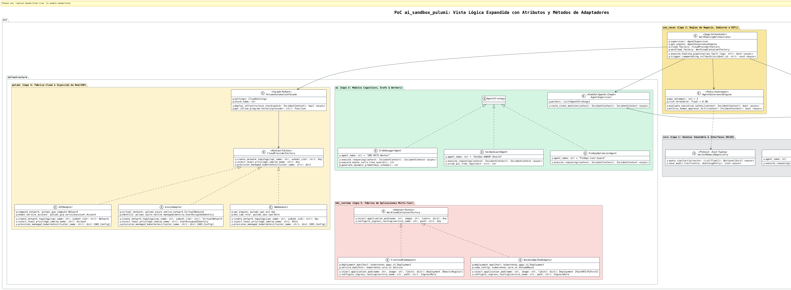
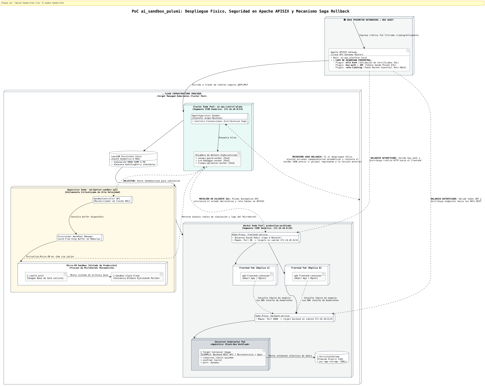

# 🤖 Plataforma AI-Ops Autónoma: ai_sandbox_pulumi

Plataforma de ingeniería de plataformas y automatización cognitiva de infraestructura diseñada bajo los principios de **Clean Architecture**, **Sistemas Agénticos Autónomos (MoA)** y **Self-Healing Declarativo**. El sistema intercepta anomalías en clústeres de Kubernetes en tiempo real, debate la solución mediante un enjambre de agentes y valida los parches en micro-VMs efímeras antes de sincronizar el estado inmutable mediante **Pulumi TypeScript & Pulumi ESC**.

---

## ⚡ Capacidades del Sistema (Core Capabilities & SLAs)

La PoC **ai_sandbox_pulumi** valida formalmente las siguientes capacidades de autogestión de infraestructura e inteligencia perimetral, operando bajo estándares de rendimiento industrial:

*   **🛡️ Anonimización de Datos en el Edge (Zero-Trust Privacy):** Interceptación y limpieza heurística de logs en menos de **15ms**, garantizando que el 100% de la información persistida semánticamente en LanceDB esté completamente libre de datos confidenciales (**PII** como contraseñas, emails o JWTs).
*   **🧠 Caché Semántica Proactiva (Bypass de Inferencia RAG):** Resolución matemática de fallos recurrentes mediante similitud de coseno (HNSW/PQ) en **<10ms**, omitiendo por completo llamadas pesadas a LLMs y reduciendo el consumo financiero de tokens a cero para bugs ya conocidos [INDEX].
*   **🔬 Árbol de Pensamiento con Evaluación Concurrente (ToT / MCTS):** Generación paralela de hasta 3 ramas candidatos de solución utilizando el algoritmo *Monte Carlo Tree Search*. Las opciones se simulan simultáneamente dentro de Micro-VMs efímeras de **Firecracker** aisladas con tiempos de arranque récord de **~5ms**.
*   **🔒 Gobernanza Regulatoria y Freno de Emergencia (HITL Interceptor):** Monitoreo financiero en caliente en dólares (USD). Dispara de forma obligatoria un bloqueo de automatización (*Human-in-the-Loop*) y congela el Grafo de Estados si el riesgo de seguridad OWASP supera el **80%** o si se detectan más de 3 ciclos de alucinación iterativos.
*   **☁️ Reconciliación Multi-Cloud Programática (Cloud Agnostic Fabric):** Abstracción total y polimórfica de la infraestructura física nativa (VPC/VNet, IAM, Firewalls/NSGs, y clústeres elásticos **AWS EKS, Google GKE o Azure AKS**) manipulada en caliente vía **Pulumi Automation API** sin depender de CLI rígidos de shell.
*   **📦 Orquestación Multi-Tier de Caja Negra (Agnostic Application Deployment):** Capacidad de inyectar y autoreparar topologías desacopladas reales (Frontend React/Angular interconectado con un Backend API de ejemplo) de manera 100% transparente para el plano de control, tratando los Pods como artefactos inmutables genéricos.
*   **🌐 Gestión de Tráfico y Seguridad Perimetral Integrada:** Reconfiguración dinámica y rotación de tokens en caliente de los Upstreams de **Apache APISIX** protegidos por **mTLS** y políticas *rate-limiting* anti-DDoS.
*   **🔄 Transacción Distribuida Resiliente con Retorno Automático (Saga Rollback):** Garantía de estado convergente. Si el clúster real de Kubernetes rechaza el parche en el último segundo, el sistema ejecuta acciones compensatorias asíncronas, recupera el último JSON seguro conocido (`~/.pulumi/`) y devuelve todo el entorno a su versión anterior en milisegundos.
*   **📈 Inmunidad Métrica Reactiva (Dynamic Prometheus Generation):** Capacidad de la IA para proponer, codificar y exponer en caliente nuevos esquemas de métricas en el endpoint `/metrics/custom-ai`, permitiendo que el recolector perimetral monitoree proactivamente comportamientos de fallos inéditos.

---


## 🏗️ Arquitectura del Sistema por Niveles

El proyecto se estructura verticalmente en 5 capas cognitivas aisladas para garantizar alta concurrencia, inmutabilidad y seguridad zero-trust:


<!-- ==============================================================================
     BLOQUE AISLADO 1: ARQUITECTURA GLOBAL
     ============================================================================== -->

  <div class="image-lens-wrapper">
    <p align="center">
    <a href="./images/ai-ops-sandbox-arquitectura-global-3.png" target="_blank" title="Haz clic para ampliar con lupa nativa">
      
    </a>
  </p>
  </div>
  
  
* **Nivel 1: Capa de Configuración (IaC / GitOps)** 
  * *Componentes:* Pulumi TypeScript Engine & Pulumi ESC.
  * *Función:* Sincroniza y muta de forma declarativa el estado de producción frente al backend de estado inmutable (`~/.pulumi JSON`).
* **Nivel 2: Capa de Inteligencia Artificial (Multi-Agent)**
  * *Componentes:* Stateful Agent Supervisor (LangGraph/Asyncio), LanceDB Vector Store, Enjambre Workers (SRE, SecOps, FinOps).
  * *Función:* Dirección ejecutiva del incidente, consulta RAG de baja latencia y bucles de reflexión/autocorrección cognitiva.
* **Nivel 3: Capa de Contexto y API del Plano de Control**
  * *Componentes:* Kubernetes MCP Server (Model Context Protocol) & Sandbox CRD Operator.
  * *Función:* Traduce métricas físicas a contexto semántico para la IA y procesa las reclamaciones de entornos virtuales seguros.
* **Nivel 4: Capa de Aplicación Observada (Pods Residentes)**
  * *Componentes:* App Microservice, App Web Frontend, OpenTelemetry Watchdog.
  * *Función:* Cargas de trabajo de producción observadas activamente; origen de las alertas de fallo (`CrashLoopBackOff`).
* **Nivel 5: Capa de Aislamiento Seguro (Micro-VMs Efímeras)**
  * *Componentes:* Firecracker WarmPool Manager & Isolated Micro-VM (Kata Runtimes).
  * *Función:* Laboratorio de pruebas protegido. Inicializa un nodo idéntico a producción en menos de 5ms para ejecutar el parche de la IA sin riesgo de contaminación.

---

## ⚡ Patrones de Diseño y Alto Rendimiento Implementados

### 1. Patrones de IA Avanzados
* **Stateful Agentic Supervisor:** Centraliza la lógica en un grafo dirigido de estados. El objeto `IncidentContext` pasa de forma síncrona/asíncrona entre agentes reteniendo el historial de pensamiento.
* **Multi-Agent Reflection & Self-Correction:** El agente de seguridad (`SecOpsGuardAgent`) audita el parche del SRE bajo estándares OWASP Top 10 para LLMs. Si detecta riesgos o fugas de **PII**, inyecta una alerta de feedback al grafo obligando al SRE a corregir el código en caliente.
* **Semantic Router:** Utiliza embeddings matemáticos de baja latencia. Si el error ya ocurrió en el pasado, aplica la solución directamente de LanceDB, reduciendo el coste de tokens de inferencia a cero.

### 2. Patrones de Diseño & Cloud
* **Saga Orchestrator Pattern:** Coordina las transacciones distributivas de infraestructura. Si un despliegue final en Pulumi falla, la Saga ejecuta acciones compensatorias automáticas para hacer rollback al último estado seguro.
* **Lock-Free Object Pool (WarmPool):** Estructura circular no bloqueante synchronizada por hardware (*Compare-And-Swap*) que arrienda Micro-VMs Firecracker compartiendo memoria base (*Flyweight Pattern*) para lograr un arranque inmediato de 5ms.
* **Backpressure Control:** Integrado en los canales gRPC reactivos del servidor MCP. Ante caídas en cascada del clúster, frena dinámicamente la tasa de ingesta para evitar desbordamientos de memoria en la capa de IA.

---

## 🏗️ Vista de dinámica

<!-- ==============================================================================
     BLOQUE AISLADO 2: VISTA DINÁMICA
     ============================================================================== -->
  
  <div class="image-lens-wrapper">
    <p align="center">
        <a href="./images/ai-ops-sandbox-vista-dinamica2.png" target="_blank" title="Haz clic para ampliar con lupa nativa">
            
        </a>
  </p>
  </div>
  
### ⚡ Descripción Técnica Detallada de la Vista Dinámica (Diagrama de Secuencia y Ciclo de Vida)

Este diagrama modela el comportamiento reactivo y la cronología asíncrona no bloqueante (`asyncio`) de la plataforma ante una falla crítica en producción. Ilustra cómo el sistema coordina el aislamiento semántico, el debate del enjambre Mixture-of-Agents (MoA), la validación en laboratorios efímeros y la reconciliación atómica, todo bajo los límites de una transacción distribuida regulada por políticas corporativas.

#### 🏁 Fase 1: Detección, Filtrado PII y Poda Semántica
1.  **Gatillo del Incidente:** El centinela de telemetría (`OpenTelemetry Watchdog`) intercepta un evento de caída (ej. `CrashLoopBackOff`) en un Pod vivo del NodePool de producción. Dispara de forma inmediata un stream reactivo vía gRPC hacia el proxy de la IA.
2.  **Guardrail de Privacidad en el Edge:** El `McpServerAdapter` procesa las trazas crudas. Aplica expresiones regulares de alto rendimiento para enmascarar datos confidenciales (**PII** como contraseñas, correos y tokens JWT). Acto seguido, invoca un **SLM local (Qwen-1.5B)** para ejecutar una poda semántica, barriendo el ruido repetitivo del sistema y aislando únicamente la firma pura del pánico.
3.  **Bypass de Inferencia (Caché RAG):** El proxy vectoriza la firma del error y consulta en caliente a **LanceDB** mediante distancias de coseno con indexación **HNSW/PQ**. Si el error ya ocurrió en el pasado, recupera el parche histórico y salta la ejecución pesada del LLM. Si es inédito, formatea e inyecta el objeto inmutable `IncidentContext` hacia la Capa 2.

#### 🧠 Fase 2: Debate Cognitivo y Árbol de Pensamiento (ToT)
4.  **Despacho y Razonamiento:** El `AgentSupervisor` (LangGraph Core) inicializa la máquina de estados del incidente y delega subtareas en paralelo a los especialistas de la Capa 3.
5.  **Simulación Monte Carlo (MCTS):** El `SreDebuggerAgent` abre un bucle de Razonamiento y Acción (*ReAct Loop*). En lugar de proponer una línea única de código, ejecuta el algoritmo **Monte Carlo Tree Search (MCTS)** sobre un **Árbol de Pensamiento (Tree of Thoughts - ToT)**, ramificando 3 propuestas candidatas de parches IaC. Simultáneamente, diseña un nuevo esquema Prometheus customizado (`/metrics/custom-ai`) diseñado específicamente para auto-monitorear la anomalía bajo análisis en el futuro. El enjambre evalúa y consolida la rama ganadora.

#### 🔒 Fase 3: Intercepción de Gobierno Corporativo Zero-Trust
6.  **Auditoría Regulatoria:** El Supervisor congela el estado del Grafo y envía la solución elegida hacia el `AgentGovernanceEngine`.
7.  **Freno de Emergencia e HITL:** El motor de gobierno evalúa los modelos de **Pydantic** frente a las políticas corporativas en caliente. Si el score de riesgo calculado por el `SecOpsGuardAgent` supera el **80%** o si se detecta un ciclo de reintentos repetitivos por alucinación, el interceptor bloquea la API de Pulumi de forma mandatoria y expone un guardrail **Human-in-the-Loop (HITL)** por Webhook, deteniendo la automatización hasta recibir una firma digital externa de un operador humano. Si el parche está dentro de los rangos seguros en USD y tokens, autoriza la transacción Saga.

#### ☁️ Fase 4: Reconciliación Atómica Multi-Cloud y Multi-Tier
8.  **Construcción de Infraestructura Agnóstica:** El Gobierno habilita la `CloudProviderFactory` (Abstract Factory). El componente lee en caliente las variables locales `.env` (`CLOUD_PROVIDER=google`, `azure` o `aws`), carga programáticamente la topología física correspondiente y ejecuta el método `Up` asíncrono de la **Pulumi Automation API** sin usar comandos CLI rígidos de shell, creando redes, firewalls y permisos IAM de privilegios mínimos.
9.  **Despliegue Multi-Tier de Caja Negra:** Pulumi dispara de forma sincronizada la `WorkloadContainerFactory` (Abstract Factory). Esta fábrica despliega la arquitectura de la aplicación viva tratando los Pods como cajas grises universales, inyectando de forma automatizada las rutas y políticas criptográficas de **Apache APISIX** perimetrales sobre la topología del clúster real.

#### 🔄 Fase 5: Trazabilidad Forense e Inmunidad Métrico-Reactiva
10. **Inmortalización del Veredicto:** Validada la convergencia exitosa de la infraestructura, el Gobierno toma los metadatos de la transacción y persiste de forma obligatoria un registro `AuditLogEntry` inmutable dentro de la tabla de auditoría forense de **LanceDB**.
11. **Hot-Reload del Centinela:** El SRE Agent inyecta el endpoint dinámico `/metrics/custom-ai` directamente en el recolector perimetral. El sistema converge, el microservicio se recupera y el clúster adquiere inmunidad proactiva contra el nuevo tipo de fallo.


---


## 📂 Estructura Limpia del Proyecto

El código fuente se organiza siguiendo estrictamente principios **SOLID**, garantizando que el núcleo del negocio no dependa de frameworks externos:

```text
ai_sandbox_pulumi/
├── ⚙️ .github/
│   └── 🚀 workflows/          # Pipelines de CI/CD para automatización de pruebas y linters.
├── 🌐 config/                 # Manifiestos de red y políticas de seguridad para clústeres.
├── 📝 docs/                   # Especificaciones, diagramas de arquitectura y especificaciones de prompts.
├── 🧪 tests/                  # Suite de Aseguramiento de Calidad (Quality Assurance).
│   ├── 🔗 integration/        # Pruebas integrales de extremo a extremo frente a entornos reales.
│   └── 🧩 unit/               # Pruebas unitarias que aíslan los LLM a través de mocks estrictos.
│
├── 📂 src/                    # Código fuente principal de la aplicación AI-Ops.
│   │
│   ├── 🏛️ core/               # CAPA 1: DOMINIO PURO (Reglas de software inmutables - SOLID)
│   │   ├── 🔹 __init__.py     # Inicializador del módulo core.
│   │   ├── 🔹 entities.py     # Modelos de datos de incidentes validados en runtime (Pydantic).
│   │   └── 🔹 interfaces.py   # Contratos abstractos estructurales y Duck Typing (Python Protocols).
│   │
│   ├── ⚙️ use_cases/          # CAPA 2: CASOS DE USO (Lógica pura de orquestación de la aplicación)
│   │   ├── 🔹 __init__.py     # Inicializador del módulo de casos de uso.
│   │   └── 🔹 self_healing.py # Coordinador asíncrono de la transacción distribuida Saga.
│   │
│   └── 🔌 infrastructure/     # CAPA 3: ADAPTADORES (Frameworks, SDKs y librerías externas)
│       ├── 🔹 __init__.py     # Inicializador del módulo de infraestructura.
│       ├── 🧠 ai/             # Enjambre cognitivo e Inteligencia Artificial.
│       │   ├── 🔸 __init__.py # Inicializador de la suite cognitiva.
│       │   ├── 🔸 agents.py   # SecOps Advanced Agent (Guardrail OWASP + Anonimizador PII).
│       │   ├── 🔸 memory.py   # Persistencia Vectorial en LanceDB (Búsquedas SIMD HNSW).
│       │   └── 🔸 supervisor.py # Demonio Orquestador Central (Grafo Dirigido/Stateful Graph).
│       │
│       ├── 📦 k8s_runtime/    # Adaptadores para el Plano de Control de K8s y Sandboxes (Firecracker).
│       └── ☁️ pulumi/         # Automatización de Infraestructura como Código (Pulumi Automation API).
│
├── 📦 pyproject.toml          # Manifiesto industrial centralizado (Poetry, Ruff, Mypy Strict).
├── 🚀 main.py                 # Punto de entrada asíncrono nativo (asyncio application app loop).
└── 📖 README.md               # Manual de ingeniería, arquitectura y despliegue del sistema.
                 # Punto de entrada asíncrono nativo (asyncio engine loop)
```
---

## 🏗️ Vista de lógica

<!-- ==============================================================================
     BLOQUE AISLADO 2: VISTA Lógica
     ============================================================================== -->
  
  <div class="image-lens-wrapper">
    <p align="center">
        <a href="./images/ai-ops-sandbox-vista-logica2.png" target="_blank" title="Haz clic para ampliar con lupa nativa">
            
        </a>
    </p>
  </div>
  
### 📦 Descripción Técnica Detallada de la Vista Lógica (Diagrama de Clases Python)

Esta vista representa el mapa estructural de bajo nivel del código fuente de `ai_sandbox_pulumi`, desarrollado en Python 3.12+ utilizando tipado estático estricto (`mypy --strict`) y validación de tipos en tiempo de ejecución. El diseño implementa la separación rígida de responsabilidades en 5 capas, garantizando que el núcleo de las reglas de negocio permanezca desacoplado y blindado frente a las librerías de infraestructura y los proveedores de nube.

#### 🏛️ 1. Capa de Dominio Inmutable e Interfaces SOLID (src/core/)
Constituye el corazón del software. Es puramente declarativo y prohíbe cualquier dependencia de librerías externas o frameworks de terceros.
*   **IncidentContext:** El objeto central de transferencia de estado (`BaseModel` de **Pydantic**). Es inmutable y se autovalida en tiempo de ejecución. Mapea de forma transparente el identificador del incidente, trazas sanitizadas libres de **PII**, la propuesta IaC y las variables dinámicas de telemetría inyectadas por la IA (`ai_suggested_metric`).
*   **AuditLogEntry:** Estructura inmutable utilizada por el motor de gobernanza para el registro persistente de auditorías de seguridad e impacto financiero.
*   **AgentStrategy [Python Protocol]:** Firma estructural abstracta (*Duck Typing*) que define el comportamiento que debe cumplir cualquier agente del enjambre (`execute_reasoning`). Permite el intercambio dinámico de agentes en runtime sin alterar el flujo principal.
*   **VectorMemoryRepository [Python Protocol]:** Abstracción abstracta de persistencia que desacopla la lógica de negocio de la base de datos vectorial real.

#### ⚙️ 2. Reglas de Negocio, Gobierno e Intercepción (src/use_cases/ & src/core/governance)
Orquesta el flujo transaccional y aplica las fronteras de control de la PoC.
*   **SelfHealingOrchestrator:** Implementa el patrón **Saga Orchestrator** para transacciones distribuidas. Es el director de la transacción: coordina de forma asíncrona la ingesta del error, el debate de la IA, la validación en el Sandbox y la propagación GitOps. Cuenta con el método privado `trigger_compensating_rollback` para revertir cambios físicos si el clúster rechaza el parche.
*   **AgentGovernanceEngine [Policy Interceptor]:** Interceptor de seguridad zero-trust. Audita el `IncidentContext` contra cuotas en USD y límites de reintentos en bucles cognitivos (`max_attempts: 3`). Implementa el método `enforce_human_approval_hitl`, capaz de congelar el loop asíncrono y levantar un guardrail **Human-in-the-Loop** esperando autorización externa si el riesgo supera el 80%.

#### 🧠 3. Enjambre de Workers Especialistas y Grafo de Estados (src/infrastructure/ai/)
Plano cognitivo encargado del razonamiento, análisis y diseño de soluciones.
*   **AgentSupervisor:** Demonio basado en estados que administra la máquina del grafo agéntico (`LangGraph`). Consume el estado común y orquesta la ejecución paralela o secuencial de su colección de trabajadores (`AgentStrategy`).
*   **SreDebuggerAgent:** Worker especialista encargado del diseño sintáctico del parche IaC. Implementa de forma simulada el algoritmo **Monte Carlo Tree Search (MCTS)** dentro de un árbol de pensamiento (**Tree of Thoughts**) para evaluar ramas de soluciones. Integra el generador de esquemas dinámicos de Prometheus.
*   **SecOpsGuardAgent:** Worker de validación perimetral. Ejecuta auditorías semánticas bajo estándares **OWASP Top 10 para LLMs** y aplica la función nativa `scrub_pii_from_logs` para limpiar JWTs, contraseñas y variables privadas antes del procesamiento.
*   **FinOpsOptimizerAgent:** Worker enfocado en el control de costes financieros de tokens y recursos físicos.

#### ☁️ 4. Fábrica Cloud e Inyección de Red/IAM Agnóstica (src/infrastructure/pulumi/)
Capa de adaptadores técnicos encargada de la inmutabilidad de la infraestructura y el polimorfismo multi-nube.
*   **CloudProviderFactory [Abstract Factory]:** Interfaz de fábrica que obliga a todos los adaptadores a implementar métodos uniformes para crear redes, inyectar permisos con privilegios mínimos y provisionar Kubernetes de forma declarativa.
*   **PulumiAutomationFacade [Facade Pattern]:** Encapsula y simplifica la complejidad de la **Pulumi Automation API** programática en Python, inicializando *stacks* locales en caliente de forma asíncrona no bloqueante (`asyncio`).
*   **AWS / GCP / Azure Adapters:** Implementaciones concretas de la fábrica. Traducen las órdenes de la IA en recursos físicos específicos de cada proveedor (`Vpc`, `Account` de IAM, clústeres `EKS`, `GKE Standard` o `AKS`).

#### 📦 5. Fábrica de Aplicaciones Multi-Tier Desacopladas (src/infrastructure/k8s_runtime/)
Capa de adaptadores finales encargada de inyectar las cargas vivas del negocio en Kubernetes.
*   **WorkloadContainerFactory [Abstract Factory]:** Contrato abstracto para generar manifiestos de Kubernetes e Ingress de forma uniforme.
*   **Frontend / Backend Pod Adapters:** Clases concretas que configuran los objetos de la API de Kubernetes (`Deployment`, `Service` ClusterIP, balanceo Ingress) tratando las aplicaciones como cajas grises universales, abstrayendo si la carga contiene una app React o un servidor REST en FastAPI con PyTorch.

  
---

## 🏗️ Vista de infraestructura

<!-- ==============================================================================
     BLOQUE AISLADO 2: Diagrama de Arquitectura
     ============================================================================== -->
  
  <div class="image-lens-wrapper">
    <p align="center">
        <a href="./images/ai-ops-sandbox-vista-infraestructura.png" target="_blank" title="Haz clic para ampliar con lupa nativa">
            
        </a>
  </p>
  </div>
  
### 🌐 Descripción Técnica Detallada del Diagrama de Despliegue de Infraestructura

Este diagrama modela la topología física, la segregación perimetral y el plano de datos de la plataforma autónoma, operando bajo un direccionamiento dinámico y genérico en el rango **172.16.x.x**. Toda la suite se ha simplificado eliminando agentes de monitoreo redundantes en los nodos para concentrar la arquitectura en el comportamiento puro del tráfico, el balanceo y la resiliencia automatizada.

#### 🎛️ 1. Perímetro de Red y Puerta de Enlace Segura (Edge Perimeter)
* **Apache APISIX Gateway:** Actúa como el balanceador de carga de alto rendimiento y punto único de entrada al clúster para tráfico externo bajo el host `ai-ops.platform.local`. 
* **🔒 Capa de Seguridad Perimetral Inyectada:** El acceso a la infraestructura está estrictamente blindado mediante tres plugins criptográficos nativos ejecutados en el Edge:
  - **mTLS Auth Plugin:** Exige y valida certificados SSL mutuos cruzados antes de permitir el ingreso de cualquier ráfaga de datos.
  - **key-auth / JWT Plugin:** Intercepta las cabeceras HTTP para validar tokens criptográficos inmutables sincronizados dinámicamente desde **Pulumi ESC**.
  - **rate-limiting Plugin:** Implementa un guardrail antiavalanchas (*Token Bucket*) para mitigar ataques DDoS o frenar bucles de alucinación concurrentes.

#### 🧠 2. Entorno de Ejecución del Plano de Control (Namespace: ai-ops-control-plane)
* **Segmento de Red Dedicado (CIDR: 172.16.10.0/24):** Aísla de forma estricta los componentes lógicos de la IA del tráfico ordinario de la aplicación.
* **AgentSupervisor Daemon:** Nodo core asíncrono que corre la máquina de estados del grafo agéntico (`LangGraph`). Centraliza el control y es el responsable directo de gobernar la transacción distribuida **Saga**.
* **Enjambre de Workers Especialistas:** Contenedores independientes (`secops-guard`, `sre-debugger`, `finops-optimizer`) que asumen tareas específicas de validación OWASP, poda de tokens y costes en USD. El SRE Agent posee canales prioritarios para inyectar configuraciones y *hot-reloads* directos sobre los Upstreams de **Apache APISIX** tras una reparación exitosa.
* **LanceDB Persistent Store:** Repositorio vectorial empotrado que opera como la memoria RAG de largo plazo. Indexa firmas de errores y configuraciones usando algoritmos **HNSW con soporte SIMD** y compresión **Product Quantization (PQ)** para búsquedas en menos de 10ms.

#### 🔬 4. Nodo de Aislamiento Experimental (Validation Sandbox Jailer)
* **SandboxController API & Firecracker WarmPool Manager:** Componentes del plano de control que administran un búfer circular libre de bloqueos (*Lock-Free Ring Buffer*) para el aprovisionamiento inmediato de laboratorios protegidos.
* **Micro-VM Sandbox Minimalista:** Entorno virtual seguro y efímero que se inicializa en **~5 milisegundos** clonando un sistema de archivos base de solo lectura (`rootfs.ext4`). El **SRE Agent** despliega de forma aislada la propuesta de parche aquí para validar su comportamiento real antes de propagar cambios a producción.

#### 📦 5. Plano de Cargas Vivas y Balanceo Multi-Tier (Namespace: production-workloads)
* **Segmento de Red de Producción (CIDR: 172.16.20.0/24):** Zona reservada exclusivamente para la ejecución de servicios del negocio.
* **Balanceo Interno Kube-Proxy:** Utiliza IPTables/IPVS para exponer los servicios de red internos de Kubernetes. `frontend-service` actúa en Capa 4 distribuyendo el tráfico web de forma equitativa (*Round-Robin*) entre dos réplicas redundantes (`Replica A` y `Replica B`), garantizando alta disponibilidad.
* **Universal Kubernetes Pod [Caja Gris Agnóstica]:** Representa el backend observado del sistema. Es una auténtica caja negra inmutable para el plano de control (el cual puede albergar cualquier microservicio, API REST o App genérica). Está definido estrictamente por sus límites de hardware (`limits.cpu/memory`), variables de entorno cifradas de un objeto `Secret` y un volumen de persistencia elástico de datos (`pvc-app-storage` de 50Gi), quedando completamente aislado de la exposición pública de internet.

#### 🔄 6. Resiliencia y Mecanismo Automático de Retorno de Versión (Saga Rollback)
* Si la solución de infraestructura diseñada por la IA supera los filtros de Gobierno, se propaga mediante la **Pulumi Automation API**. Sin embargo, si el clúster real de Kubernetes la rechaza en el último segundo (provocando un *CrashLoopBackOff* o inconsistencias físicas), el `AgentSupervisor` aborta la transacción distribuida de la Saga de inmediato.
* El sistema ejecuta de forma programática un **Rollback al último estado inmutable y seguro conocido** (`~/.pulumi/`), eliminando la red corrupta y regresando automáticamente el entorno corporativo a la versión estable anterior en milisegundos.

---

## 🚀 Guía de Instalación y Desarrollo

### Requisitos Previos
* Python 3.12 o superior.
* Poetry (Gestor de entornos y paquetes).
* Pulumi CLI configurado con acceso a tu cuenta/backend.

### 1. Inicializar el Entorno e Instalar Dependencias
Instala el ecosistema completo junto con las herramientas de verificación estricta (**Ruff** para linter de alta velocidad en Rust y **Mypy** para validación estática de tipos):
```bash
poetry install
```

### 2. Ejecutar la Suite de Calidad (Verificación Estricta)
Antes de levantar el daemon asíncrono, el código debe superar el control de tipado zero-trust y formato:
```bash
# Ejecutar verificación de tipos estáticos
poetry run mypy src

# Ejecutar formateador y linter automatizado
poetry run ruff check src --fix
```

### 3. Lanzar la Plataforma Autónoma
Inicia el bucle reactivo de eventos asíncronos para comenzar a escuchar incidentes en tu clúster de Kubernetes:
```bash
poetry run python main.py
```
---

> ⚠️ **ESTADO DEL PROYECTO: Proof of Concept (PoC) / Prueba de Concepto**
> Este repositorio es una PoC técnica diseñada para validar la viabilidad de la autoreparación de infraestructura mediante sistemas agénticos avanzados. Se requiere auditoría corporativa de las políticas de aislamiento.


<p align="center">
  <sub><b>Ecosistema AI-Ops Autónomo • Prueba de Concepto (PoC)</b></sub><br>
  <sub><b>Autor:</b> Edith Barrientos 💻</sub><br>
  <sub><b>Año:</b> 2026 🚀</sub>
</p>