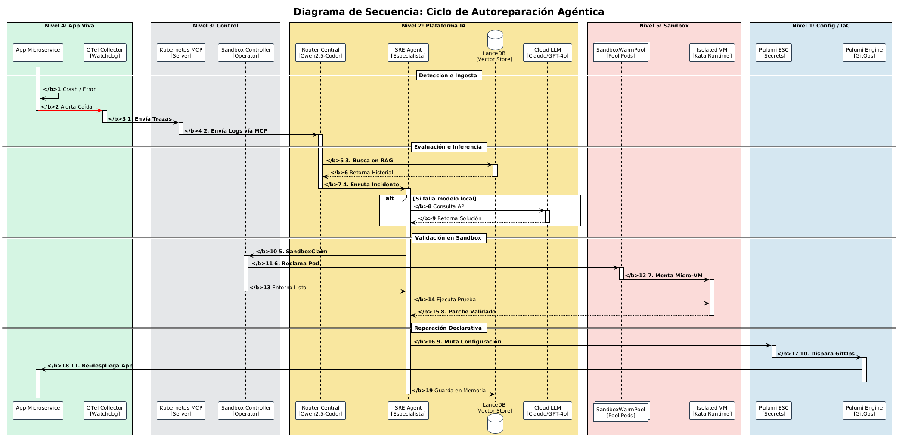

# 🤖 Plataforma AI-Ops Autónoma: ai_sandbox_pulumi

> ⚠️ **ESTADO DEL PROYECTO: Proof of Concept (PoC) / Prueba de Concepto**
> Este repositorio es una PoC técnica diseñada para validar la viabilidad de la autoreparación de infraestructura mediante sistemas agénticos avanzados. No está destinado a despliegues de producción directa sin previa auditoría corporativa de las políticas de aislamiento.

Plataforma de ingeniería de plataformas y automatización cognitiva de infraestructura diseñada bajo los principios de **Clean Architecture**, **Sistemas Agénticos Autónomos (MoA)** y **Self-Healing Declarativo**. El sistema intercepta anomalías en clústeres de Kubernetes en tiempo real, debate la solución mediante un enjambre de agentes y valida los parches en micro-VMs efímeras antes de sincronizar el estado inmutable mediante **Pulumi TypeScript & Pulumi ESC**.

---

## 🏗️ Arquitectura del Sistema por Niveles

El proyecto se estructura verticalmente en 5 capas cognitivas aisladas para garantizar alta concurrencia, inmutabilidad y seguridad zero-trust:


<!-- ==============================================================================
     BLOQUE AISLADO 1: ARQUITECTURA GLOBAL
     ============================================================================== -->
<div class="layer-block-isolated">
  <div class="block-header-title">🌐 Bloque 1: Arquitectura Global por Niveles</div>
  
  <div class="image-lens-wrapper">
    
  </div>
  
  <div class="technical-meta-data">
    <p><b>Descripción General:</b> Establece la división modular estricta de la PoC en 5 niveles operativos e inmutables, aislando por completo las decisiones del enjambre cognitivo de las cargas de trabajo vivas.</p>
    
    <div class="meta-subtitle-tech">📦 Componentes de Infraestructura:</div>
    <ul>
      <li><b>Pulumi TypeScript Engine & ESC:</b> Responsables de la inmutabilidad y la mutación declarativa del estado de la red e inyección de políticas criptográficas.</li>
      <li><b>Kubernetes MCP Server:</b> Adaptador del plano de control que expone el estado físico del clúster como telemetría semántica estructurada.</li>
      <li><b>App Workload Pods:</b> Cargas de trabajo supervisadas activamente por recolectores reactivos de OpenTelemetry.</li>
    </ul>


* **Nivel 1: Capa de Configuración (IaC / GitOps)** 
  * *Componentes:* Pulumi TypeScript Engine & Pulumi ESC.
  * *Función:* Sincroniza y muta de forma declarativa el estado de producción frente al backend de estado inmutable (`~/.pulumi JSON`).
* **Nivel 2: Capa de Inteligencia Artificial (Multi-Agent)**
  * *Componentes:* Stateful Agent Supervisor (LangGraph/Asyncio), LanceDB Vector Store, Enjambre Workers (SRE, SecOps, FinOps).
  * *Función:* Dirección ejecutiva del incidente, consulta RAG de baja latencia y bucles de reflexión/autocorrección cognitiva.
* **Nivel 3: Capa de Contexto y API del Plano de Control**
  * *Componentes:* Kubernetes MCP Server (Model Context Protocol) & Sandbox CRD Operator.
  * *Función:* Traduce métricas físicas a contexto semántico para la IA y procesa las reclamaciones de entornos virtuales seguros.
* **Nivel 4: Capa de Aplicación Observada (Pods Residentes)**
  * *Componentes:* App Microservice, App Web Frontend, OpenTelemetry Watchdog.
  * *Función:* Cargas de trabajo de producción observadas activamente; origen de las alertas de fallo (`CrashLoopBackOff`).
* **Nivel 5: Capa de Aislamiento Seguro (Micro-VMs Efímeras)**
  * *Componentes:* Firecracker WarmPool Manager & Isolated Micro-VM (Kata Runtimes).
  * *Función:* Laboratorio de pruebas protegido. Inicializa un nodo idéntico a producción en menos de 5ms para ejecutar el parche de la IA sin riesgo de contaminación.

---

## ⚡ Patrones de Diseño y Alto Rendimiento Implementados

### 1. Patrones de IA Avanzados
* **Stateful Agentic Supervisor:** Centraliza la lógica en un grafo dirigido de estados. El objeto `IncidentContext` pasa de forma síncrona/asíncrona entre agentes reteniendo el historial de pensamiento.
* **Multi-Agent Reflection & Self-Correction:** El agente de seguridad (`SecOpsGuardAgent`) audita el parche del SRE bajo estándares OWASP Top 10 para LLMs. Si detecta riesgos o fugas de **PII**, inyecta una alerta de feedback al grafo obligando al SRE a corregir el código en caliente.
* **Semantic Router:** Utiliza embeddings matemáticos de baja latencia. Si el error ya ocurrió en el pasado, aplica la solución directamente de LanceDB, reduciendo el coste de tokens de inferencia a cero.

### 2. Patrones de Diseño & Cloud
* **Saga Orchestrator Pattern:** Coordina las transacciones distributivas de infraestructura. Si un despliegue final en Pulumi falla, la Saga ejecuta acciones compensatorias automáticas para hacer rollback al último estado seguro.
* **Lock-Free Object Pool (WarmPool):** Estructura circular no bloqueante synchronizada por hardware (*Compare-And-Swap*) que arrienda Micro-VMs Firecracker compartiendo memoria base (*Flyweight Pattern*) para lograr un arranque inmediato de 5ms.
* **Backpressure Control:** Integrado en los canales gRPC reactivos del servidor MCP. Ante caídas en cascada del clúster, frena dinámicamente la tasa de ingesta para evitar desbordamientos de memoria en la capa de IA.

---


## 🏗️ Vista de dinámica

<!-- ==============================================================================
     BLOQUE AISLADO 2: VISTA DINÁMICA
     ============================================================================== -->
<div class="layer-block-isolated">
  <div class="block-header-title">⚡ Bloque 2: Vista Dinámica y Ciclo de Secuencia</div>
  
  <div class="image-lens-wrapper">
    
  </div>
  
  <div class="technical-meta-data">
    <p><b>Descripción General:</b> Ilustra la cronología exacta paso a paso del ciclo de autoreparación reactiva asíncrona ante la caída catastrófica de un microservicio.</p>
    
    <div class="meta-subtitle-tech">📦 Componentes de Infraestructura:</div>
    <ul>
      <li><b>OTel Collector Watchdog:</b> Centinela reactivo que dispara las señales de pánico ante un CrashLoopBackOff.</li>
      <li><b>Sandbox Controller Operator:</b> Reconciliador del plano de control que procesa los reclamos declarativos de sandboxes.</li>
      <li><b>SandboxWarmPool:</b> Pool circular optimizado por hardware que almacena instancias de Micro-VMs listas para ser rentadas.</li>
    </ul>

    <div class="meta-subtitle-tech">🤖 Roles Agénticos:</div>
    <ul>
      <li><b>SRE Debugger Agent:</b> Especialista que orquesta el bucle cognitivo de razonamiento y acción (ReAct Loop) para diseñar el parche.</li>
      <li><b>LanceDB Store:</b> Base de datos vectorial embebida que actúa como memoria RAG de largo plazo para inyectar soluciones históricas.</li>
    </ul>

    <div class="meta-subtitle-tech">🔄 Flujo de Trabajo:</div>
    <p>1. OTel reporta caída &rarr; 2. LanceDB inyecta contexto previo &rarr; 3. SRE Agent emite SandboxClaim &rarr; 4. El WarmPool inicializa una Micro-VM en ~5ms &rarr; 5. El parche se valida y se autoriza el despliegue GitOps final.</p>
  </div>
</div>

---


## 📂 Estructura Limpia del Proyecto

El código fuente se organiza siguiendo estrictamente principios **SOLID**, garantizando que el núcleo del negocio no dependa de frameworks externos:

```text
ai_sandbox_pulumi/
├── ⚙️ .github/
│   └── 🚀 workflows/          # Pipelines de CI/CD para automatización de pruebas y linters.
├── 🌐 config/                 # Manifiestos de red y políticas de seguridad para clústeres.
├── 📝 docs/                   # Especificaciones, diagramas de arquitectura y especificaciones de prompts.
├── 🧪 tests/                  # Suite de Aseguramiento de Calidad (Quality Assurance).
│   ├── 🔗 integration/        # Pruebas integrales de extremo a extremo frente a entornos reales.
│   └── 🧩 unit/               # Pruebas unitarias que aíslan los LLM a través de mocks estrictos.
│
├── 📂 src/                    # Código fuente principal de la aplicación AI-Ops.
│   │
│   ├── 🏛️ core/               # CAPA 1: DOMINIO PURO (Reglas de software inmutables - SOLID)
│   │   ├── 🔹 __init__.py     # Inicializador del módulo core.
│   │   ├── 🔹 entities.py     # Modelos de datos de incidentes validados en runtime (Pydantic).
│   │   └── 🔹 interfaces.py   # Contratos abstractos estructurales y Duck Typing (Python Protocols).
│   │
│   ├── ⚙️ use_cases/          # CAPA 2: CASOS DE USO (Lógica pura de orquestación de la aplicación)
│   │   ├── 🔹 __init__.py     # Inicializador del módulo de casos de uso.
│   │   └── 🔹 self_healing.py # Coordinador asíncrono de la transacción distribuida Saga.
│   │
│   └── 🔌 infrastructure/     # CAPA 3: ADAPTADORES (Frameworks, SDKs y librerías externas)
│       ├── 🔹 __init__.py     # Inicializador del módulo de infraestructura.
│       ├── 🧠 ai/             # Enjambre cognitivo e Inteligencia Artificial.
│       │   ├── 🔸 __init__.py # Inicializador de la suite cognitiva.
│       │   ├── 🔸 agents.py   # SecOps Advanced Agent (Guardrail OWASP + Anonimizador PII).
│       │   ├── 🔸 memory.py   # Persistencia Vectorial en LanceDB (Búsquedas SIMD HNSW).
│       │   └── 🔸 supervisor.py # Demonio Orquestador Central (Grafo Dirigido/Stateful Graph).
│       │
│       ├── 📦 k8s_runtime/    # Adaptadores para el Plano de Control de K8s y Sandboxes (Firecracker).
│       └── ☁️ pulumi/         # Automatización de Infraestructura como Código (Pulumi Automation API).
│
├── 📦 pyproject.toml          # Manifiesto industrial centralizado (Poetry, Ruff, Mypy Strict).
├── 🚀 main.py                 # Punto de entrada asíncrono nativo (asyncio application app loop).
└── 📖 README.md               # Manual de ingeniería, arquitectura y despliegue del sistema.
                 # Punto de entrada asíncrono nativo (asyncio engine loop)
```
---


## 🏗️ Vista de lógica

  <div class="image-lens-wrapper">
    
  </div>
  
  <div class="technical-meta-data">
    <p><b>Descripción General:</b> Mapea las abstracciones de código, los contratos y el diseño orientado a objetos del backend estructurado bajo Clean Architecture en Python 3.12+, asegurando el desacoplamiento estricto del dominio.</p>
    
    <div class="meta-subtitle-tech">📦 Componentes del Código Fuente:</div>
    <ul>
      <li><b>src.core (Dominio Puro):</b> Capa central que encapsula las entidades inmutables de datos optimizadas con <b>Pydantic</b> y contratos lógicos (<i>Python Protocols</i>).</li>
      <li><b>src.use_cases (Casos de Uso):</b> Orquestadores puros del flujo lógico de la aplicación (Saga Execution) que coordinan los subsistemas sin depender de ellos.</li>
      <li><b>src.infrastructure (Adaptadores):</b> Capa externa que implementa los detalles técnicos frente a las interfaces de dominio (LanceDB, Pulumi Automation API, clientes gRPC).</li>
    </ul>

    <div class="meta-subtitle-tech">🤖 Patrones y Algoritmos de Alto Rendimiento:</div>
    <ul>
      <li><b>Patrón Strategy & Facade:</b> Intercambio dinámico de agentes en tiempo de ejecución y simplificación pragmática del CLI programático de IaC.</li>
      <li><b>HNSW SIMD-Accelerated Indexing:</b> Búsquedas vectoriales matemáticas por similitud de coseno resueltas directamente en la caché de la CPU.</li>
      <li><b>Disruptor Pattern:</b> Procesamiento masivo de SandboxClaims mediante Ring Buffers concurrentes lock-free.</li>
    </ul>

    <div class="meta-subtitle-tech">🔄 Flujo de Trabajo del Código:</div>
    <p>McpServer transforma los logs en un objeto <i>IncidentContext</i> &rarr; El caso de uso <i>SelfHealingOrchestrator</i> activa las corrutinas de <i>asyncio</i> &rarr; Se evalúa el parche de forma asíncrona en el <i>WarmPoolManager</i> (Patrón Flyweight) &rarr; Sincronización inmutable en Pulumi.</p>
  </div>
</div>
---

## 🏗️ ARQUITECTURA DE IA

<!-- ==============================================================================
     BLOQUE AISLADO 4: ARQUITECTURA DE IA
     ============================================================================== -->
<div class="layer-block-isolated">
  <div class="block-header-title">🧠 Bloque 4: Grafo Agéntico y Capas Cognitivas de IA</div>
  
  <div class="image-lens-wrapper">
    
  </div>
  
  <div class="technical-meta-data">
    <p><b>Descripción General:</b> Detalla el comportamiento del cerebro cognitivo del sistema, estructurado como un Grafo de Estados Dirigido (Stateful Graph) encargado de la toma asíncrona de decisiones de nivel empresarial.</p>
    
    <div class="meta-subtitle-tech">📦 Componentes de Soporte:</div>
    <ul>
      <li><b>Semantic Router Guardrail:</b> Clasificador vectorial temprano que bypassa llamadas pesadas al LLM si el error ya cuenta con una solución en la caché.</li>
      <li><b>Token Bucket Rate Limiter:</b> Guardrail de control que frena e intercepta bucles de alucinación para proteger la cuota financiera de las APIs.</li>
    </ul>

    <div class="meta-subtitle-tech">🤖 Roles Agénticos (Workers & Supervisor):</div>
    <ul>
      <li><b><&person> AgentSupervisor:</b> Director ejecutivo del grafo (Python LangGraph) encargado de la consistencia del estado y de la delegación paralela.</li>
      <li><b><&shield> SecOpsGuardAgent:</b> Máximo auditor de seguridad. Aplica técnicas de <b>Reflexión Multi-Agente</b>, mitigación de inyecciones OWASP y un anonimizador estricto de <b>PII</b> (limpieza automática de contraseñas, JWTs y correos).</li>
      <li><b><&bug> SreDebuggerAgent:</b> Diseña y muta el código del parche en un bucle iterativo cerrado con el entorno físico de validación.</li>
      <li><b><&graph> FinOpsOptimizerAgent:</b> Analiza el impacto presupuestario de tokens y recursos de hardware de la solución propuesta.</li>
    </ul>

    <div class="meta-subtitle-tech">🔄 Flujo de Trabajo:</div>

---

## 🚀 Guía de Instalación y Desarrollo

### Requisitos Previos
* Python 3.12 o superior.
* Poetry (Gestor de entornos y paquetes).
* Pulumi CLI configurado con acceso a tu cuenta/backend.

### 1. Inicializar el Entorno e Instalar Dependencias
Instala el ecosistema completo junto con las herramientas de verificación estricta (**Ruff** para linter de alta velocidad en Rust y **Mypy** para validación estática de tipos):
```bash
poetry install
```

### 2. Ejecutar la Suite de Calidad (Verificación Estricta)
Antes de levantar el daemon asíncrono, el código debe superar el control de tipado zero-trust y formato:
```bash
# Ejecutar verificación de tipos estáticos
poetry run mypy src

# Ejecutar formateador y linter automatizado
poetry run ruff check src --fix
```

### 3. Lanzar la Plataforma Autónoma
Inicia el bucle reactivo de eventos asíncronos para comenzar a escuchar incidentes en tu clúster de Kubernetes:
```bash
poetry run python main.py
```
---

<p align="center">
  <sub><b>Ecosistema AI-Ops Autónomo • Prueba de Concepto (PoC)</b></sub><br>
  <sub><b>Autor:</b> Edith Barrientos 💻</sub><br>
  <sub><b>Año:</b> 2026 🚀</sub>
</p>